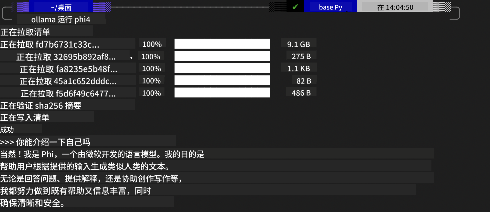
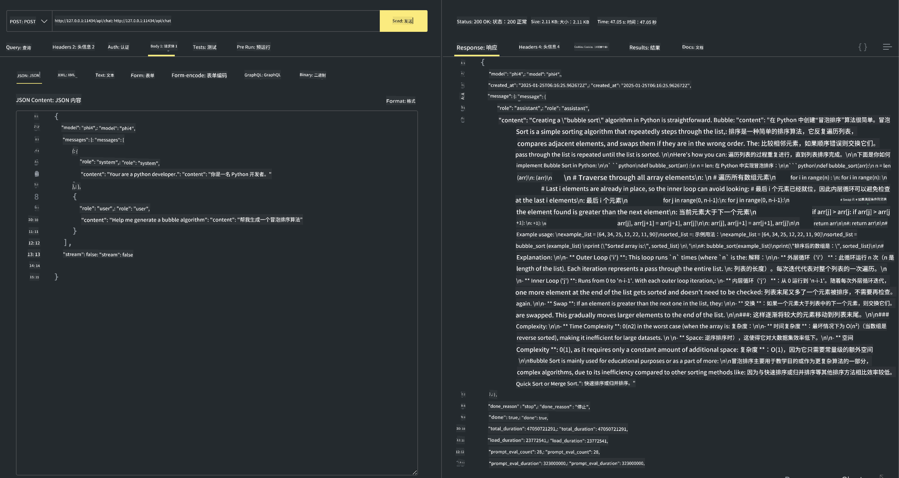

<!--
CO_OP_TRANSLATOR_METADATA:
{
  "original_hash": "0b38834693bb497f96bf53f0d941f9a1",
  "translation_date": "2025-07-16T19:13:23+00:00",
  "source_file": "md/01.Introduction/02/04.Ollama.md",
  "language_code": "zh"
}
-->
## Ollama 中的 Phi 系列

[Ollama](https://ollama.com) 让更多人能够通过简单的脚本直接部署开源的 LLM 或 SLM，也可以构建 API 来支持本地 Copilot 应用场景。

## **1. 安装**

Ollama 支持在 Windows、macOS 和 Linux 上运行。你可以通过这个链接安装 Ollama（[https://ollama.com/download](https://ollama.com/download)）。安装成功后，可以直接通过终端窗口使用 Ollama 脚本调用 Phi-3。你可以查看所有 [Ollama 中可用的库](https://ollama.com/library)。如果你在 Codespace 中打开此仓库，Ollama 已经预装好了。

```bash

ollama run phi4

```

> [!NOTE]
> 第一次运行时模型会先被下载。当然，你也可以直接指定已下载的 Phi-4 模型。这里以 WSL 为例运行命令。模型下载成功后，你可以直接在终端进行交互。



## **2. 从 Ollama 调用 phi-4 API**

如果你想调用 Ollama 生成的 Phi-4 API，可以在终端使用以下命令启动 Ollama 服务器。

```bash

ollama serve

```

> [!NOTE]
> 如果你使用的是 MacOS 或 Linux，可能会遇到以下错误 **"Error: listen tcp 127.0.0.1:11434: bind: address already in use"**。当运行命令时可能会出现这个错误。你可以忽略它，因为通常表示服务器已经在运行，或者你可以停止并重启 Ollama：

**macOS**

```bash

brew services restart ollama

```

**Linux**

```bash

sudo systemctl stop ollama

```

Ollama 支持两种 API：generate 和 chat。你可以根据需要调用 Ollama 提供的模型 API，向运行在本地 11434 端口的服务发送请求。

**Chat**

```bash

curl http://127.0.0.1:11434/api/chat -d '{
  "model": "phi3",
  "messages": [
    {
      "role": "system",
      "content": "Your are a python developer."
    },
    {
      "role": "user",
      "content": "Help me generate a bubble algorithm"
    }
  ],
  "stream": false
  
}'

This is the result in Postman



## Additional Resources

Check the list of available models in Ollama in [their library](https://ollama.com/library).

Pull your model from the Ollama server using this command

```bash
ollama pull phi4
```

Run the model using this command

```bash
ollama run phi4
```

***Note:*** Visit this link [https://github.com/ollama/ollama/blob/main/docs/api.md](https://github.com/ollama/ollama/blob/main/docs/api.md) to learn more

## Calling Ollama from Python

You can use `requests` or `urllib3` to make requests to the local server endpoints used above. However, a popular way to use Ollama in Python is via the [openai](https://pypi.org/project/openai/) SDK, since Ollama provides OpenAI-compatible server endpoints as well.

Here is an example for phi3-mini:

```python
import openai

client = openai.OpenAI(
    base_url="http://localhost:11434/v1",
    api_key="nokeyneeded",
)

response = client.chat.completions.create(
    model="phi4",
    temperature=0.7,
    n=1,
    messages=[
        {"role": "system", "content": "You are a helpful assistant."},
        {"role": "user", "content": "Write a haiku about a hungry cat"},
    ],
)

print("Response:")
print(response.choices[0].message.content)
```

## Calling Ollama from JavaScript 

```javascript
// 使用 Phi-4 对文件进行摘要的示例
script({
    model: "ollama:phi4",
    title: "使用 Phi-4 进行摘要",
    system: ["system"],
})

// 摘要示例
const file = def("FILE", env.files)
$`用一段话总结 ${file}。`
```

## Calling Ollama from C#

Create a new C# Console application and add the following NuGet package:

```bash
dotnet add package Microsoft.SemanticKernel --version 1.34.0
```

Then replace this code in the `Program.cs` file

```csharp
using Microsoft.SemanticKernel;
using Microsoft.SemanticKernel.ChatCompletion;

// 使用本地 ollama 服务器端点添加聊天完成服务
#pragma warning disable SKEXP0001, SKEXP0003, SKEXP0010, SKEXP0011, SKEXP0050, SKEXP0052
builder.AddOpenAIChatCompletion(
    modelId: "phi4",
    endpoint: new Uri("http://localhost:11434/"),
    apiKey: "non required");

// 调用聊天服务执行简单提示
string prompt = "Write a joke about kittens";
var response = await kernel.InvokePromptAsync(prompt);
Console.WriteLine(response.GetValue<string>());
```

Run the app with the command:

```bash
dotnet run


**免责声明**：  
本文件使用 AI 翻译服务 [Co-op Translator](https://github.com/Azure/co-op-translator) 进行翻译。虽然我们力求准确，但请注意自动翻译可能包含错误或不准确之处。原始文件的母语版本应被视为权威来源。对于重要信息，建议使用专业人工翻译。对于因使用本翻译而产生的任何误解或误释，我们概不负责。