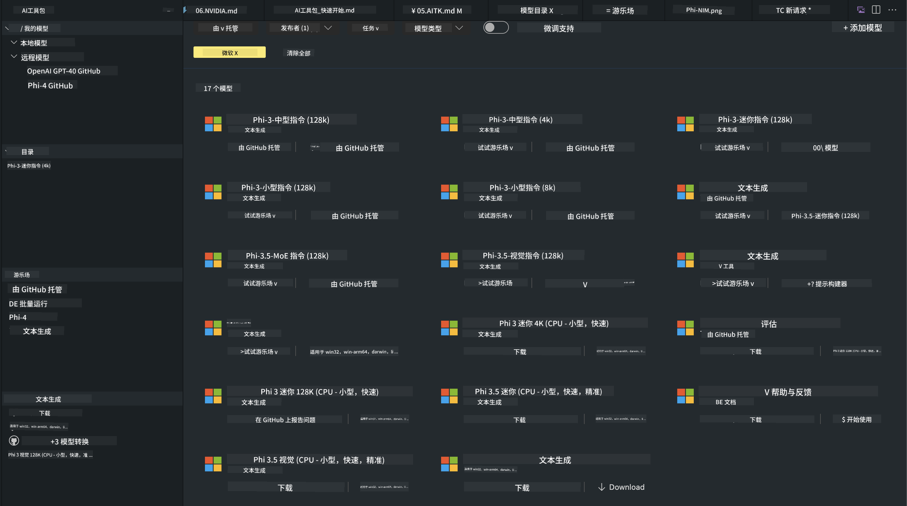
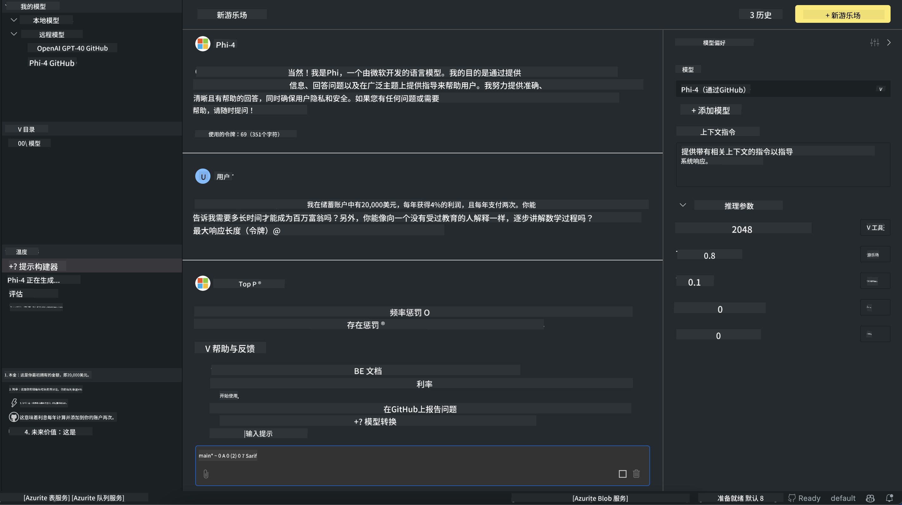

<!--
CO_OP_TRANSLATOR_METADATA:
{
  "original_hash": "4951d458c0b60c02cd1e751b40903877",
  "translation_date": "2025-05-07T15:05:31+00:00",
  "source_file": "md/01.Introduction/02/05.AITK.md",
  "language_code": "zh"
}
-->
# AITK 中的 Phi 家族

[AI Toolkit for VS Code](https://marketplace.visualstudio.com/items?itemName=ms-windows-ai-studio.windows-ai-studio) 通过整合来自 Azure AI Foundry Catalog 以及 Hugging Face 等目录的先进 AI 开发工具和模型，简化了生成式 AI 应用开发。你可以浏览由 GitHub Models 和 Azure AI Foundry Model Catalogs 支持的 AI 模型目录，下载到本地或远程，进行微调、测试并在应用中使用。

AI Toolkit 预览版将在本地运行。根据你选择的模型，进行本地推理或微调时，可能需要 NVIDIA CUDA GPU 等 GPU 支持。你也可以直接用 AITK 运行 GitHub Models。

## 快速开始

[了解如何安装 Windows 子系统 Linux](https://learn.microsoft.com/windows/wsl/install?WT.mc_id=aiml-137032-kinfeylo)

以及[更改默认发行版](https://learn.microsoft.com/windows/wsl/install#change-the-default-linux-distribution-installed)。

[AI Toolkit GitHub 仓库](https://github.com/microsoft/vscode-ai-toolkit/)

- 支持 Windows、Linux、macOS
  
- 在 Windows 和 Linux 上进行微调时，需要 Nvidia GPU。此外，**Windows** 需要安装带有 Ubuntu 18.04 及以上版本的 Linux 子系统。[了解如何安装 Windows 子系统 Linux](https://learn.microsoft.com/windows/wsl/install) 及[更改默认发行版](https://learn.microsoft.com/windows/wsl/install#change-the-default-linux-distribution-installed)。

### 安装 AI Toolkit

AI Toolkit 作为[Visual Studio Code 扩展](https://code.visualstudio.com/docs/setup/additional-components#_vs-code-extensions)发布，因此你需要先安装[VS Code](https://code.visualstudio.com/docs/setup/windows?WT.mc_id=aiml-137032-kinfeylo)，然后从[VS Marketplace](https://marketplace.visualstudio.com/items?itemName=ms-windows-ai-studio.windows-ai-studio)下载 AI Toolkit。
[AI Toolkit 可在 Visual Studio Marketplace](https://marketplace.visualstudio.com/items?itemName=ms-windows-ai-studio.windows-ai-studio)中获取，安装方式与其他 VS Code 扩展相同。

如果你不熟悉安装 VS Code 扩展，按照以下步骤操作：

### 登录

1. 在 VS Code 的活动栏中选择 **扩展**
1. 在扩展搜索栏输入 “AI Toolkit”
1. 选择 “AI Toolkit for Visual Studio code”
1. 点击 **安装**

现在，你可以开始使用该扩展了！

系统会提示你登录 GitHub，请点击“允许”继续。你将被重定向到 GitHub 登录页面。

请登录并按照流程操作。完成后，你会返回 VS Code。

扩展安装完成后，你会在活动栏看到 AI Toolkit 图标。

让我们来探索可用功能吧！

### 可用功能

AI Toolkit 的主侧边栏分为  

- **Models**
- **Resources**
- **Playground**  
- **Fine-tuning**
- **Evaluation**

这些都位于 Resources 部分。开始时请选择 **Model Catalog**。

### 从目录下载模型

启动 AI Toolkit 后，在 VS Code 侧边栏可以选择以下选项：



- 从 **Model Catalog** 中查找支持的模型并下载到本地
- 在 **Model Playground** 测试模型推理
- 在 **Model Fine-tuning** 中本地或远程微调模型
- 通过 AI Toolkit 命令面板将微调后的模型部署到云端
- 评估模型

> [!NOTE]
>
> **GPU 与 CPU**
>
> 你会发现模型卡片显示了模型大小、平台和加速器类型（CPU、GPU）。对于拥有至少一块 GPU 的 **Windows 设备**，请选择仅针对 Windows 优化的模型版本，以获得最佳性能。
>
> 这样可以确保你使用的是针对 DirectML 加速器优化的模型。
>
> 模型名称格式为
>
> - `{model_name}-{accelerator}-{quantization}-{format}`。
>
>要检查你的 Windows 设备是否有 GPU，打开 **任务管理器**，然后选择 **性能** 选项卡。如果有 GPU，会以 “GPU 0” 或 “GPU 1” 等名称显示。

### 在 Playground 中运行模型

所有参数设置完成后，点击 **Generate Project**。

模型下载完成后，在目录中的模型卡片上选择 **Load in Playground**：

- 启动模型下载
- 安装所有前置条件和依赖项
- 创建 VS Code 工作区



### 在应用中使用 REST API

AI Toolkit 自带一个本地 REST API 网络服务器，**监听端口 5272**，采用 [OpenAI 聊天完成格式](https://platform.openai.com/docs/api-reference/chat/create)。

这让你可以在本地测试应用，而无需依赖云端 AI 模型服务。例如，下面的 JSON 文件展示了如何配置请求体：

```json
{
    "model": "Phi-4",
    "messages": [
        {
            "role": "user",
            "content": "what is the golden ratio?"
        }
    ],
    "temperature": 0.7,
    "top_p": 1,
    "top_k": 10,
    "max_tokens": 100,
    "stream": true
}
```

你可以用 [Postman](https://www.postman.com/) 或 CURL（客户端 URL 工具）测试 REST API：

```bash
curl -vX POST http://127.0.0.1:5272/v1/chat/completions -H 'Content-Type: application/json' -d @body.json
```

### 使用 Python 的 OpenAI 客户端库

```python
from openai import OpenAI

client = OpenAI(
    base_url="http://127.0.0.1:5272/v1/", 
    api_key="x" # required for the API but not used
)

chat_completion = client.chat.completions.create(
    messages=[
        {
            "role": "user",
            "content": "what is the golden ratio?",
        }
    ],
    model="Phi-4",
)

print(chat_completion.choices[0].message.content)
```

### 使用 .NET 的 Azure OpenAI 客户端库

通过 NuGet 将 [.NET 版 Azure OpenAI 客户端库](https://www.nuget.org/packages/Azure.AI.OpenAI/) 添加到你的项目：

```bash
dotnet add {project_name} package Azure.AI.OpenAI --version 1.0.0-beta.17
```

向项目添加名为 **OverridePolicy.cs** 的 C# 文件，并粘贴以下代码：

```csharp
// OverridePolicy.cs
using Azure.Core.Pipeline;
using Azure.Core;

internal partial class OverrideRequestUriPolicy(Uri overrideUri)
    : HttpPipelineSynchronousPolicy
{
    private readonly Uri _overrideUri = overrideUri;

    public override void OnSendingRequest(HttpMessage message)
    {
        message.Request.Uri.Reset(_overrideUri);
    }
}
```

接着，将以下代码粘贴到你的 **Program.cs** 文件中：

```csharp
// Program.cs
using Azure.AI.OpenAI;

Uri localhostUri = new("http://localhost:5272/v1/chat/completions");

OpenAIClientOptions clientOptions = new();
clientOptions.AddPolicy(
    new OverrideRequestUriPolicy(localhostUri),
    Azure.Core.HttpPipelinePosition.BeforeTransport);
OpenAIClient client = new(openAIApiKey: "unused", clientOptions);

ChatCompletionsOptions options = new()
{
    DeploymentName = "Phi-4",
    Messages =
    {
        new ChatRequestSystemMessage("You are a helpful assistant. Be brief and succinct."),
        new ChatRequestUserMessage("What is the golden ratio?"),
    }
};

StreamingResponse<StreamingChatCompletionsUpdate> streamingChatResponse
    = await client.GetChatCompletionsStreamingAsync(options);

await foreach (StreamingChatCompletionsUpdate chatChunk in streamingChatResponse)
{
    Console.Write(chatChunk.ContentUpdate);
}
```


## 使用 AI Toolkit 进行微调

- 从模型发现和 Playground 入手
- 使用本地计算资源进行模型微调和推理
- 使用 Azure 资源进行远程微调和推理

[使用 AI Toolkit 进行微调](../../03.FineTuning/Finetuning_VSCodeaitoolkit.md)

## AI Toolkit 问答资源

请参考我们的[问答页面](https://github.com/microsoft/vscode-ai-toolkit/blob/main/archive/QA.md)了解常见问题及解决方案

**免责声明**：  
本文件使用AI翻译服务[Co-op Translator](https://github.com/Azure/co-op-translator)进行翻译。尽管我们力求准确，但请注意，自动翻译可能存在错误或不准确之处。原始语言版本的文件应被视为权威来源。对于重要信息，建议采用专业人工翻译。因使用本翻译而产生的任何误解或误释，我们不承担任何责任。