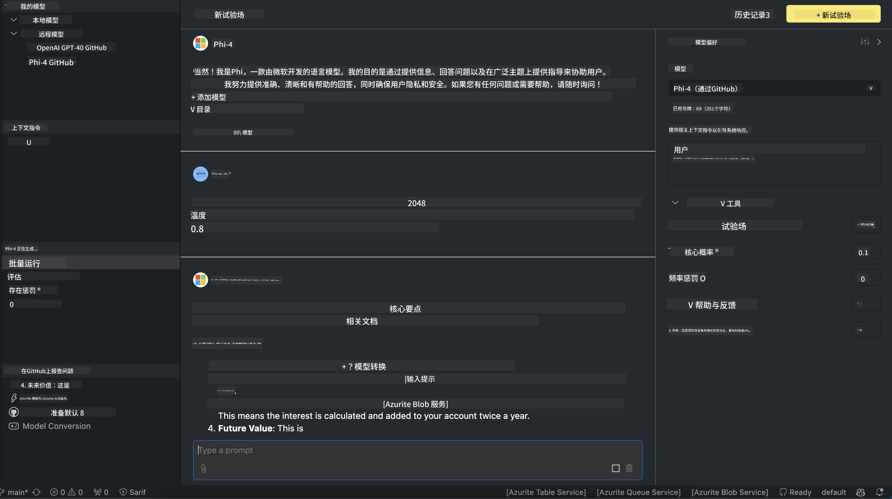

<!--
CO_OP_TRANSLATOR_METADATA:
{
  "original_hash": "9365fb38f5c75c4d7ac9b9a4baa7c9d1",
  "translation_date": "2025-04-03T06:45:24+00:00",
  "source_file": "md\\01.Introduction\\02\\05.AITK.md",
  "language_code": "zh"
}
-->
# AITK中的Phi家族

[AI Toolkit for VS Code](https://marketplace.visualstudio.com/items?itemName=ms-windows-ai-studio.windows-ai-studio) 通过整合来自Azure AI Foundry Catalog和其他目录（如Hugging Face）的尖端AI开发工具和模型，简化了生成式AI应用的开发。您可以浏览由GitHub Models和Azure AI Foundry Model Catalogs支持的AI模型目录，下载模型到本地或远程环境，进行微调、测试，并将其用于您的应用程序。

AI Toolkit预览版将在本地运行。无论是本地推理还是微调，都取决于您选择的模型。您可能需要具备GPU，例如NVIDIA CUDA GPU。此外，您还可以直接使用AITK运行GitHub模型。

## 入门指南

[了解如何安装Windows子系统Linux](https://learn.microsoft.com/windows/wsl/install?WT.mc_id=aiml-137032-kinfeylo)

以及[更改默认发行版](https://learn.microsoft.com/windows/wsl/install#change-the-default-linux-distribution-installed)。

[AI Toolkit GitHub Repo](https://github.com/microsoft/vscode-ai-toolkit/)

- Windows、Linux、macOS

- 若需在Windows和Linux上进行微调，您需要一块Nvidia GPU。此外，**Windows**需要安装带有Ubuntu 18.4或更高版本的Linux子系统。[了解如何安装Windows子系统Linux](https://learn.microsoft.com/windows/wsl/install)以及[更改默认发行版](https://learn.microsoft.com/windows/wsl/install#change-the-default-linux-distribution-installed)。

### 安装AI Toolkit

AI Toolkit作为[Visual Studio Code扩展](https://code.visualstudio.com/docs/setup/additional-components#_vs-code-extensions)提供，因此您需要先安装[VS Code](https://code.visualstudio.com/docs/setup/windows?WT.mc_id=aiml-137032-kinfeylo)，然后从[VS Marketplace](https://marketplace.visualstudio.com/items?itemName=ms-windows-ai-studio.windows-ai-studio)下载AI Toolkit。
[AI Toolkit在Visual Studio Marketplace中可用](https://marketplace.visualstudio.com/items?itemName=ms-windows-ai-studio.windows-ai-studio)，可以像其他VS Code扩展一样安装。

如果您不熟悉安装VS Code扩展，请按照以下步骤操作：

### 登录

1. 在VS Code的活动栏中选择**扩展**
1. 在扩展搜索栏中输入“AI Toolkit”
1. 选择“AI Toolkit for Visual Studio Code”
1. 点击**安装**

现在，您已准备好使用此扩展！

系统会提示您登录GitHub，请点击“允许”继续。您将被重定向到GitHub登录页面。

请登录并按照步骤完成流程。成功完成后，您将被重定向回VS Code。

安装扩展后，您会在活动栏中看到AI Toolkit图标。

让我们探索可用的操作！

### 可用操作

AI Toolkit的主侧边栏组织为以下部分：

- **模型**
- **资源**
- **实验室**
- **微调**
- **评估**

这些功能都可以在资源部分找到。要开始，请选择**模型目录**。

### 从目录下载模型

在从VS Code侧边栏启动AI Toolkit后，您可以选择以下选项：


- 从**模型目录**中找到支持的模型并下载到本地
- 在**模型实验室**中测试模型推理
- 在**模型微调**中本地或远程微调模型
- 通过AI Toolkit命令面板将微调后的模型部署到云端
- 评估模型

> [!NOTE]
>
> **GPU与CPU**
>
> 您会注意到模型卡显示了模型大小、平台以及加速器类型（CPU、GPU）。对于**至少拥有一个GPU的Windows设备**，请选择仅针对Windows优化的模型版本。
>
> 这确保您使用的是针对DirectML加速器优化的模型。
>
> 模型名称格式为
>
> - `{model_name}-{accelerator}-{quantization}-{format}`。
>
>要检查您的Windows设备是否有GPU，请打开**任务管理器**，然后选择**性能**选项卡。如果有GPU，它们会以“GPU 0”或“GPU 1”等名称列出。

### 在实验室中运行模型

设置好所有参数后，点击**生成项目**。

下载模型后，在目录中的模型卡上选择**加载到实验室**：

- 开始下载模型
- 安装所有必要的前置条件和依赖项
- 创建VS Code工作区



### 在应用中使用REST API

AI Toolkit附带了一个本地REST API Web服务器，**运行在端口5272**，使用[OpenAI聊天完成格式](https://platform.openai.com/docs/api-reference/chat/create)。

这使您可以在本地测试您的应用，而无需依赖云端AI模型服务。例如，以下JSON文件展示了如何配置请求体：

```json
{
    "model": "Phi-4",
    "messages": [
        {
            "role": "user",
            "content": "what is the golden ratio?"
        }
    ],
    "temperature": 0.7,
    "top_p": 1,
    "top_k": 10,
    "max_tokens": 100,
    "stream": true
}
```

您可以使用[Postman](https://www.postman.com/)或CURL（客户端URL）工具测试REST API：

```bash
curl -vX POST http://127.0.0.1:5272/v1/chat/completions -H 'Content-Type: application/json' -d @body.json
```

### 使用Python的OpenAI客户端库

```python
from openai import OpenAI

client = OpenAI(
    base_url="http://127.0.0.1:5272/v1/", 
    api_key="x" # required for the API but not used
)

chat_completion = client.chat.completions.create(
    messages=[
        {
            "role": "user",
            "content": "what is the golden ratio?",
        }
    ],
    model="Phi-4",
)

print(chat_completion.choices[0].message.content)
```

### 使用.NET的Azure OpenAI客户端库

通过NuGet将[Azure OpenAI客户端库](https://www.nuget.org/packages/Azure.AI.OpenAI/)添加到您的项目中：

```bash
dotnet add {project_name} package Azure.AI.OpenAI --version 1.0.0-beta.17
```

添加一个名为**OverridePolicy.cs**的C#文件到您的项目中，并粘贴以下代码：

```csharp
// OverridePolicy.cs
using Azure.Core.Pipeline;
using Azure.Core;

internal partial class OverrideRequestUriPolicy(Uri overrideUri)
    : HttpPipelineSynchronousPolicy
{
    private readonly Uri _overrideUri = overrideUri;

    public override void OnSendingRequest(HttpMessage message)
    {
        message.Request.Uri.Reset(_overrideUri);
    }
}
```

接下来，将以下代码粘贴到您的**Program.cs**文件中：

```csharp
// Program.cs
using Azure.AI.OpenAI;

Uri localhostUri = new("http://localhost:5272/v1/chat/completions");

OpenAIClientOptions clientOptions = new();
clientOptions.AddPolicy(
    new OverrideRequestUriPolicy(localhostUri),
    Azure.Core.HttpPipelinePosition.BeforeTransport);
OpenAIClient client = new(openAIApiKey: "unused", clientOptions);

ChatCompletionsOptions options = new()
{
    DeploymentName = "Phi-4",
    Messages =
    {
        new ChatRequestSystemMessage("You are a helpful assistant. Be brief and succinct."),
        new ChatRequestUserMessage("What is the golden ratio?"),
    }
};

StreamingResponse<StreamingChatCompletionsUpdate> streamingChatResponse
    = await client.GetChatCompletionsStreamingAsync(options);

await foreach (StreamingChatCompletionsUpdate chatChunk in streamingChatResponse)
{
    Console.Write(chatChunk.ContentUpdate);
}
```

## 使用AI Toolkit进行微调

- 从模型发现和实验室开始
- 使用本地计算资源进行模型微调和推理
- 使用Azure资源进行远程微调和推理

[使用AI Toolkit进行微调](../../03.FineTuning/Finetuning_VSCodeaitoolkit.md)

## AI Toolkit问答资源

请参考我们的[问答页面](https://github.com/microsoft/vscode-ai-toolkit/blob/main/archive/QA.md)，了解最常见的问题和解决方案

**免责声明**：  
本文档使用 AI 翻译服务 [Co-op Translator](https://github.com/Azure/co-op-translator) 进行翻译。尽管我们努力确保翻译的准确性，但请注意，自动翻译可能会包含错误或不准确之处。应以原始语言的文档为权威来源。对于关键信息，建议使用专业的人工翻译服务。我们对因使用此翻译而导致的任何误解或误读不承担责任。