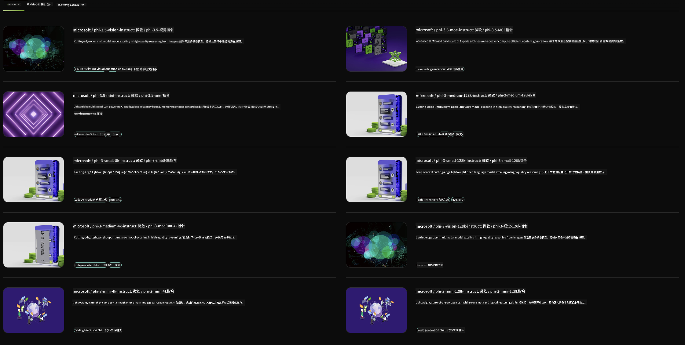

<!--
CO_OP_TRANSLATOR_METADATA:
{
  "original_hash": "6b028cdc5b33b99efb0f061bcff71023",
  "translation_date": "2025-04-03T06:46:27+00:00",
  "source_file": "md\\01.Introduction\\02\\06.NVIDIA.md",
  "language_code": "zh"
}
-->
## NVIDIA NIM中的Phi系列

NVIDIA NIM是一组易于使用的微服务，旨在加速生成式AI模型在云端、数据中心和工作站上的部署。NIM根据模型系列以及具体模型进行分类。例如，NVIDIA NIM针对大型语言模型（LLMs），将最先进的LLM能力带入企业应用，提供无与伦比的自然语言处理和理解能力。

NIM使IT和DevOps团队能够在自主管理的环境中轻松托管大型语言模型（LLMs），同时为开发者提供行业标准API，帮助他们构建强大的辅助工具、聊天机器人和AI助手，从而改变业务模式。借助NVIDIA尖端的GPU加速和可扩展部署，NIM提供了最快的推理路径，性能无与伦比。

您可以使用NVIDIA NIM对Phi系列模型进行推理。



### **示例 - NVIDIA NIM中的Phi-3-Vision**

假设您有一张图片 (`demo.png`)，并希望生成Python代码来处理这张图片并保存一个新版本 (`phi-3-vision.jpg`)。

上述代码通过以下步骤自动完成此过程：

1. 设置环境和必要的配置。
2. 创建一个提示，指示模型生成所需的Python代码。
3. 将提示发送到模型并收集生成的代码。
4. 提取并运行生成的代码。
5. 显示原始图片和处理后的图片。

这种方法利用AI的强大功能来自动化图像处理任务，使目标实现变得更简单、更快速。

[示例代码解决方案](../../../../../code/06.E2E/E2E_Nvidia_NIM_Phi3_Vision.ipynb)

我们逐步解析整个代码的功能：

1. **安装必要的包**：
    ```python
    !pip install langchain_nvidia_ai_endpoints -U
    ```
    此命令安装`langchain_nvidia_ai_endpoints`包，确保其为最新版本。

2. **导入必要模块**：
    ```python
    from langchain_nvidia_ai_endpoints import ChatNVIDIA
    import getpass
    import os
    import base64
    ```
    这些导入模块用于与NVIDIA AI端点交互、安全处理密码、与操作系统交互以及进行base64格式的编码/解码。

3. **设置API密钥**：
    ```python
    if not os.getenv("NVIDIA_API_KEY"):
        os.environ["NVIDIA_API_KEY"] = getpass.getpass("Enter your NVIDIA API key: ")
    ```
    此代码检查环境变量`NVIDIA_API_KEY`是否已设置。如果未设置，会提示用户安全地输入其API密钥。

4. **定义模型和图片路径**：
    ```python
    model = 'microsoft/phi-3-vision-128k-instruct'
    chat = ChatNVIDIA(model=model)
    img_path = './imgs/demo.png'
    ```
    此代码设置要使用的模型，创建一个指定模型的`ChatNVIDIA`实例，并定义图片文件的路径。

5. **创建文本提示**：
    ```python
    text = "Please create Python code for image, and use plt to save the new picture under imgs/ and name it phi-3-vision.jpg."
    ```
    此代码定义了一个文本提示，指示模型生成处理图片的Python代码。

6. **将图片编码为Base64**：
    ```python
    with open(img_path, "rb") as f:
        image_b64 = base64.b64encode(f.read()).decode()
    image = f''
    ```
    此代码读取图片文件，将其编码为Base64，并创建一个包含编码数据的HTML图片标签。

7. **将文本和图片合并到提示中**：
    ```python
    prompt = f"{text} {image}"
    ```
    此代码将文本提示和HTML图片标签合并为一个字符串。

8. **使用ChatNVIDIA生成代码**：
    ```python
    code = ""
    for chunk in chat.stream(prompt):
        print(chunk.content, end="")
        code += chunk.content
    ```
    此代码将提示发送到`ChatNVIDIA` model and collects the generated code in chunks, printing and appending each chunk to the `code`字符串。

9. **从生成内容中提取Python代码**：
    ```python
    begin = code.index('```python') + 9
    code = code[begin:]
    end = code.index('```')
    code = code[:end]
    ```
    此代码通过移除markdown格式，从生成内容中提取实际的Python代码。

10. **运行生成的代码**：
    ```python
    import subprocess
    result = subprocess.run(["python", "-c", code], capture_output=True)
    ```
    此代码将提取的Python代码作为子进程运行，并捕获其输出。

11. **显示图片**：
    ```python
    from IPython.display import Image, display
    display(Image(filename='./imgs/phi-3-vision.jpg'))
    display(Image(filename='./imgs/demo.png'))
    ```
    这些代码行通过`IPython.display`模块显示图片。

**免责声明**：  
本文档使用AI翻译服务[Co-op Translator](https://github.com/Azure/co-op-translator)进行翻译。尽管我们力求准确，但请注意，自动翻译可能包含错误或不准确之处。应以原文档的母语版本作为权威来源。对于关键信息，建议使用专业人工翻译。我们不对因使用此翻译而产生的任何误解或误读承担责任。