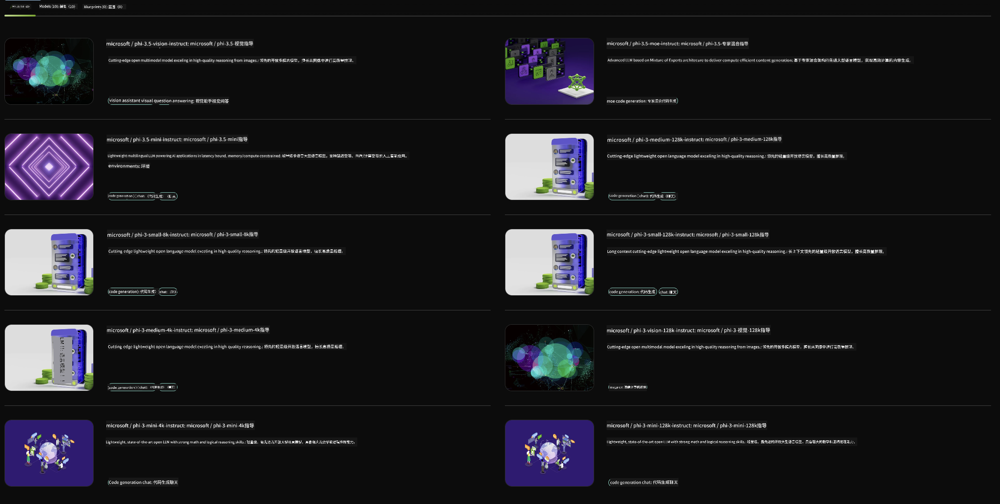

<!--
CO_OP_TRANSLATOR_METADATA:
{
  "original_hash": "7b08e277df2a9307f861ae54bc30c772",
  "translation_date": "2025-05-07T15:08:33+00:00",
  "source_file": "md/01.Introduction/02/06.NVIDIA.md",
  "language_code": "zh"
}
-->
## NVIDIA NIM中的Phi系列

NVIDIA NIM是一组易于使用的微服务，旨在加速生成式AI模型在云端、数据中心和工作站的部署。NIM根据模型家族和具体模型进行分类。例如，针对大型语言模型（LLMs）的NVIDIA NIM将最先进的LLM能力带入企业应用，提供无与伦比的自然语言处理和理解功能。

NIM让IT和DevOps团队能够轻松在自主管理的环境中托管大型语言模型（LLMs），同时为开发者提供行业标准的API，支持他们构建强大的协助工具、聊天机器人和AI助手，从而改变业务模式。借助NVIDIA领先的GPU加速和可扩展部署，NIM提供最快的推理路径和卓越性能。

你可以使用NVIDIA NIM来推理Phi系列模型



### **示例 - NVIDIA NIM中的Phi-3-Vision**

假设你有一张图片（`demo.png`），并希望生成Python代码来处理这张图片并保存一份新的版本（`phi-3-vision.jpg`）。

上面的代码实现了这一过程的自动化：

1. 设置环境和必要的配置。
2. 创建提示，指示模型生成所需的Python代码。
3. 将提示发送给模型并收集生成的代码。
4. 提取并运行生成的代码。
5. 显示原始图片和处理后的图片。

这种方法利用AI的强大能力自动化图像处理任务，使你更轻松、更快速地实现目标。

[示例代码解决方案](../../../../../code/06.E2E/E2E_Nvidia_NIM_Phi3_Vision.ipynb)

让我们逐步解析整段代码的作用：

1. **安装所需的包**：
    ```python
    !pip install langchain_nvidia_ai_endpoints -U
    ```
    该命令安装`langchain_nvidia_ai_endpoints`包，确保为最新版本。

2. **导入必要的模块**：
    ```python
    from langchain_nvidia_ai_endpoints import ChatNVIDIA
    import getpass
    import os
    import base64
    ```
    这些导入包含与NVIDIA AI端点交互、密码安全处理、操作系统交互以及Base64编码/解码相关的模块。

3. **设置API密钥**：
    ```python
    if not os.getenv("NVIDIA_API_KEY"):
        os.environ["NVIDIA_API_KEY"] = getpass.getpass("Enter your NVIDIA API key: ")
    ```
    该代码检查是否设置了`NVIDIA_API_KEY`环境变量。如果未设置，则提示用户安全输入API密钥。

4. **定义模型和图片路径**：
    ```python
    model = 'microsoft/phi-3-vision-128k-instruct'
    chat = ChatNVIDIA(model=model)
    img_path = './imgs/demo.png'
    ```
    这里设置要使用的模型，创建指定模型的`ChatNVIDIA`实例，并定义图片文件路径。

5. **创建文本提示**：
    ```python
    text = "Please create Python code for image, and use plt to save the new picture under imgs/ and name it phi-3-vision.jpg."
    ```
    该提示指示模型生成用于处理图片的Python代码。

6. **将图片编码为Base64**：
    ```python
    with open(img_path, "rb") as f:
        image_b64 = base64.b64encode(f.read()).decode()
    image = f''
    ```
    该代码读取图片文件，将其编码为Base64，并创建包含编码数据的HTML图片标签。

7. **将文本和图片合并为提示**：
    ```python
    prompt = f"{text} {image}"
    ```
    这一步将文本提示和HTML图片标签合并为一个字符串。

8. **使用ChatNVIDIA生成代码**：
    ```python
    code = ""
    for chunk in chat.stream(prompt):
        print(chunk.content, end="")
        code += chunk.content
    ```
    该代码将提示发送给`ChatNVIDIA`，并将生成的响应存储在`code`字符串中。

9. **从生成内容中提取Python代码**：
    ```python
    begin = code.index('```python') + 9
    code = code[begin:]
    end = code.index('```')
    code = code[:end]
    ```
    通过去除markdown格式，从生成内容中提取实际的Python代码。

10. **运行生成的代码**：
    ```python
    import subprocess
    result = subprocess.run(["python", "-c", code], capture_output=True)
    ```
    这一步作为子进程运行提取的Python代码，并捕获其输出。

11. **显示图片**：
    ```python
    from IPython.display import Image, display
    display(Image(filename='./imgs/phi-3-vision.jpg'))
    display(Image(filename='./imgs/demo.png'))
    ```
    这些代码使用`IPython.display`模块显示图片。

**免责声明**：  
本文件使用 AI 翻译服务 [Co-op Translator](https://github.com/Azure/co-op-translator) 进行翻译。虽然我们力求准确，但请注意自动翻译可能存在错误或不准确之处。原始文件的母语版本应被视为权威来源。对于重要信息，建议采用专业人工翻译。因使用本翻译而引起的任何误解或误释，我们不承担任何责任。