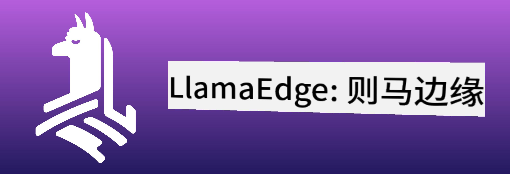
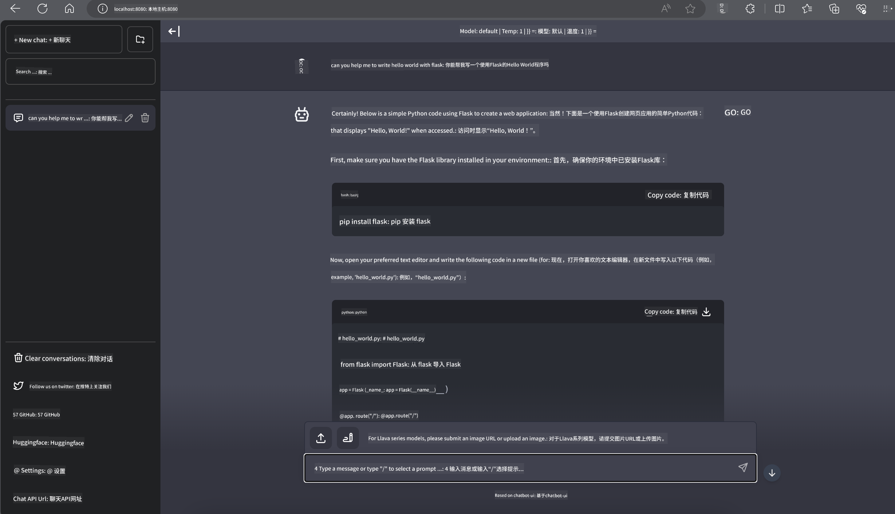

<!--
CO_OP_TRANSLATOR_METADATA:
{
  "original_hash": "be4101a30d98e95a71d42c276e8bcd37",
  "translation_date": "2025-05-07T14:28:42+00:00",
  "source_file": "md/01.Introduction/03/Jetson_Inference.md",
  "language_code": "zh"
}
-->
# **在 Nvidia Jetson 上推理 Phi-3**

Nvidia Jetson 是 Nvidia 推出的一系列嵌入式计算板。Jetson TK1、TX1 和 TX2 型号均搭载了 Nvidia 的 Tegra 处理器（或 SoC），集成了基于 ARM 架构的中央处理器（CPU）。Jetson 是一款低功耗系统，专为加速机器学习应用设计。Nvidia Jetson 被专业开发者用于打造各行业的突破性 AI 产品，同时也被学生和爱好者用于动手学习 AI 和制作精彩项目。SLM 部署在 Jetson 等边缘设备上，将推动工业生成式 AI 应用场景的更好实现。

## 在 NVIDIA Jetson 上部署：
从事自主机器人和嵌入式设备开发的人员可以利用 Phi-3 Mini。Phi-3 体积相对较小，非常适合边缘部署。训练过程中参数经过精心调优，确保响应的高准确度。

### TensorRT-LLM 优化：
NVIDIA 的 [TensorRT-LLM 库](https://github.com/NVIDIA/TensorRT-LLM?WT.mc_id=aiml-138114-kinfeylo) 优化了大型语言模型的推理。它支持 Phi-3 Mini 的长上下文窗口，提升吞吐量和延迟表现。优化技术包括 LongRoPE、FP8 以及飞行批处理等。

### 可用性与部署：
开发者可以在 [NVIDIA 的 AI 页面](https://www.nvidia.com/en-us/ai-data-science/generative-ai/) 探索带有 128K 上下文窗口的 Phi-3 Mini。它被打包成 NVIDIA NIM，一种具有标准 API 的微服务，可以部署到任何地方。此外，相关的 [TensorRT-LLM GitHub 实现](https://github.com/NVIDIA/TensorRT-LLM) 也可供参考。

## **1. 准备工作**

a. Jetson Orin NX / Jetson NX

b. JetPack 5.1.2+

c. Cuda 11.8

d. Python 3.8+

## **2. 在 Jetson 上运行 Phi-3**

我们可以选择使用 [Ollama](https://ollama.com) 或 [LlamaEdge](https://llamaedge.com)

如果想同时在云端和边缘设备使用 gguf，LlamaEdge 可以理解为 WasmEdge（WasmEdge 是一个轻量级、高性能、可扩展的 WebAssembly 运行时，适用于云原生、边缘和去中心化应用。它支持无服务器应用、嵌入式函数、微服务、智能合约和物联网设备）。你可以通过 LlamaEdge 将 gguf 的量化模型部署到边缘设备和云端。



使用步骤如下：

1. 安装并下载相关库和文件

```bash

curl -sSf https://raw.githubusercontent.com/WasmEdge/WasmEdge/master/utils/install.sh | bash -s -- --plugin wasi_nn-ggml

curl -LO https://github.com/LlamaEdge/LlamaEdge/releases/latest/download/llama-api-server.wasm

curl -LO https://github.com/LlamaEdge/chatbot-ui/releases/latest/download/chatbot-ui.tar.gz

tar xzf chatbot-ui.tar.gz

```

**注意**：llama-api-server.wasm 和 chatbot-ui 需要放在同一目录下

2. 在终端运行脚本

```bash

wasmedge --dir .:. --nn-preload default:GGML:AUTO:{Your gguf path} llama-api-server.wasm -p phi-3-chat

```

运行结果如下



***示例代码*** [Phi-3 mini WASM Notebook 示例](https://github.com/Azure-Samples/Phi-3MiniSamples/tree/main/wasm)

总结来说，Phi-3 Mini 在语言模型领域实现了飞跃，结合了高效性、上下文感知能力和 NVIDIA 的优化实力。无论你是在打造机器人还是边缘应用，Phi-3 Mini 都是一个值得关注的强大工具。

**免责声明**：  
本文件由 AI 翻译服务 [Co-op Translator](https://github.com/Azure/co-op-translator) 翻译而成。虽然我们力求准确，但请注意，自动翻译可能存在错误或不准确之处。原始文件的原文版本应被视为权威来源。对于重要信息，建议采用专业人工翻译。对于因使用本翻译而产生的任何误解或曲解，我们概不负责。