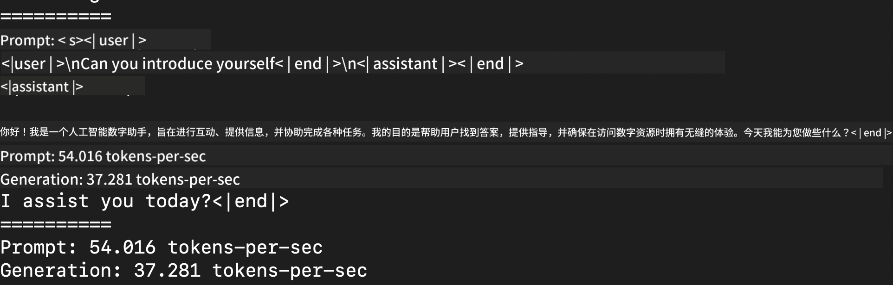
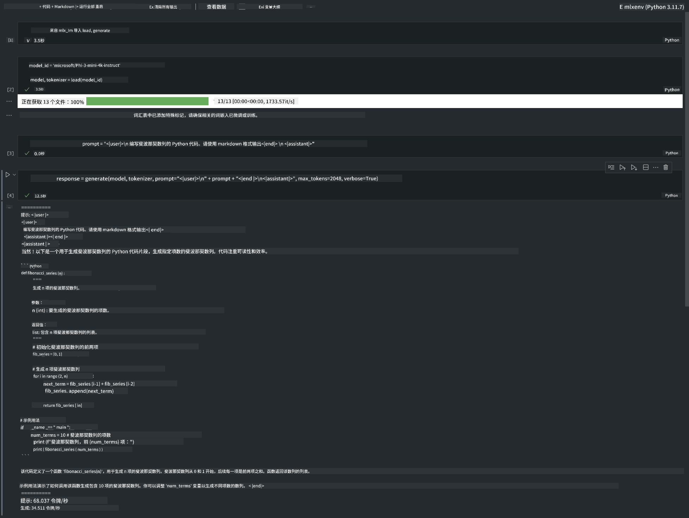

<!--
CO_OP_TRANSLATOR_METADATA:
{
  "original_hash": "dcb656f3d206fc4968e236deec5d4384",
  "translation_date": "2025-07-16T21:01:04+00:00",
  "source_file": "md/01.Introduction/03/MLX_Inference.md",
  "language_code": "zh"
}
-->
# **使用 Apple MLX 框架推理 Phi-3**

## **什么是 MLX 框架**

MLX 是一个面向 Apple 硅芯片的机器学习研究数组框架，由 Apple 机器学习研究团队开发。

MLX 由机器学习研究人员为机器学习研究人员设计。该框架旨在用户友好，同时在训练和部署模型时保持高效。框架本身的设计也非常简洁。我们的目标是让研究人员能够轻松扩展和改进 MLX，从而快速探索新想法。

通过 MLX，LLM 可以在 Apple 硅芯片设备上加速运行，模型也可以非常方便地在本地执行。

## **使用 MLX 推理 Phi-3-mini**

### **1. 设置你的 MLX 环境**

1. Python 3.11.x  
2. 安装 MLX 库


```bash

pip install mlx-lm

```

### **2. 在终端使用 MLX 运行 Phi-3-mini**


```bash

python -m mlx_lm.generate --model microsoft/Phi-3-mini-4k-instruct --max-token 2048 --prompt  "<|user|>\nCan you introduce yourself<|end|>\n<|assistant|>"

```

结果（我的环境是 Apple M1 Max，64GB）如下


### **3. 在终端使用 MLX 对 Phi-3-mini 进行量化**


```bash

python -m mlx_lm.convert --hf-path microsoft/Phi-3-mini-4k-instruct

```

***Note：*** 模型可以通过 mlx_lm.convert 进行量化，默认量化方式是 INT4。此示例将 Phi-3-mini 量化为 INT4。

模型可以通过 mlx_lm.convert 进行量化，默认量化方式是 INT4。此示例是将 Phi-3-mini 量化为 INT4。量化后，模型将存储在默认目录 ./mlx_model 中。

我们可以从终端测试使用 MLX 量化后的模型


```bash

python -m mlx_lm.generate --model ./mlx_model/ --max-token 2048 --prompt  "<|user|>\nCan you introduce yourself<|end|>\n<|assistant|>"

```

结果如下




### **4. 在 Jupyter Notebook 中使用 MLX 运行 Phi-3-mini**




***Note:*** 请阅读此示例 [点击此链接](../../../../../code/03.Inference/MLX/MLX_DEMO.ipynb)


## **资源**

1. 了解 Apple MLX 框架 [https://ml-explore.github.io](https://ml-explore.github.io/mlx/build/html/index.html)

2. Apple MLX GitHub 仓库 [https://github.com/ml-explore](https://github.com/ml-explore)

**免责声明**：  
本文件使用 AI 翻译服务 [Co-op Translator](https://github.com/Azure/co-op-translator) 进行翻译。虽然我们力求准确，但请注意，自动翻译可能包含错误或不准确之处。原始文件的母语版本应被视为权威来源。对于重要信息，建议采用专业人工翻译。对于因使用本翻译而产生的任何误解或误释，我们概不负责。