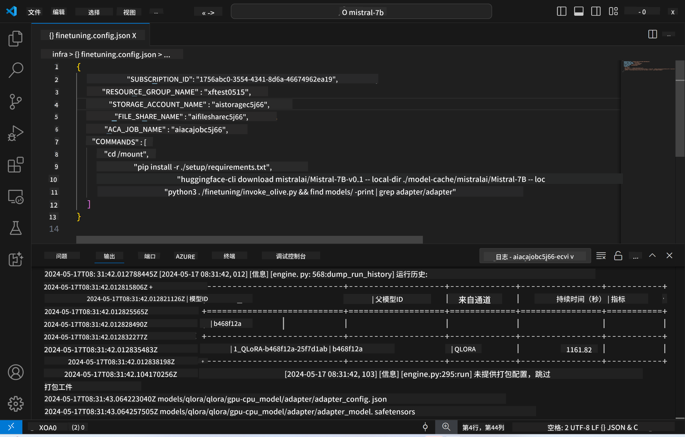

<!--
CO_OP_TRANSLATOR_METADATA:
{
  "original_hash": "a54cd3d65b6963e4e8ce21e143c3ab04",
  "translation_date": "2025-07-16T21:15:43+00:00",
  "source_file": "md/01.Introduction/03/Remote_Interence.md",
  "language_code": "zh"
}
-->
# 使用微调模型进行远程推理

在远程环境中训练好适配器后，可以使用一个简单的 Gradio 应用与模型进行交互。



### 配置 Azure 资源
你需要通过命令面板执行 `AI Toolkit: Provision Azure Container Apps for inference` 来设置远程推理所需的 Azure 资源。设置过程中会要求你选择 Azure 订阅和资源组。  

   
默认情况下，推理所用的订阅和资源组应与微调时使用的保持一致。推理将使用相同的 Azure Container App 环境，并访问存储在 Azure Files 中的模型和模型适配器，这些都是在微调步骤中生成的。

## 使用 AI Toolkit

### 推理部署  
如果你想修改推理代码或重新加载推理模型，请执行 `AI Toolkit: Deploy for inference` 命令。此操作会将你最新的代码同步到 ACA 并重启副本。


部署成功后，模型即可通过该端点进行评估。

### 访问推理 API

你可以通过点击 VSCode 通知中显示的“*Go to Inference Endpoint*”按钮访问推理 API。或者，也可以在 `./infra/inference.config.json` 文件中的 `ACA_APP_ENDPOINT` 以及输出面板中找到 Web API 端点。


> **Note:** 推理端点可能需要几分钟时间才能完全启动。

## 模板中包含的推理组件

| 文件夹 | 内容 |
| ------ |--------- |
| `infra` | 包含远程操作所需的所有配置。 |
| `infra/provision/inference.parameters.json` | 存放 bicep 模板参数，用于推理的 Azure 资源配置。 |
| `infra/provision/inference.bicep` | 用于推理的 Azure 资源配置模板。 |
| `infra/inference.config.json` | 配置文件，由 `AI Toolkit: Provision Azure Container Apps for inference` 命令生成，作为其他远程命令面板的输入。 |

### 使用 AI Toolkit 配置 Azure 资源
配置 [AI Toolkit](https://marketplace.visualstudio.com/items?itemName=ms-windows-ai-studio.windows-ai-studio)

执行 `Provision Azure Container Apps for inference` 命令。

你可以在 `./infra/provision/inference.parameters.json` 文件中找到配置参数。具体如下：

| 参数 | 说明 |
| --------- |------------ |
| `defaultCommands` | 启动 Web API 的命令。 |
| `maximumInstanceCount` | 设置 GPU 实例的最大数量。 |
| `location` | Azure 资源的部署位置，默认与所选资源组位置相同。 |
| `storageAccountName`、`fileShareName`、`acaEnvironmentName`、`acaEnvironmentStorageName`、`acaAppName`、`acaLogAnalyticsName` | 用于命名 Azure 资源的参数。默认与微调时使用的资源名称相同。你可以输入新的未使用资源名来创建自定义资源，或者输入已有 Azure 资源的名称以复用。详情请参见[使用已有 Azure 资源](../../../../../md/01.Introduction/03)部分。 |

### 使用已有 Azure 资源

默认情况下，推理配置会使用微调时相同的 Azure Container App 环境、存储账户、Azure 文件共享和 Azure Log Analytics。推理 API 会单独创建一个 Azure Container App。

如果你在微调步骤中自定义了 Azure 资源，或者想使用自己已有的 Azure 资源进行推理，请在 `./infra/inference.parameters.json` 文件中指定它们的名称。然后，从命令面板运行 `AI Toolkit: Provision Azure Container Apps for inference` 命令。该命令会更新指定的资源并创建缺失的资源。

例如，如果你已有一个 Azure 容器环境，你的 `./infra/finetuning.parameters.json` 文件应如下所示：

```json
{
    "$schema": "https://schema.management.azure.com/schemas/2019-04-01/deploymentParameters.json#",
    "contentVersion": "1.0.0.0",
    "parameters": {
      ...
      "acaEnvironmentName": {
        "value": "<your-aca-env-name>"
      },
      "acaEnvironmentStorageName": {
        "value": null
      },
      ...
    }
  }
```

### 手动配置  
如果你更倾向于手动配置 Azure 资源，可以使用 `./infra/provision` 文件夹中提供的 bicep 文件。如果你已经完成了所有 Azure 资源的设置且未使用 AI Toolkit 命令面板，只需将资源名称填写到 `inference.config.json` 文件中即可。

例如：

```json
{
  "SUBSCRIPTION_ID": "<your-subscription-id>",
  "RESOURCE_GROUP_NAME": "<your-resource-group-name>",
  "STORAGE_ACCOUNT_NAME": "<your-storage-account-name>",
  "FILE_SHARE_NAME": "<your-file-share-name>",
  "ACA_APP_NAME": "<your-aca-name>",
  "ACA_APP_ENDPOINT": "<your-aca-endpoint>"
}
```

**免责声明**：  
本文件使用 AI 翻译服务 [Co-op Translator](https://github.com/Azure/co-op-translator) 进行翻译。虽然我们力求准确，但请注意，自动翻译可能包含错误或不准确之处。原始文件的母语版本应被视为权威来源。对于重要信息，建议使用专业人工翻译。对于因使用本翻译而产生的任何误解或误释，我们不承担任何责任。