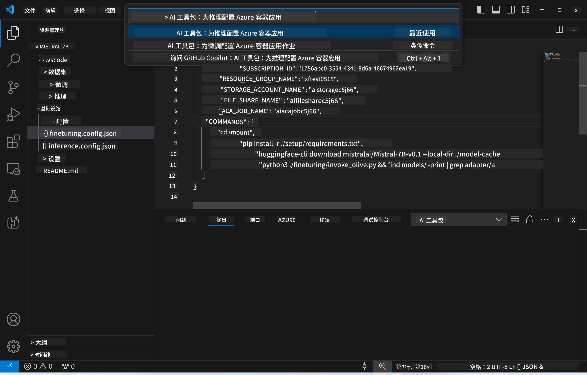

<!--
CO_OP_TRANSLATOR_METADATA:
{
  "original_hash": "a54cd3d65b6963e4e8ce21e143c3ab04",
  "translation_date": "2025-05-07T14:32:45+00:00",
  "source_file": "md/01.Introduction/03/Remote_Interence.md",
  "language_code": "zh"
}
-->
# 使用微调模型进行远程推理

适配器在远程环境中训练完成后，可以使用一个简单的 Gradio 应用与模型进行交互。


### 配置 Azure 资源
你需要通过命令面板执行 `AI Toolkit: Provision Azure Container Apps for inference` 来设置用于远程推理的 Azure 资源。设置过程中会要求你选择 Azure 订阅和资源组。  


默认情况下，推理所用的订阅和资源组应与微调时使用的保持一致。推理将使用相同的 Azure 容器应用环境，并访问存储在 Azure 文件中的模型和模型适配器，这些内容是在微调步骤中生成的。

## 使用 AI Toolkit

### 推理部署  
如果你想修改推理代码或重新加载推理模型，请执行 `AI Toolkit: Deploy for inference` 命令。此操作会将你最新的代码同步到 ACA 并重启副本。


部署成功后，模型即可通过该端点进行评估。

### 访问推理 API

你可以通过点击 VSCode 通知中显示的“*Go to Inference Endpoint*”按钮访问推理 API。或者，也可以在 `./infra/inference.config.json` 中的 `ACA_APP_ENDPOINT` 以及输出面板找到 Web API 端点。


> **Note:** 推理端点可能需要几分钟时间才能完全启动。

## 模板中包含的推理组件

| 文件夹 | 内容 |
| ------ |--------- |
| `infra` | 包含远程操作所需的所有配置。 |
| `infra/provision/inference.parameters.json` | 存放 bicep 模板的参数，用于配置推理所需的 Azure 资源。 |
| `infra/provision/inference.bicep` | 包含用于配置推理 Azure 资源的模板。 |
| `infra/inference.config.json` | 配置文件，由 `AI Toolkit: Provision Azure Container Apps for inference` 命令生成，用作其他远程命令面板的输入。 |

### 使用 AI Toolkit 配置 Azure 资源配置
配置 [AI Toolkit](https://marketplace.visualstudio.com/items?itemName=ms-windows-ai-studio.windows-ai-studio)

为推理配置 Azure 容器应用` command.

You can find configuration parameters in `./infra/provision/inference.parameters.json` file. Here are the details:
| Parameter | Description |
| --------- |------------ |
| `defaultCommands` | This is the commands to initiate a web API. |
| `maximumInstanceCount` | This parameter sets the maximum capacity of GPU instances. |
| `location` | This is the location where Azure resources are provisioned. The default value is the same as the chosen resource group's location. |
| `storageAccountName`, `fileShareName` `acaEnvironmentName`, `acaEnvironmentStorageName`, `acaAppName`,  `acaLogAnalyticsName` | These parameters are used to name the Azure resources for provision. By default, they will be same to the fine-tuning resource name. You can input a new, unused resource name to create your own custom-named resources, or you can input the name of an already existing Azure resource if you'd prefer to use that. For details, refer to the section [Using existing Azure Resources](../../../../../md/01.Introduction/03). |

### Using Existing Azure Resources

By default, the inference provision use the same Azure Container App Environment, Storage Account, Azure File Share, and Azure Log Analytics that were used for fine-tuning. A separate Azure Container App is created solely for the inference API. 

If you have customized the Azure resources during the fine-tuning step or want to use your own existing Azure resources for inference, specify their names in the `./infra/inference.parameters.json` 文件。然后，从命令面板运行 `AI Toolkit: Provision Azure Container Apps for inference` 命令。此命令会更新指定的资源，并创建缺失的资源。

例如，如果你已有一个现成的 Azure 容器环境，你的 `./infra/finetuning.parameters.json` 文件应如下所示：

```json
{
    "$schema": "https://schema.management.azure.com/schemas/2019-04-01/deploymentParameters.json#",
    "contentVersion": "1.0.0.0",
    "parameters": {
      ...
      "acaEnvironmentName": {
        "value": "<your-aca-env-name>"
      },
      "acaEnvironmentStorageName": {
        "value": null
      },
      ...
    }
  }
```

### 手动配置  
如果你更倾向于手动配置 Azure 资源，可以使用 `./infra/provision` folders. If you have already set up and configured all the Azure resources without using the AI Toolkit command palette, you can simply enter the resource names in the `inference.config.json` 文件中提供的 bicep 文件。

例如：

```json
{
  "SUBSCRIPTION_ID": "<your-subscription-id>",
  "RESOURCE_GROUP_NAME": "<your-resource-group-name>",
  "STORAGE_ACCOUNT_NAME": "<your-storage-account-name>",
  "FILE_SHARE_NAME": "<your-file-share-name>",
  "ACA_APP_NAME": "<your-aca-name>",
  "ACA_APP_ENDPOINT": "<your-aca-endpoint>"
}
```

**免责声明**：  
本文件由AI翻译服务[Co-op Translator](https://github.com/Azure/co-op-translator)翻译而成。尽管我们努力确保翻译的准确性，但请注意自动翻译可能存在错误或不准确之处。原始语言版本的文件应被视为权威来源。对于重要信息，建议采用专业人工翻译。因使用本翻译内容而产生的任何误解或误释，我们概不负责。