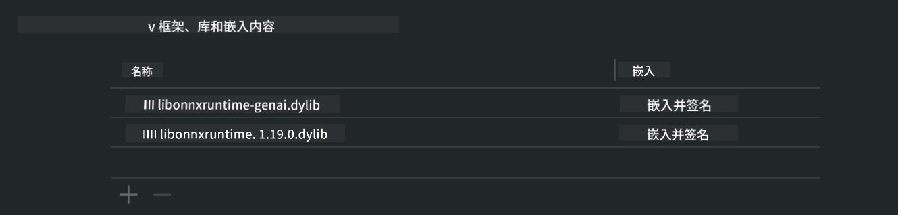
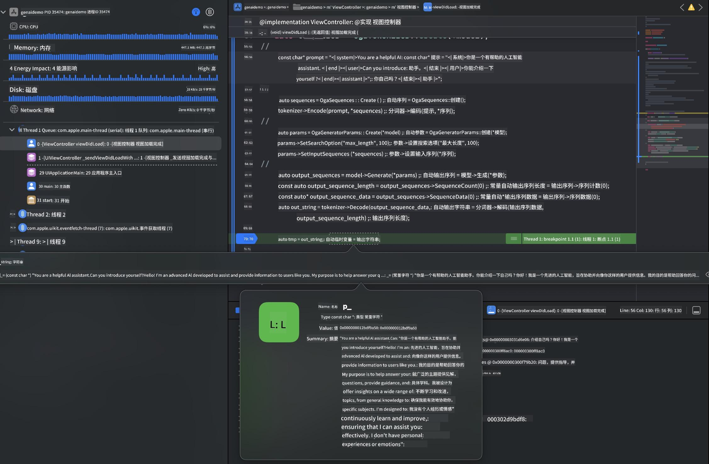

<!--
CO_OP_TRANSLATOR_METADATA:
{
  "original_hash": "82af197df38d25346a98f1f0e84d1698",
  "translation_date": "2025-05-07T14:29:45+00:00",
  "source_file": "md/01.Introduction/03/iOS_Inference.md",
  "language_code": "zh"
}
-->
# **在 iOS 上推理 Phi-3**

Phi-3-mini 是微软推出的一系列新模型，支持在边缘设备和物联网设备上部署大型语言模型（LLM）。Phi-3-mini 可用于 iOS、Android 和边缘设备部署，使生成式 AI 能够在自带设备（BYOD）环境中运行。以下示例演示了如何在 iOS 上部署 Phi-3-mini。

## **1. 准备工作**

- **a.** macOS 14 及以上版本  
- **b.** Xcode 15 及以上版本  
- **c.** iOS SDK 17.x（iPhone 14 A16 或更高版本）  
- **d.** 安装 Python 3.10 及以上版本（推荐使用 Conda）  
- **e.** 安装 Python 库：`python-flatbuffers`  
- **f.** 安装 CMake  

### 语义内核与推理

语义内核是一个应用框架，支持创建兼容 Azure OpenAI 服务、OpenAI 模型乃至本地模型的应用。通过语义内核访问本地服务，可以方便地集成自托管的 Phi-3-mini 模型服务器。

### 使用 Ollama 或 LlamaEdge 调用量化模型

许多用户喜欢使用量化模型在本地运行。 [Ollama](https://ollama.com) 和 [LlamaEdge](https://llamaedge.com) 支持调用多种量化模型：

#### **Ollama**

你可以直接运行 `ollama run phi3`，或者离线配置。创建一个 Modelfile，指定 `gguf` 文件的路径。以下是运行 Phi-3-mini 量化模型的示例代码：

```gguf
FROM {Add your gguf file path}
TEMPLATE \"\"\"<|user|> .Prompt<|end|> <|assistant|>\"\"\"
PARAMETER stop <|end|>
PARAMETER num_ctx 4096
```

#### **LlamaEdge**

如果想在云端和边缘设备同时使用 `gguf`，LlamaEdge 是不错的选择。

## **2. 为 iOS 编译 ONNX Runtime**

```bash

git clone https://github.com/microsoft/onnxruntime.git

cd onnxruntime

./build.sh --build_shared_lib --ios --skip_tests --parallel --build_dir ./build_ios --ios --apple_sysroot iphoneos --osx_arch arm64 --apple_deploy_target 17.5 --cmake_generator Xcode --config Release

cd ../

```

### **注意**

- **a.** 编译前，请确保 Xcode 已正确配置，并在终端设置为活动开发者目录：

    ```bash
    sudo xcode-select -switch /Applications/Xcode.app/Contents/Developer
    ```

- **b.** ONNX Runtime 需要针对不同平台编译。iOS 平台可编译 `arm64` or `x86_64`。

- **c.** 推荐使用最新的 iOS SDK 进行编译，但如果需要兼容旧版本 SDK，也可以使用较旧版本。

## **3. 使用 ONNX Runtime 为 iOS 编译生成式 AI**

> **注意：** 由于基于 ONNX Runtime 的生成式 AI 仍处于预览阶段，可能会有变动。

```bash

git clone https://github.com/microsoft/onnxruntime-genai
 
cd onnxruntime-genai
 
mkdir ort
 
cd ort
 
mkdir include
 
mkdir lib
 
cd ../
 
cp ../onnxruntime/include/onnxruntime/core/session/onnxruntime_c_api.h ort/include
 
cp ../onnxruntime/build_ios/Release/Release-iphoneos/libonnxruntime*.dylib* ort/lib
 
export OPENCV_SKIP_XCODEBUILD_FORCE_TRYCOMPILE_DEBUG=1
 
python3 build.py --parallel --build_dir ./build_ios --ios --ios_sysroot iphoneos --ios_arch arm64 --ios_deployment_target 17.5 --cmake_generator Xcode --cmake_extra_defines CMAKE_XCODE_ATTRIBUTE_CODE_SIGNING_ALLOWED=NO

```

## **4. 在 Xcode 中创建 App 应用**

我选择使用 Objective-C 进行 App 开发，因为通过 ONNX Runtime C++ API 使用生成式 AI 时，Objective-C 兼容性更好。当然，也可以通过 Swift 桥接实现相关调用。


## **5. 将 ONNX 量化的 INT4 模型复制到 App 项目中**

我们需要导入 ONNX 格式的 INT4 量化模型，需先下载该模型。


下载完成后，将模型添加到 Xcode 项目的 Resources 目录下。


## **6. 在 ViewControllers 中添加 C++ API**

> **注意：**

- **a.** 将对应的 C++ 头文件添加到项目中。

  

- **b.** 在 `onnxruntime-genai` dynamic library in Xcode.

  

- **c.** Use the C Samples code for testing. You can also add additional features like ChatUI for more functionality.

- **d.** Since you need to use C++ in your project, rename `ViewController.m` to `ViewController.mm` 中包含相关代码，以启用 Objective-C++ 支持。

```objc

    NSString *llmPath = [[NSBundle mainBundle] resourcePath];
    char const *modelPath = llmPath.cString;

    auto model =  OgaModel::Create(modelPath);

    auto tokenizer = OgaTokenizer::Create(*model);

    const char* prompt = "<|system|>You are a helpful AI assistant.<|end|><|user|>Can you introduce yourself?<|end|><|assistant|>";

    auto sequences = OgaSequences::Create();
    tokenizer->Encode(prompt, *sequences);

    auto params = OgaGeneratorParams::Create(*model);
    params->SetSearchOption("max_length", 100);
    params->SetInputSequences(*sequences);

    auto output_sequences = model->Generate(*params);
    const auto output_sequence_length = output_sequences->SequenceCount(0);
    const auto* output_sequence_data = output_sequences->SequenceData(0);
    auto out_string = tokenizer->Decode(output_sequence_data, output_sequence_length);
    
    auto tmp = out_string;

```

## **7. 运行应用**

完成上述设置后，即可运行应用，查看 Phi-3-mini 模型推理结果。



更多示例代码和详细说明，请访问 [Phi-3 Mini Samples 仓库](https://github.com/Azure-Samples/Phi-3MiniSamples/tree/main/ios)。

**免责声明**：  
本文件使用 AI 翻译服务 [Co-op Translator](https://github.com/Azure/co-op-translator) 进行翻译。尽管我们努力确保准确性，但请注意自动翻译可能存在错误或不准确之处。原始文件的母语版本应被视为权威来源。对于重要信息，建议采用专业人工翻译。我们不对因使用本翻译而产生的任何误解或误释承担责任。