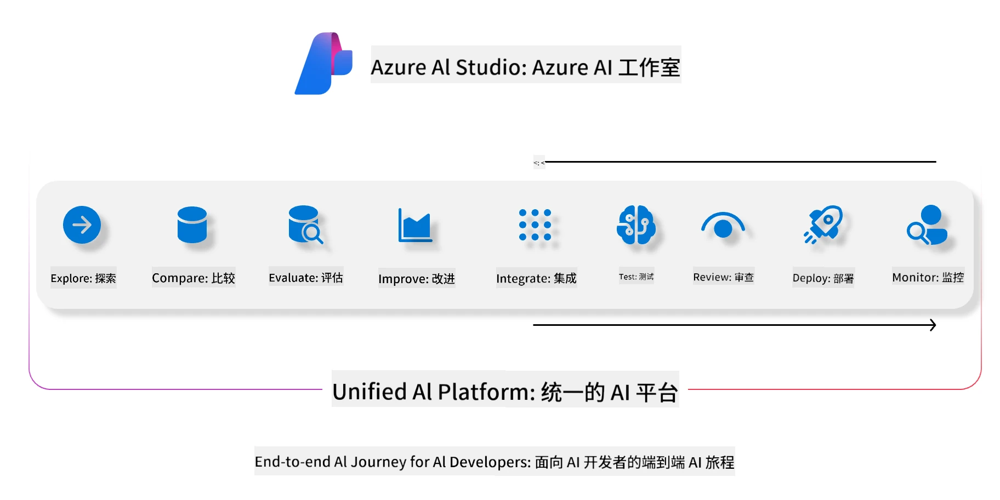
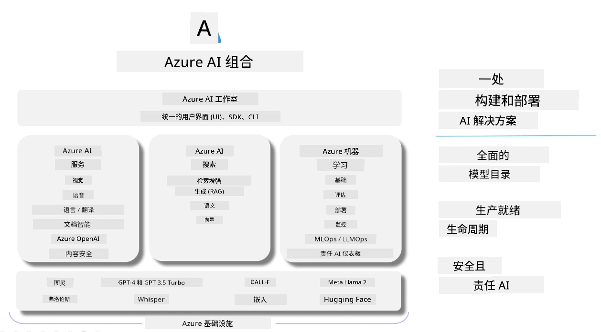

<!--
CO_OP_TRANSLATOR_METADATA:
{
  "original_hash": "7b4235159486df4000e16b7b46ddfec3",
  "translation_date": "2025-07-16T22:29:03+00:00",
  "source_file": "md/01.Introduction/05/AIFoundry.md",
  "language_code": "zh"
}
-->
# **使用 Azure AI Foundry 进行评估**

如何使用 [Azure AI Foundry](https://ai.azure.com?WT.mc_id=aiml-138114-kinfeylo) 评估你的生成式 AI 应用。无论是评估单轮对话还是多轮对话，Azure AI Foundry 都提供了评估模型性能和安全性的工具。

## 如何使用 Azure AI Foundry 评估生成式 AI 应用
更多详细说明请参见 [Azure AI Foundry 文档](https://learn.microsoft.com/azure/ai-studio/how-to/evaluate-generative-ai-app?WT.mc_id=aiml-138114-kinfeylo)

以下是入门步骤：

## 在 Azure AI Foundry 中评估生成式 AI 模型

**前提条件**

- 一个 CSV 或 JSON 格式的测试数据集。
- 一个已部署的生成式 AI 模型（如 Phi-3、GPT 3.5、GPT 4 或 Davinci 模型）。
- 一个带有计算实例的运行时环境，用于执行评估。

## 内置评估指标

Azure AI Foundry 支持评估单轮对话和复杂的多轮对话。
对于基于特定数据的检索增强生成（RAG）场景，可以使用内置评估指标来衡量性能。
此外，还可以评估一般的单轮问答场景（非 RAG）。

## 创建评估运行

在 Azure AI Foundry 界面中，进入 Evaluate 页面或 Prompt Flow 页面。
按照评估创建向导设置评估运行。你可以为评估命名（可选）。
选择与你应用目标相符的场景。
选择一个或多个评估指标来评估模型输出。

## 自定义评估流程（可选）

如果需要更高的灵活性，可以建立自定义评估流程，根据具体需求定制评估过程。

## 查看结果

评估完成后，在 Azure AI Foundry 中记录、查看并分析详细的评估指标。深入了解你的应用能力和局限。

**Note** Azure AI Foundry 目前处于公开预览阶段，建议用于实验和开发。生产环境请考虑其他方案。更多详情和操作步骤，请查阅官方 [AI Foundry 文档](https://learn.microsoft.com/azure/ai-studio/?WT.mc_id=aiml-138114-kinfeylo)。

**免责声明**：  
本文件使用 AI 翻译服务 [Co-op Translator](https://github.com/Azure/co-op-translator) 进行翻译。虽然我们力求准确，但请注意，自动翻译可能包含错误或不准确之处。原始文件的母语版本应被视为权威来源。对于重要信息，建议使用专业人工翻译。对于因使用本翻译而产生的任何误解或误释，我们概不负责。