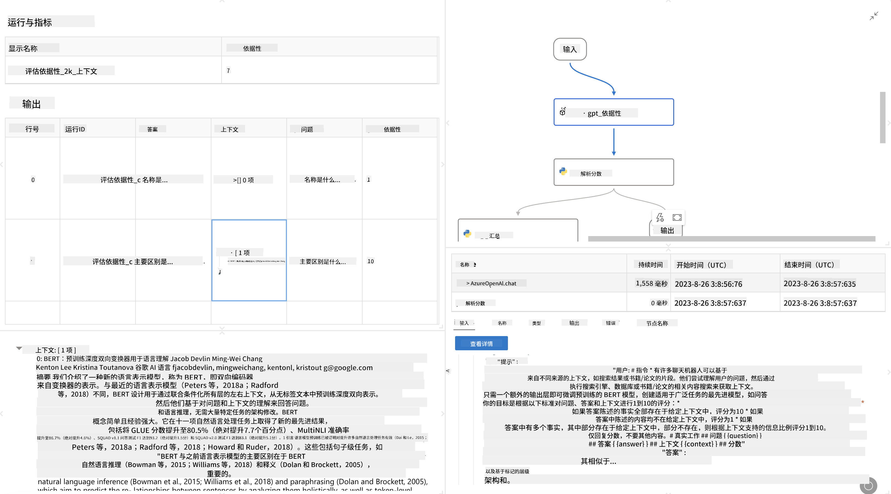

<!--
CO_OP_TRANSLATOR_METADATA:
{
  "original_hash": "3cbe7629d254f1043193b7fe22524d55",
  "translation_date": "2025-05-07T14:46:27+00:00",
  "source_file": "md/01.Introduction/05/Promptflow.md",
  "language_code": "zh"
}
-->
# **介绍 Promptflow**

[Microsoft Prompt Flow](https://microsoft.github.io/promptflow/index.html?WT.mc_id=aiml-138114-kinfeylo) 是一款可视化的工作流自动化工具，允许用户使用预设模板和自定义连接器来创建自动化工作流。它旨在帮助开发者和业务分析师快速构建自动化流程，应用于数据管理、协作和流程优化等任务。通过 Prompt Flow，用户可以轻松连接不同的服务、应用和系统，实现复杂业务流程的自动化。

Microsoft Prompt Flow 旨在简化基于大型语言模型（LLMs）的 AI 应用从头到尾的开发周期。无论你是在构思、原型设计、测试、评估还是部署基于 LLM 的应用，Prompt Flow 都能简化流程，帮助你构建具有生产质量的 LLM 应用。

## Microsoft Prompt Flow 的主要功能和优势：

**交互式创作体验**

Prompt Flow 提供了工作流结构的可视化展示，使你能够轻松理解和导航项目。
它还提供类似笔记本的编码体验，提升工作流开发和调试的效率。

**提示变体和调优**

创建并比较多个提示变体，促进迭代优化过程。评估不同提示的表现，选择最有效的方案。

**内置评估工作流**

利用内置评估工具评估你的提示和工作流的质量与效果。
了解基于 LLM 的应用运行表现。

**丰富的资源**

Prompt Flow 包含丰富的内置工具库、示例和模板。这些资源为开发提供起点，激发创意，加速开发进程。

**协作与企业级准备**

支持团队协作，允许多用户共同参与提示工程项目。
保持版本控制，有效共享知识。简化从开发、评估到部署和监控的整个提示工程流程。

## Prompt Flow 中的评估

在 Microsoft Prompt Flow 中，评估在衡量 AI 模型表现中起着关键作用。下面介绍如何在 Prompt Flow 中自定义评估工作流和指标：

**理解 Prompt Flow 中的评估**

在 Prompt Flow 中，工作流代表一系列处理输入并生成输出的节点。评估工作流是一种特殊的工作流，用于根据特定标准和目标评估运行结果的表现。

**评估工作流的主要特点**

它们通常在被测试工作流运行后执行，使用其输出结果。
计算分数或指标来衡量被测试工作流的表现。指标可以包括准确率、相关性分数或其他相关度量。

### 自定义评估工作流

**定义输入**

评估工作流需要接收被测试运行的输出。输入定义方式与标准工作流类似。
例如，评估问答工作流时，输入命名为“answer”；评估分类工作流时，输入命名为“category”。可能还需要提供真实标签等基准输入。

**输出和指标**

评估工作流会产出衡量被测工作流表现的结果。指标可以通过 Python 或 LLM（大型语言模型）计算。使用 log_metric() 函数记录相关指标。

**使用自定义评估工作流**

开发针对特定任务和目标量身定制的评估工作流。
根据评估目标自定义指标。
将此自定义评估工作流应用于批量运行，实现大规模测试。

## 内置评估方法

Prompt Flow 还提供了内置的评估方法。
你可以提交批量运行，使用这些方法评估工作流在大规模数据集上的表现。
查看评估结果，比较指标，按需迭代优化。
请记住，评估对于确保 AI 模型达到预期标准和目标至关重要。请参考官方文档，了解在 Microsoft Prompt Flow 中开发和使用评估工作流的详细说明。

总结来说，Microsoft Prompt Flow 通过简化提示工程并提供强大的开发环境，助力开发者打造高质量的 LLM 应用。如果你正在使用 LLM，Prompt Flow 是一个值得探索的重要工具。详见 [Prompt Flow 评估文档](https://learn.microsoft.com/azure/machine-learning/prompt-flow/how-to-develop-an-evaluation-flow?view=azureml-api-2?WT.mc_id=aiml-138114-kinfeylo) 获取关于在 Microsoft Prompt Flow 中开发和使用评估工作流的详细指导。

**免责声明**：  
本文件由 AI 翻译服务 [Co-op Translator](https://github.com/Azure/co-op-translator) 翻译而成。尽管我们力求准确，但请注意，自动翻译可能存在错误或不准确之处。原始语言版本的文件应被视为权威来源。对于重要信息，建议使用专业人工翻译。因使用本翻译而产生的任何误解或错误解释，我们概不负责。