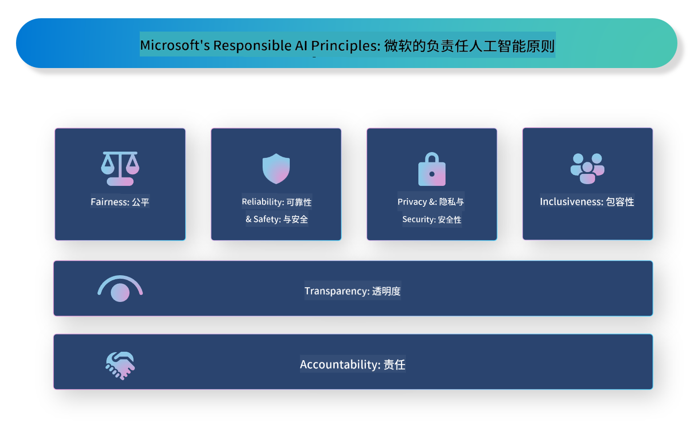

<!--
CO_OP_TRANSLATOR_METADATA:
{
  "original_hash": "3b3107c2477241058ef506743188f399",
  "translation_date": "2025-04-03T07:10:10+00:00",
  "source_file": "md\\01.Introduction\\05\\ResponsibleAI.md",
  "language_code": "zh"
}
-->
# **介绍负责任的人工智能**

[Microsoft Responsible AI](https://www.microsoft.com/ai/responsible-ai?WT.mc_id=aiml-138114-kinfeylo) 是一个旨在帮助开发者和组织构建透明、可信且负责任的人工智能系统的倡议。该倡议提供了指导和资源，帮助开发符合伦理原则的负责任的人工智能解决方案，例如隐私、公平和透明性。我们还将探讨构建负责任人工智能系统所面临的一些挑战和最佳实践。

## Microsoft Responsible AI 概述

**伦理原则**

Microsoft Responsible AI 以一系列伦理原则为指导，例如隐私、公平、透明、责任和安全。这些原则旨在确保人工智能系统以伦理和负责任的方式进行开发。

**透明的人工智能**

Microsoft Responsible AI 强调人工智能系统的透明性。这包括提供关于人工智能模型如何工作的清晰解释，以及确保数据来源和算法的公开可用性。

**负责任的人工智能**

[Microsoft Responsible AI](https://www.microsoft.com/ai/responsible-ai?WT.mc_id=aiml-138114-kinfeylo) 推动开发负责任的人工智能系统，这些系统能够提供关于人工智能模型如何做出决策的洞察。这有助于用户理解并信任人工智能系统的输出。

**包容性**

人工智能系统应设计为惠及所有人。Microsoft 致力于创建包容性的人工智能，考虑多样化的观点，并避免偏见或歧视。

**可靠性和安全性**

确保人工智能系统的可靠性和安全性至关重要。Microsoft 专注于构建稳健的模型，以确保其一致表现并避免有害结果。

**人工智能中的公平性**

Microsoft Responsible AI 认识到，如果人工智能系统使用带有偏见的数据或算法进行训练，它可能会延续偏见。该倡议提供了指导，帮助开发不基于种族、性别或年龄等因素进行歧视的公平人工智能系统。

**隐私和安全**

Microsoft Responsible AI 强调保护人工智能系统中的用户隐私和数据安全的重要性。这包括实施强大的数据加密和访问控制，并定期审计人工智能系统以发现漏洞。

**责任与担当**

Microsoft Responsible AI 推动人工智能开发和部署中的责任与担当。这包括确保开发者和组织意识到人工智能系统的潜在风险，并采取措施减轻这些风险。

## 构建负责任人工智能系统的最佳实践

**使用多样化的数据集开发人工智能模型**

为了避免人工智能系统中的偏见，使用代表多样化观点和经验的数据集非常重要。

**使用可解释的人工智能技术**

可解释的人工智能技术可以帮助用户理解人工智能模型如何做出决策，从而提高对系统的信任。

**定期审计人工智能系统以发现漏洞**

定期审计人工智能系统可以帮助识别需要解决的潜在风险和漏洞。

**实施强大的数据加密和访问控制**

数据加密和访问控制可以帮助保护人工智能系统中的用户隐私和安全。

**在人工智能开发中遵循伦理原则**

遵循公平、透明和责任等伦理原则，可以帮助建立对人工智能系统的信任，并确保其以负责任的方式进行开发。

## 使用 AI Foundry 实现负责任的人工智能

[Azure AI Foundry](https://ai.azure.com?WT.mc_id=aiml-138114-kinfeylo) 是一个强大的平台，允许开发者和组织快速创建智能、先进、市场就绪且负责任的应用程序。以下是 Azure AI Foundry 的一些关键功能和能力：

**现成的 API 和模型**

Azure AI Foundry 提供预构建和可定制的 API 和模型。这些涵盖了广泛的人工智能任务，包括生成式人工智能、用于对话的自然语言处理、搜索、监控、翻译、语音、视觉和决策。

**Prompt Flow**

Azure AI Foundry 中的 Prompt Flow 使您能够创建对话式人工智能体验。它允许您设计和管理对话流程，便于构建聊天机器人、虚拟助手和其他交互式应用程序。

**检索增强生成 (RAG)**

RAG 是一种结合基于检索和生成的方法的技术。它通过利用现有知识（检索）和创造性生成（生成）来提升生成的响应质量。

**生成式人工智能的评估和监控指标**

Azure AI Foundry 提供评估和监控生成式人工智能模型的工具。您可以评估其性能、公平性和其他重要指标，以确保负责任的部署。此外，如果您已经创建了仪表板，可以使用 Azure Machine Learning Studio 中的无代码 UI 来定制并生成基于 [Responsible AI Toolbox](https://responsibleaitoolbox.ai/?WT.mc_id=aiml-138114-kinfeylo) Python 库的负责任人工智能仪表板及相关评分卡。此评分卡有助于与技术和非技术利益相关者共享有关公平性、特征重要性和其他负责任部署考虑因素的关键见解。

要使用 AI Foundry 实现负责任的人工智能，您可以遵循以下最佳实践：

**定义人工智能系统的问题和目标**

在开始开发过程之前，明确定义人工智能系统旨在解决的问题或目标非常重要。这将帮助您确定构建有效模型所需的数据、算法和资源。

**收集并预处理相关数据**

用于训练人工智能系统的数据质量和数量对其性能有重要影响。因此，重要的是收集相关数据，对其进行清理和预处理，并确保其能够代表您尝试解决的人群或问题。

**选择适当的评估方法**

有各种评估算法可用。根据您的数据和问题选择最适合的算法非常重要。

**评估并解释模型**

构建人工智能模型后，使用适当的指标评估其性能，并以透明的方式解释结果。这将帮助您识别模型中的任何偏见或局限性，并在必要时进行改进。

**确保透明性和可解释性**

人工智能系统应该是透明且可解释的，以便用户理解其工作原理以及如何做出决策。这对于在人类生活中具有重要影响的应用尤为重要，例如医疗、金融和法律系统。

**监控并更新模型**

人工智能系统应持续监控并更新，以确保其长期保持准确和有效。这需要对模型进行持续维护、测试和重新训练。

总结来说，Microsoft Responsible AI 是一个旨在帮助开发者和组织构建透明、可信且负责任的人工智能系统的倡议。请记住，负责任的人工智能实施至关重要，而 Azure AI Foundry 致力于让其变得对组织来说更加实用。通过遵循伦理原则和最佳实践，我们可以确保人工智能系统以负责任的方式进行开发和部署，从而惠及整个社会。

**免责声明**:  
本文档通过AI翻译服务 [Co-op Translator](https://github.com/Azure/co-op-translator) 翻译而成。尽管我们努力确保翻译的准确性，但请注意，自动翻译可能包含错误或不准确之处。原始语言版本的文档应被视为权威来源。对于关键信息，建议使用专业的人工翻译。我们不对因使用本翻译而产生的任何误解或错误解释承担责任。