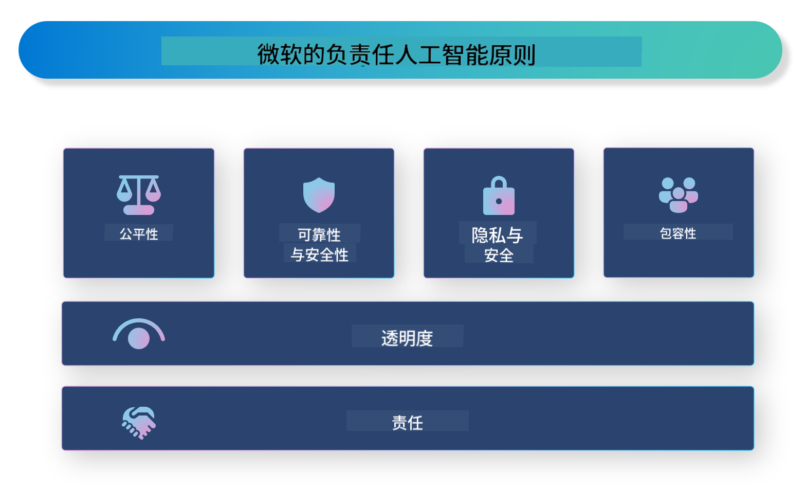

<!--
CO_OP_TRANSLATOR_METADATA:
{
  "original_hash": "805b96b20152936d8f4c587d90d6e06e",
  "translation_date": "2025-05-07T14:44:43+00:00",
  "source_file": "md/01.Introduction/05/ResponsibleAI.md",
  "language_code": "zh"
}
-->
# **介绍负责任的人工智能**

[Microsoft Responsible AI](https://www.microsoft.com/ai/responsible-ai?WT.mc_id=aiml-138114-kinfeylo) 是一项旨在帮助开发者和组织构建透明、可信且负责任的人工智能系统的倡议。该倡议提供了开发符合隐私、公平和透明等伦理原则的负责任AI解决方案的指导和资源。我们还将探讨构建负责任AI系统时面临的一些挑战和最佳实践。

## Microsoft Responsible AI 概述

**伦理原则**

Microsoft Responsible AI 以一系列伦理原则为指导，包括隐私、公平、透明、问责和安全。这些原则旨在确保人工智能系统以伦理和负责任的方式开发。

**透明的AI**

Microsoft Responsible AI 强调AI系统透明性的重要性。这包括清晰说明AI模型的工作原理，以及确保数据来源和算法公开可用。

**负责任的AI**

[Microsoft Responsible AI](https://www.microsoft.com/ai/responsible-ai?WT.mc_id=aiml-138114-kinfeylo) 推动开发负责任的AI系统，这些系统能够提供AI模型如何做出决策的洞见，帮助用户理解并信任AI系统的输出。

**包容性**

AI系统应设计为惠及所有人。Microsoft 致力于打造包容性的AI，考虑多样化的视角，避免偏见和歧视。

**可靠性与安全**

确保AI系统的可靠性和安全性至关重要。Microsoft 专注于构建表现稳定且避免有害结果的稳健模型。

**AI中的公平性**

Microsoft Responsible AI 认识到，如果AI系统训练数据或算法存在偏见，可能会延续这些偏见。该倡议提供指导，帮助开发不因种族、性别或年龄等因素歧视的公平AI系统。

**隐私与安全**

Microsoft Responsible AI 强调保护用户隐私和数据安全的重要性。这包括实施强有力的数据加密和访问控制，并定期审计AI系统的漏洞。

**问责与责任**

Microsoft Responsible AI 推动AI开发和部署中的问责和责任，确保开发者和组织了解AI系统潜在风险，并采取措施减轻这些风险。

## 构建负责任AI系统的最佳实践

**使用多样化数据集开发AI模型**

为避免AI系统中的偏见，重要的是使用代表多种视角和经验的多样化数据集。

**采用可解释的AI技术**

可解释的AI技术帮助用户理解AI模型如何做出决策，从而增强对系统的信任。

**定期审计AI系统的漏洞**

定期审计AI系统有助于发现需要解决的潜在风险和漏洞。

**实施强有力的数据加密和访问控制**

数据加密和访问控制有助于保护AI系统中的用户隐私和安全。

**遵循AI开发中的伦理原则**

遵循公平、透明和问责等伦理原则，有助于建立对AI系统的信任，并确保其负责任地开发。

## 使用 AI Foundry 实现负责任AI

[Azure AI Foundry](https://ai.azure.com?WT.mc_id=aiml-138114-kinfeylo) 是一个强大的平台，帮助开发者和组织快速创建智能、前沿、市场就绪且负责任的应用。以下是Azure AI Foundry的一些关键功能和能力：

**开箱即用的API和模型**

Azure AI Foundry 提供预构建且可定制的API和模型，涵盖生成式AI、对话式自然语言处理、搜索、监控、翻译、语音、视觉和决策等多种AI任务。

**Prompt Flow**

Azure AI Foundry 中的Prompt Flow 让你能够创建对话式AI体验，设计和管理对话流程，方便构建聊天机器人、虚拟助手和其他交互式应用。

**检索增强生成（RAG）**

RAG技术结合了基于检索和生成的方法，通过利用现有知识（检索）和创造性生成（生成）来提升生成回答的质量。

**生成式AI的评估和监控指标**

Azure AI Foundry 提供评估和监控生成式AI模型的工具，帮助评估其性能、公平性及其他重要指标，确保负责任的部署。此外，如果你创建了仪表板，可以使用Azure Machine Learning Studio中的无代码UI，基于[Responsible AI Toolbox](https://responsibleaitoolbox.ai/?WT.mc_id=aiml-138114-kinfeylo) Python库自定义并生成负责任AI仪表板和相关评分卡。该评分卡帮助你与技术和非技术利益相关者分享关于公平性、特征重要性及其他负责任部署考量的关键见解。

使用AI Foundry实现负责任AI时，可以遵循以下最佳实践：

**明确AI系统的问题和目标**

在开始开发之前，明确AI系统旨在解决的问题或目标，有助于确定构建有效模型所需的数据、算法和资源。

**收集和预处理相关数据**

训练AI系统所用数据的质量和数量对其性能有重大影响，因此需要收集相关数据，进行清洗和预处理，并确保数据能代表目标群体或问题。

**选择合适的评估算法**

根据数据和问题选择最合适的评估算法。

**评估并解读模型**

构建AI模型后，需使用合适的指标评估其性能，并以透明的方式解读结果，帮助识别模型中的偏见或局限，必要时进行改进。

**确保透明性和可解释性**

AI系统应具备透明性和可解释性，让用户理解其工作原理和决策过程。这对医疗、金融和法律等对人类生活有重大影响的应用尤为重要。

**监控并更新模型**

AI系统应持续监控和更新，确保其随时间保持准确和有效，这需要持续的维护、测试和模型再训练。

总之，Microsoft Responsible AI 是一项旨在帮助开发者和组织构建透明、可信和负责任AI系统的倡议。负责任的AI实施至关重要，而Azure AI Foundry致力于让组织能够切实实现这一目标。通过遵循伦理原则和最佳实践，我们能够确保AI系统以负责任的方式开发和部署，造福整个社会。

**免责声明**：  
本文件由 AI 翻译服务 [Co-op Translator](https://github.com/Azure/co-op-translator) 翻译。尽管我们力求准确，但请注意，自动翻译可能包含错误或不准确之处。原始文件的母语版本应被视为权威来源。对于重要信息，建议使用专业人工翻译。对于因使用本翻译而产生的任何误解或误释，我们不承担任何责任。