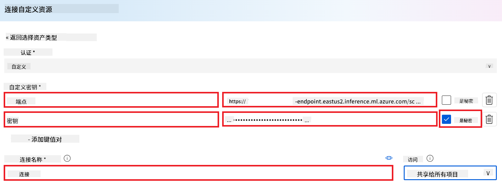
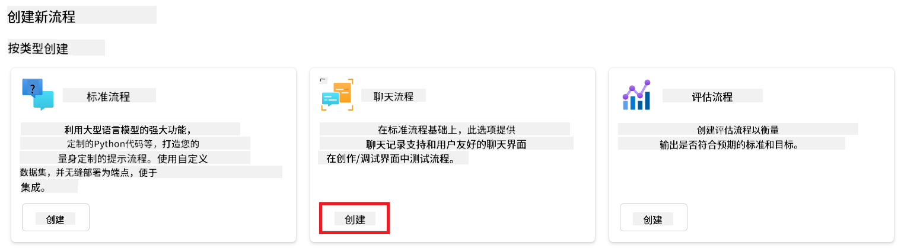
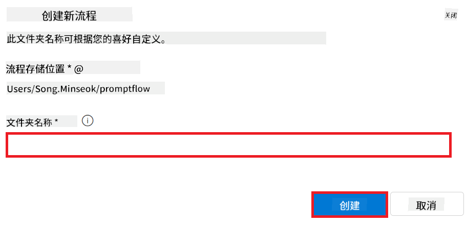
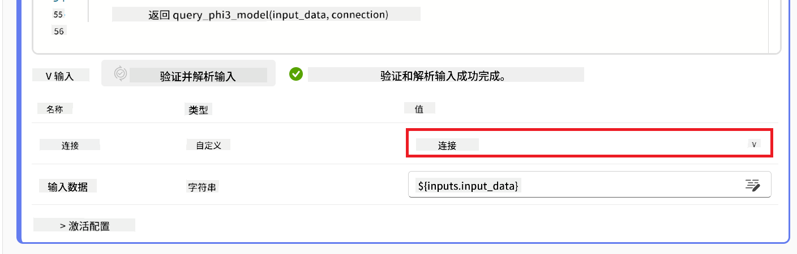
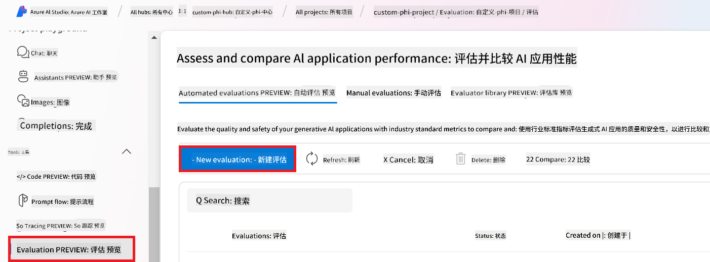
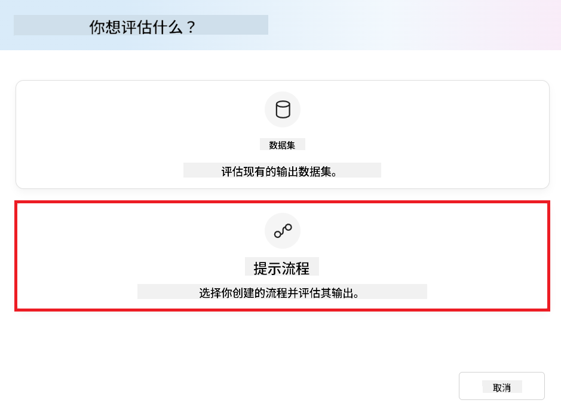
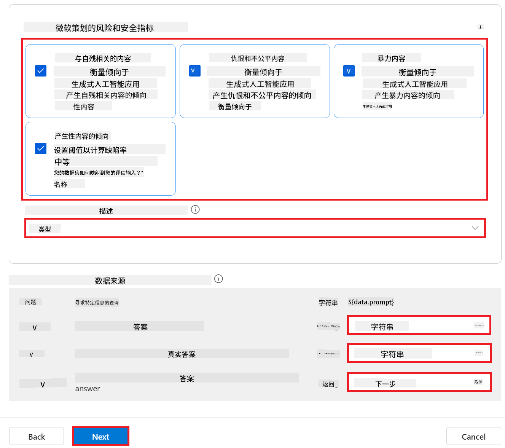
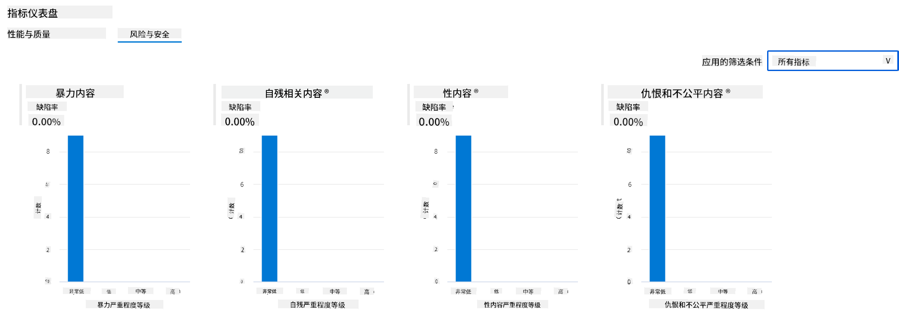

<!--
CO_OP_TRANSLATOR_METADATA:
{
  "original_hash": "80a853c08e4ee25ef9b4bfcedd8990da",
  "translation_date": "2025-07-16T23:17:13+00:00",
  "source_file": "md/02.Application/01.TextAndChat/Phi3/E2E_Phi-3-Evaluation_AIFoundry.md",
  "language_code": "zh"
}
-->
# 在 Azure AI Foundry 中评估微调后的 Phi-3 / Phi-3.5 模型，聚焦微软的负责任 AI 原则

本端到端（E2E）示例基于微软技术社区的指南《[在 Azure AI Foundry 中评估微调后的 Phi-3 / 3.5 模型，聚焦微软的负责任 AI](https://techcommunity.microsoft.com/blog/educatordeveloperblog/evaluate-fine-tuned-phi-3--3-5-models-in-azure-ai-studio-focusing-on-microsofts-/4227850?WT.mc_id=aiml-137032-kinfeylo)》。

## 概述

### 如何在 Azure AI Foundry 中评估微调后的 Phi-3 / Phi-3.5 模型的安全性和性能？

模型微调有时可能导致意外或不理想的响应。为了确保模型保持安全且有效，评估模型生成有害内容的潜力以及其产生准确、相关且连贯回答的能力非常重要。在本教程中，您将学习如何评估集成了 Prompt flow 的微调 Phi-3 / Phi-3.5 模型在 Azure AI Foundry 中的安全性和性能。

以下是 Azure AI Foundry 的评估流程。


*图片来源：[生成式 AI 应用评估](https://learn.microsoft.com/azure/ai-studio/concepts/evaluation-approach-gen-ai?wt.mc_id%3Dstudentamb_279723)*

> [!NOTE]
>
> 如需更详细的信息及探索更多关于 Phi-3 / Phi-3.5 的资源，请访问 [Phi-3CookBook](https://github.com/microsoft/Phi-3CookBook?wt.mc_id=studentamb_279723)。

### 先决条件

- [Python](https://www.python.org/downloads)
- [Azure 订阅](https://azure.microsoft.com/free?wt.mc_id=studentamb_279723)
- [Visual Studio Code](https://code.visualstudio.com)
- 微调后的 Phi-3 / Phi-3.5 模型

### 目录

1. [**场景 1：Azure AI Foundry 的 Prompt flow 评估介绍**](../../../../../../md/02.Application/01.TextAndChat/Phi3)

    - [安全性评估介绍](../../../../../../md/02.Application/01.TextAndChat/Phi3)
    - [性能评估介绍](../../../../../../md/02.Application/01.TextAndChat/Phi3)

1. [**场景 2：在 Azure AI Foundry 中评估 Phi-3 / Phi-3.5 模型**](../../../../../../md/02.Application/01.TextAndChat/Phi3)

    - [开始之前](../../../../../../md/02.Application/01.TextAndChat/Phi3)
    - [部署 Azure OpenAI 以评估 Phi-3 / Phi-3.5 模型](../../../../../../md/02.Application/01.TextAndChat/Phi3)
    - [使用 Azure AI Foundry 的 Prompt flow 评估微调后的 Phi-3 / Phi-3.5 模型](../../../../../../md/02.Application/01.TextAndChat/Phi3)

1. [恭喜！](../../../../../../md/02.Application/01.TextAndChat/Phi3)

## **场景 1：Azure AI Foundry 的 Prompt flow 评估介绍**

### 安全性评估介绍

为了确保您的 AI 模型符合伦理且安全，评估其是否符合微软的负责任 AI 原则至关重要。在 Azure AI Foundry 中，安全性评估可以帮助您检测模型是否容易被绕过限制（jailbreak 攻击）以及其生成有害内容的潜力，这与这些原则直接相关。


*图片来源：[生成式 AI 应用评估](https://learn.microsoft.com/azure/ai-studio/concepts/evaluation-approach-gen-ai?wt.mc_id%3Dstudentamb_279723)*

#### 微软的负责任 AI 原则

在开始技术步骤之前，理解微软的负责任 AI 原则非常重要。这是一套伦理框架，旨在指导 AI 系统的负责任开发、部署和运营。这些原则指导 AI 系统的设计、开发和部署，确保 AI 技术以公平、透明和包容的方式构建。这些原则是评估 AI 模型安全性的基础。

微软的负责任 AI 原则包括：

- **公平与包容**：AI 系统应公平对待所有人，避免对处境相似的群体产生不同影响。例如，当 AI 系统为医疗治疗、贷款申请或就业提供建议时，应对所有具有相似症状、财务状况或专业资格的人给出相同的建议。

- **可靠性与安全性**：为了建立信任，AI 系统必须可靠、安全且一致地运行。这些系统应能按设计正常工作，安全应对意外情况，并抵御有害操控。它们的行为及能处理的各种情况反映了开发者在设计和测试阶段预见的情境范围。

- **透明度**：当 AI 系统帮助做出对人们生活有重大影响的决策时，确保人们理解这些决策的依据至关重要。例如，银行可能使用 AI 系统判断一个人的信用状况，公司可能用 AI 系统筛选最合适的候选人。

- **隐私与安全**：随着 AI 的普及，保护隐私和保障个人及企业信息安全变得更加重要且复杂。AI 需要访问数据以做出准确且有依据的预测和决策，因此隐私和数据安全需特别关注。

- **问责制**：设计和部署 AI 系统的人必须对系统的运行负责。组织应借鉴行业标准制定问责规范，确保 AI 系统不会成为影响人们生活决策的最终权威，并确保人类对高度自主的 AI 系统保持有效控制。

”中描述的低代码方法操作，可以跳过本练习，直接进行下一个。  
> 但是，如果你是按照“[Fine-Tune and Integrate Custom Phi-3 Models with Prompt Flow: Step-by-Step Guide](https://techcommunity.microsoft.com/t5/educator-developer-blog/fine-tune-and-integrate-custom-phi-3-models-with-prompt-flow/ba-p/4178612?wt.mc_id=studentamb_279723)”中描述的代码优先方法来微调并部署你的 Phi-3 / Phi-3.5 模型，那么将模型连接到 Prompt flow 的流程会有所不同。你将在本练习中学习这一过程。
要继续操作，您需要将微调后的 Phi-3 / Phi-3.5 模型集成到 Azure AI Foundry 的 Prompt flow 中。

#### 创建 Azure AI Foundry Hub

在创建项目之前，您需要先创建一个 Hub。Hub 类似于资源组，方便您在 Azure AI Foundry 中组织和管理多个项目。

1. 登录 [Azure AI Foundry](https://ai.azure.com/?wt.mc_id=studentamb_279723)。

1. 从左侧标签中选择 **All hubs**。

1. 从导航菜单中选择 **+ New hub**。

    

1. 执行以下操作：

    - 输入 **Hub name**，必须是唯一值。
    - 选择您的 Azure **Subscription**。
    - 选择要使用的 **Resource group**（如有需要可新建）。
    - 选择您想使用的 **Location**。
    - 选择要连接的 **Connect Azure AI Services**（如有需要可新建）。
    - 选择 **Connect Azure AI Search** 并选择 **Skip connecting**。

    

1. 选择 **Next**。

#### 创建 Azure AI Foundry 项目

1. 在您创建的 Hub 中，从左侧标签选择 **All projects**。

1. 从导航菜单选择 **+ New project**。

    

1. 输入 **Project name**，必须是唯一值。

    

1. 选择 **Create a project**。

#### 为微调后的 Phi-3 / Phi-3.5 模型添加自定义连接

要将您的自定义 Phi-3 / Phi-3.5 模型集成到 Prompt flow 中，您需要将模型的端点和密钥保存到自定义连接中。这样可以确保 Prompt flow 能访问您的自定义模型。

#### 设置微调后的 Phi-3 / Phi-3.5 模型的 api key 和 endpoint uri

1. 访问 [Azure ML Studio](https://ml.azure.com/home?wt.mc_id=studentamb_279723)。

1. 进入您创建的 Azure 机器学习工作区。

1. 从左侧标签选择 **Endpoints**。

    

1. 选择您创建的端点。

    

1. 从导航菜单选择 **Consume**。

1. 复制您的 **REST endpoint** 和 **Primary key**。

    

#### 添加自定义连接

1. 访问 [Azure AI Foundry](https://ai.azure.com/?wt.mc_id=studentamb_279723)。

1. 进入您创建的 Azure AI Foundry 项目。

1. 在项目中，从左侧标签选择 **Settings**。

1. 选择 **+ New connection**。

    

1. 从导航菜单选择 **Custom keys**。

    

1. 执行以下操作：

    - 选择 **+ Add key value pairs**。
    - 键名输入 **endpoint**，将从 Azure ML Studio 复制的端点粘贴到值字段。
    - 再次选择 **+ Add key value pairs**。
    - 键名输入 **key**，将从 Azure ML Studio 复制的密钥粘贴到值字段。
    - 添加完密钥后，选择 **is secret** 以防止密钥泄露。

    

1. 选择 **Add connection**。

#### 创建 Prompt flow

您已在 Azure AI Foundry 中添加了自定义连接。接下来，按照以下步骤创建一个 Prompt flow，然后将其连接到自定义连接，以便在 Prompt flow 中使用微调模型。

1. 进入您创建的 Azure AI Foundry 项目。

1. 从左侧标签选择 **Prompt flow**。

1. 从导航菜单选择 **+ Create**。

    

1. 从导航菜单选择 **Chat flow**。

    

1. 输入要使用的 **Folder name**。

    

1. 选择 **Create**。

#### 设置 Prompt flow 以与您的自定义 Phi-3 / Phi-3.5 模型聊天

您需要将微调后的 Phi-3 / Phi-3.5 模型集成到 Prompt flow 中。但现有的 Prompt flow 并非为此设计，因此您必须重新设计 Prompt flow 来实现自定义模型的集成。

1. 在 Prompt flow 中，执行以下操作以重建现有流程：

    - 选择 **Raw file mode**。
    - 删除 *flow.dag.yml* 文件中所有现有代码。
    - 将以下代码添加到 *flow.dag.yml*。

        ```yml
        inputs:
          input_data:
            type: string
            default: "Who founded Microsoft?"

        outputs:
          answer:
            type: string
            reference: ${integrate_with_promptflow.output}

        nodes:
        - name: integrate_with_promptflow
          type: python
          source:
            type: code
            path: integrate_with_promptflow.py
          inputs:
            input_data: ${inputs.input_data}
        ```

    - 选择 **Save**。

    

1. 将以下代码添加到 *integrate_with_promptflow.py*，以便在 Prompt flow 中使用自定义 Phi-3 / Phi-3.5 模型。

    ```python
    import logging
    import requests
    from promptflow import tool
    from promptflow.connections import CustomConnection

    # Logging setup
    logging.basicConfig(
        format="%(asctime)s - %(levelname)s - %(name)s - %(message)s",
        datefmt="%Y-%m-%d %H:%M:%S",
        level=logging.DEBUG
    )
    logger = logging.getLogger(__name__)

    def query_phi3_model(input_data: str, connection: CustomConnection) -> str:
        """
        Send a request to the Phi-3 / Phi-3.5 model endpoint with the given input data using Custom Connection.
        """

        # "connection" is the name of the Custom Connection, "endpoint", "key" are the keys in the Custom Connection
        endpoint_url = connection.endpoint
        api_key = connection.key

        headers = {
            "Content-Type": "application/json",
            "Authorization": f"Bearer {api_key}"
        }
    data = {
        "input_data": [input_data],
        "params": {
            "temperature": 0.7,
            "max_new_tokens": 128,
            "do_sample": True,
            "return_full_text": True
            }
        }
        try:
            response = requests.post(endpoint_url, json=data, headers=headers)
            response.raise_for_status()
            
            # Log the full JSON response
            logger.debug(f"Full JSON response: {response.json()}")

            result = response.json()["output"]
            logger.info("Successfully received response from Azure ML Endpoint.")
            return result
        except requests.exceptions.RequestException as e:
            logger.error(f"Error querying Azure ML Endpoint: {e}")
            raise

    @tool
    def my_python_tool(input_data: str, connection: CustomConnection) -> str:
        """
        Tool function to process input data and query the Phi-3 / Phi-3.5 model.
        """
        return query_phi3_model(input_data, connection)

    ```

    

> [!NOTE]
> 
> 有关在 Azure AI Foundry 中使用 Prompt flow 的详细信息，请参阅 [Prompt flow in Azure AI Foundry](https://learn.microsoft.com/azure/ai-studio/how-to/prompt-flow)。

1. 选择 **Chat input** 和 **Chat output**，以启用与模型的聊天功能。

    

1. 现在，您已准备好与自定义 Phi-3 / Phi-3.5 模型聊天。下一练习中，您将学习如何启动 Prompt flow 并使用它与微调模型对话。

> [!NOTE]
>
> 重建后的流程应如下图所示：
>
> 
>

#### 启动 Prompt flow

1. 选择 **Start compute sessions** 启动 Prompt flow。

    

1. 选择 **Validate and parse input** 以更新参数。

    

1. 选择 **connection** 的 **Value**，即您创建的自定义连接，例如 *connection*。

    

#### 与您的自定义 Phi-3 / Phi-3.5 模型聊天

1. 选择 **Chat**。

    

1. 以下是示例结果：现在您可以与自定义 Phi-3 / Phi-3.5 模型聊天。建议基于用于微调的数据提问。

    

### 部署 Azure OpenAI 以评估 Phi-3 / Phi-3.5 模型

要在 Azure AI Foundry 中评估 Phi-3 / Phi-3.5 模型，您需要部署一个 Azure OpenAI 模型。该模型将用于评估 Phi-3 / Phi-3.5 模型的性能。

#### 部署 Azure OpenAI

1. 登录 [Azure AI Foundry](https://ai.azure.com/?wt.mc_id=studentamb_279723)。

1. 进入您创建的 Azure AI Foundry 项目。

    

1. 在项目中，从左侧标签选择 **Deployments**。

1. 从导航菜单选择 **+ Deploy model**。

1. 选择 **Deploy base model**。

    

1. 选择您想使用的 Azure OpenAI 模型，例如 **gpt-4o**。

    

1. 选择 **Confirm**。

### 使用 Azure AI Foundry 的 Prompt flow 评估微调后的 Phi-3 / Phi-3.5 模型

### 开始新的评估

1. 访问 [Azure AI Foundry](https://ai.azure.com/?wt.mc_id=studentamb_279723)。

1. 进入您创建的 Azure AI Foundry 项目。

    

1. 在项目中，从左侧标签选择 **Evaluation**。

1. 从导航菜单选择 **+ New evaluation**。

    

1. 选择 **Prompt flow** 评估。

    

1. 执行以下操作：

    - 输入评估名称，必须唯一。
    - 选择任务类型为 **Question and answer without context**，因为本教程使用的 **ULTRACHAT_200k** 数据集不包含上下文。
    - 选择您想评估的 prompt flow。

    

1. 选择 **Next**。

1. 执行以下操作：

    - 选择 **Add your dataset** 上传数据集。例如，您可以上传测试数据集文件，如下载的 **ULTRACHAT_200k** 数据集中的 *test_data.json1*。
    - 选择与数据集匹配的 **Dataset column**。例如，使用 **ULTRACHAT_200k** 数据集时，选择 **${data.prompt}** 作为数据列。

    

1. 选择 **Next**。

1. 配置性能和质量指标：

    - 选择您想使用的性能和质量指标。
    - 选择用于评估的 Azure OpenAI 模型，例如 **gpt-4o**。

    

1. 配置风险和安全指标：

    - 选择您想使用的风险和安全指标。
    - 选择用于计算缺陷率的阈值，例如选择 **Medium**。
    - 对于 **question**，选择数据源为 **{$data.prompt}**。
    - 对于 **answer**，选择数据源为 **{$run.outputs.answer}**。
    - 对于 **ground_truth**，选择数据源为 **{$data.message}**。

    

1. 选择 **Next**。

1. 选择 **Submit** 开始评估。

1. 评估需要一些时间完成，您可以在 **Evaluation** 标签中监控进度。

### 查看评估结果
> [!NOTE]
> 下面展示的结果旨在说明评估过程。在本教程中，我们使用了一个在相对较小的数据集上微调的模型，因此结果可能不够理想。实际结果可能会因所用数据集的规模、质量和多样性，以及模型的具体配置而有较大差异。
评估完成后，您可以查看性能和安全指标的结果。

1. 性能和质量指标：

    - 评估模型生成连贯、流畅且相关响应的效果。

    

1. 风险和安全指标：

    - 确保模型输出安全，符合 Responsible AI Principles，避免任何有害或冒犯性内容。

    

1. 您可以向下滚动查看**详细指标结果**。

    

1. 通过对自定义的 Phi-3 / Phi-3.5 模型进行性能和安全指标的评估，您可以确认模型不仅有效，而且遵循负责任的 AI 实践，准备好投入实际应用。

## 恭喜！

### 您已完成本教程

您已成功评估了集成了 Prompt flow 的微调 Phi-3 模型，这是确保您的 AI 模型不仅表现优异，还遵守微软 Responsible AI 原则的重要步骤，帮助您构建值得信赖且可靠的 AI 应用。


## 清理 Azure 资源

请清理您的 Azure 资源，以避免产生额外费用。登录 Azure 门户，删除以下资源：

- Azure 机器学习资源。
- Azure 机器学习模型端点。
- Azure AI Foundry 项目资源。
- Azure AI Foundry Prompt flow 资源。

### 后续步骤

#### 文档

- [使用 Responsible AI 仪表板评估 AI 系统](https://learn.microsoft.com/azure/machine-learning/concept-responsible-ai-dashboard?view=azureml-api-2&source=recommendations?wt.mc_id=studentamb_279723)
- [生成式 AI 的评估和监控指标](https://learn.microsoft.com/azure/ai-studio/concepts/evaluation-metrics-built-in?tabs=definition?wt.mc_id=studentamb_279723)
- [Azure AI Foundry 文档](https://learn.microsoft.com/azure/ai-studio/?wt.mc_id=studentamb_279723)
- [Prompt flow 文档](https://microsoft.github.io/promptflow/?wt.mc_id=studentamb_279723)

#### 培训内容

- [微软 Responsible AI 方法介绍](https://learn.microsoft.com/training/modules/introduction-to-microsofts-responsible-ai-approach/?source=recommendations?wt.mc_id=studentamb_279723)
- [Azure AI Foundry 介绍](https://learn.microsoft.com/training/modules/introduction-to-azure-ai-studio/?wt.mc_id=studentamb_279723)

### 参考资料

- [什么是 Responsible AI？](https://learn.microsoft.com/azure/machine-learning/concept-responsible-ai?view=azureml-api-2?wt.mc_id=studentamb_279723)
- [宣布 Azure AI 新工具，助您构建更安全、更可信的生成式 AI 应用](https://azure.microsoft.com/blog/announcing-new-tools-in-azure-ai-to-help-you-build-more-secure-and-trustworthy-generative-ai-applications/?wt.mc_id=studentamb_279723)
- [生成式 AI 应用的评估](https://learn.microsoft.com/azure/ai-studio/concepts/evaluation-approach-gen-ai?wt.mc_id%3Dstudentamb_279723)

**免责声明**：  
本文件使用 AI 翻译服务 [Co-op Translator](https://github.com/Azure/co-op-translator) 进行翻译。虽然我们力求准确，但请注意，自动翻译可能包含错误或不准确之处。原始文件的母语版本应被视为权威来源。对于重要信息，建议使用专业人工翻译。对于因使用本翻译而产生的任何误解或误释，我们不承担任何责任。