<!--
CO_OP_TRANSLATOR_METADATA:
{
  "original_hash": "7799f9e2960966adc296d24cdf0d6486",
  "translation_date": "2025-04-03T07:15:26+00:00",
  "source_file": "md\\02.Application\\01.TextAndChat\\Phi3\\E2E_Phi-3-Evaluation_AIFoundry.md",
  "language_code": "zh"
}
-->
# 评估在 Azure AI Foundry 中优化的 Phi-3 / Phi-3.5 模型，重点关注微软的负责任 AI 原则

此端到端 (E2E) 示例基于 Microsoft Tech Community 的指南 "[评估在 Azure AI Foundry 中优化的 Phi-3 / 3.5 模型，重点关注微软的负责任 AI](https://techcommunity.microsoft.com/t5/educator-developer-blog/evaluate-fine-tuned-phi-3-3-5-models-in-azure-ai-studio-focusing/ba-p/4227850?WT.mc_id=aiml-137032-kinfeylo)"。

## 概述

### 如何在 Azure AI Foundry 中评估优化的 Phi-3 / Phi-3.5 模型的安全性和性能？

对模型进行优化有时可能会导致意外或不期望的响应。为了确保模型的安全性和有效性，评估其生成有害内容的潜力以及生成准确、相关和连贯响应的能力至关重要。在本教程中，您将学习如何评估与 Azure AI Foundry 中的 Prompt flow 集成的优化 Phi-3 / Phi-3.5 模型的安全性和性能。

以下是 Azure AI Foundry 的评估流程。


*图片来源：[生成式 AI 应用的评估](https://learn.microsoft.com/azure/ai-studio/concepts/evaluation-approach-gen-ai?wt.mc_id%3Dstudentamb_279723)*

> [!NOTE]
>
> 有关更详细的信息以及探索关于 Phi-3 / Phi-3.5 的更多资源，请访问 [Phi-3CookBook](https://github.com/microsoft/Phi-3CookBook?wt.mc_id=studentamb_279723)。

### 先决条件

- [Python](https://www.python.org/downloads)
- [Azure 订阅](https://azure.microsoft.com/free?wt.mc_id=studentamb_279723)
- [Visual Studio Code](https://code.visualstudio.com)
- 优化的 Phi-3 / Phi-3.5 模型

### 内容目录

1. [**场景 1：Azure AI Foundry 的 Prompt flow 评估简介**](../../../../../../md/02.Application/01.TextAndChat/Phi3)

    - [安全性评估简介](../../../../../../md/02.Application/01.TextAndChat/Phi3)
    - [性能评估简介](../../../../../../md/02.Application/01.TextAndChat/Phi3)

1. [**场景 2：在 Azure AI Foundry 中评估 Phi-3 / Phi-3.5 模型**](../../../../../../md/02.Application/01.TextAndChat/Phi3)

    - [开始之前](../../../../../../md/02.Application/01.TextAndChat/Phi3)
    - [部署 Azure OpenAI 以评估 Phi-3 / Phi-3.5 模型](../../../../../../md/02.Application/01.TextAndChat/Phi3)
    - [使用 Azure AI Foundry 的 Prompt flow 评估优化的 Phi-3 / Phi-3.5 模型](../../../../../../md/02.Application/01.TextAndChat/Phi3)

1. [恭喜！](../../../../../../md/02.Application/01.TextAndChat/Phi3)

## **场景 1：Azure AI Foundry 的 Prompt flow 评估简介**

### 安全性评估简介

为了确保您的 AI 模型是道德且安全的，评估其是否符合微软的负责任 AI 原则至关重要。在 Azure AI Foundry 中，安全性评估允许您评估模型是否易受越狱攻击以及生成有害内容的潜力，这与这些原则直接相关。

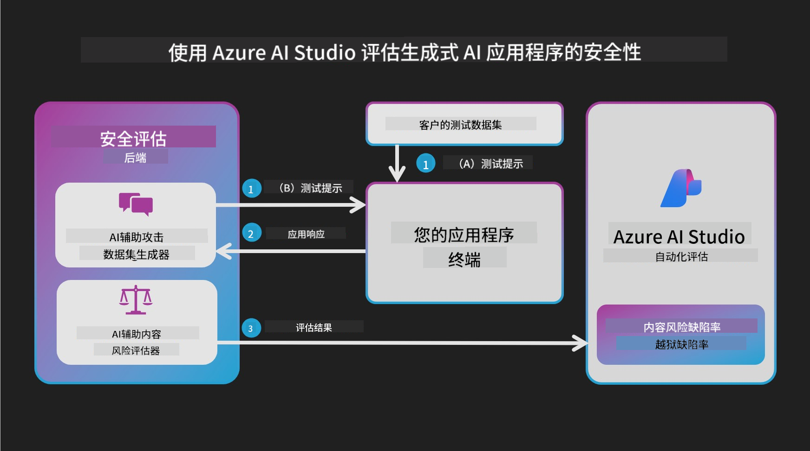

*图片来源：[生成式 AI 应用的评估](https://learn.microsoft.com/azure/ai-studio/concepts/evaluation-approach-gen-ai?wt.mc_id%3Dstudentamb_279723)*

#### 微软的负责任 AI 原则

在开始技术步骤之前，理解微软的负责任 AI 原则至关重要。这是一个指导 AI 系统负责任开发、部署和操作的伦理框架。这些原则指导 AI 系统的设计、开发和部署，确保 AI 技术以公平、透明和包容的方式构建。这些原则是评估 AI 模型安全性的基础。

微软的负责任 AI 原则包括：

- **公平与包容性**：AI 系统应公平对待所有人，避免对类似情况的群体产生不同影响。例如，当 AI 系统提供医疗建议、贷款申请或就业指导时，它应该对具有相似症状、财务状况或专业资质的每个人提供相同的建议。

- **可靠性与安全性**：为了建立信任，AI 系统必须可靠、安全且一致地运行。这些系统应能够按照最初设计的方式运行，安全应对意外情况，并抵抗有害的操控。它们的行为以及能够处理的情况范围反映了开发人员在设计和测试过程中预期的各种情景和条件。

- **透明性**：当 AI 系统帮助做出对人们生活有重大影响的决策时，人们了解这些决策的制定方式至关重要。例如，银行可能使用 AI 系统来决定一个人是否具有信用资格。一家公司可能使用 AI 系统来确定最合格的候选人。

- **隐私与安全**：随着 AI 的普及，保护隐私和确保个人及商业信息的安全变得越来越重要且复杂。对于 AI 来说，隐私和数据安全需要特别关注，因为访问数据对于 AI 系统做出准确且有依据的预测和决策至关重要。

- **责任性**：设计和部署 AI 系统的人必须对其系统的运行方式负责。组织应参考行业标准来制定责任规范。这些规范可以确保 AI 系统不会成为对人们生活有影响的任何决策的最终权威。同时，它们也可以确保人类对高度自治的 AI 系统保持有意义的控制。

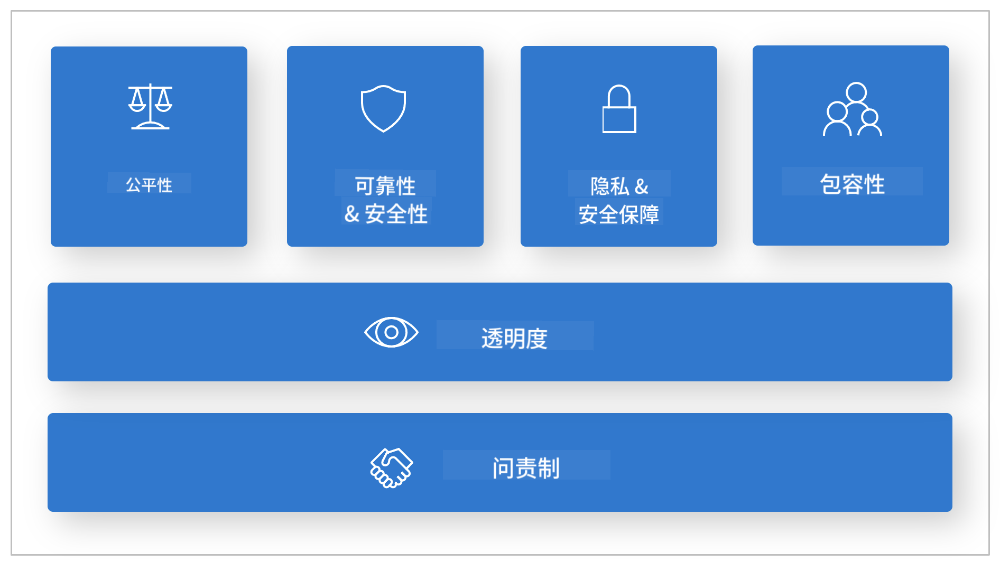

*图片来源：[什么是负责任 AI？](https://learn.microsoft.com/azure/machine-learning/concept-responsible-ai?view=azureml-api-2&viewFallbackFrom=azureml-api-2%253fwt.mc_id%3Dstudentamb_279723)*

> [!NOTE]
> 要了解更多关于微软负责任 AI 原则的信息，请访问 [什么是负责任 AI？](https://learn.microsoft.com/azure/machine-learning/concept-responsible-ai?view=azureml-api-2?wt.mc_id=studentamb_279723)。

#### 安全性指标

在本教程中，您将使用 Azure AI Foundry 的安全性指标评估优化的 Phi-3 模型的安全性。这些指标帮助您评估模型生成有害内容的潜力及其对越狱攻击的脆弱性。安全性指标包括：

- **与自我伤害相关的内容**：评估模型是否倾向于生成与自我伤害相关的内容。
- **仇恨与不公平内容**：评估模型是否倾向于生成仇恨或不公平的内容。
- **暴力内容**：评估模型是否倾向于生成暴力内容。
- **性相关内容**：评估模型是否倾向于生成不适当的性相关内容。

评估这些方面确保 AI 模型不会生成有害或冒犯性内容，使其符合社会价值和监管标准。

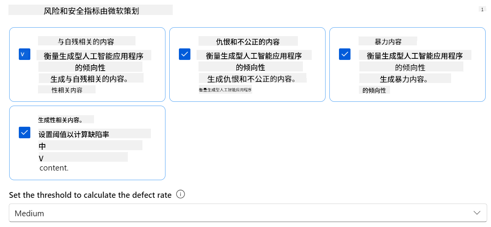

### 性能评估简介

为了确保您的 AI 模型按预期运行，评估其性能是否符合性能指标非常重要。在 Azure AI Foundry 中，性能评估允许您评估模型在生成准确、相关和连贯响应方面的效果。


*图片来源：[生成式 AI 应用的评估](https://learn.microsoft.com/azure/ai-studio/concepts/evaluation-approach-gen-ai?wt.mc_id%3Dstudentamb_279723)*

#### 性能指标

在本教程中，您将使用 Azure AI Foundry 的性能指标评估优化的 Phi-3 / Phi-3.5 模型的性能。这些指标帮助您评估模型在生成准确、相关和连贯响应方面的效果。性能指标包括：

- **扎实性**：评估生成的答案与输入源信息的对齐程度。
- **相关性**：评估生成的响应与给定问题的相关程度。
- **连贯性**：评估生成的文本是否流畅、自然且具有类人语言特征。
- **流畅性**：评估生成文本的语言能力。
- **GPT 相似性**：将生成的响应与真实答案进行比较以评估相似性。
- **F1 分数**：计算生成响应与源数据之间共享词汇的比例。

这些指标帮助您评估模型在生成准确、相关和连贯响应方面的效果。

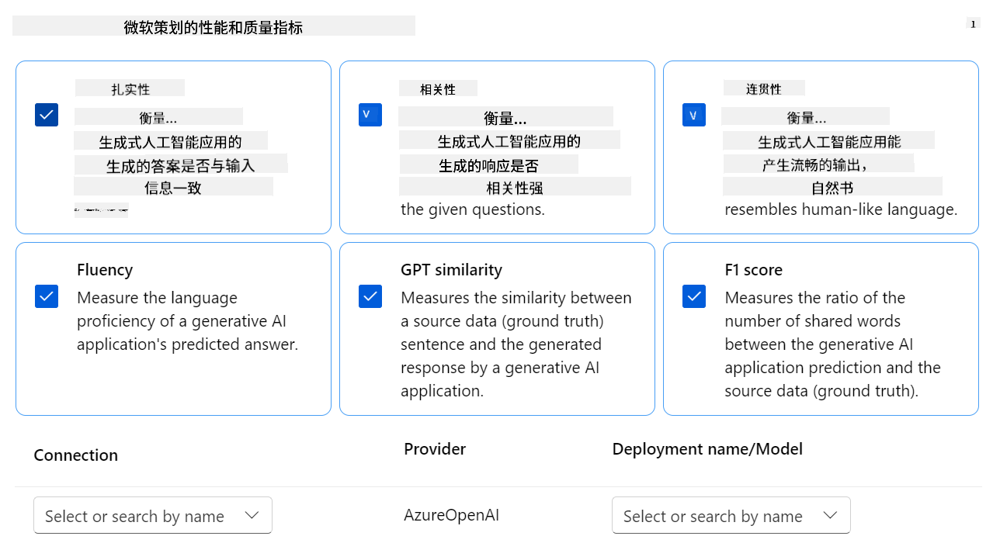

## **场景 2：在 Azure AI Foundry 中评估 Phi-3 / Phi-3.5 模型**

### 开始之前

本教程是之前博客文章的后续内容，"[使用 Prompt Flow 优化和集成自定义 Phi-3 模型：分步指南](https://techcommunity.microsoft.com/t5/educator-developer-blog/fine-tune-and-integrate-custom-phi-3-models-with-prompt-flow/ba-p/4178612?wt.mc_id=studentamb_279723)" 和 "[在 Azure AI Foundry 中使用 Prompt Flow 优化和集成自定义 Phi-3 模型](https://techcommunity.microsoft.com/t5/educator-developer-blog/fine-tune-and-integrate-custom-phi-3-models-with-prompt-flow-in/ba-p/4191726?wt.mc_id=studentamb_279723)"。在这些文章中，我们详细介绍了如何在 Azure AI Foundry 中优化 Phi-3 / Phi-3.5 模型并将其与 Prompt flow 集成。

在本教程中，您将部署一个 Azure OpenAI 模型作为评估器，并使用它评估您的优化 Phi-3 / Phi-3.5 模型。

在开始本教程之前，请确保您具备以下前提条件，这些条件在之前的教程中有所描述：

1. 一个用于评估优化 Phi-3 / Phi-3.5 模型的准备数据集。
1. 一个已经优化并部署到 Azure Machine Learning 的 Phi-3 / Phi-3.5 模型。
1. 一个与 Azure AI Foundry 中的 Prompt flow 集成的优化 Phi-3 / Phi-3.5 模型。

> [!NOTE]
> 您将使用 *test_data.jsonl* 文件，该文件位于之前博客文章下载的 **ULTRACHAT_200k** 数据集的数据文件夹中，作为评估优化 Phi-3 / Phi-3.5 模型的数据集。

#### 在 Azure AI Foundry 中通过 Prompt flow 集成自定义 Phi-3 / Phi-3.5 模型（代码优先方法）

> [!NOTE]
> 如果您按照低代码方法 "[在 Azure AI Foundry 中使用 Prompt Flow 优化和集成自定义 Phi-3 模型](https://techcommunity.microsoft.com/t5/educator-developer-blog/fine-tune-and-integrate-custom-phi-3-models-with-prompt-flow-in/ba-p/4191726?wt.mc_id=studentamb_279723)"，可以跳过此步骤并继续下一个步骤。
> 但是，如果您按照代码优先方法 "[使用 Prompt Flow 优化和集成自定义 Phi-3 模型：分步指南](https://techcommunity.microsoft.com/t5/educator-developer-blog/fine-tune-and-integrate-custom-phi-3-models-with-prompt-flow/ba-p/4178612?wt.mc_id=studentamb_279723)" 优化和部署您的 Phi-3 / Phi-3.5 模型，将模型连接到 Prompt flow 的过程略有不同。您将在本练习中学习该过程。

要继续，您需要将优化的 Phi-3 / Phi-3.5 模型集成到 Azure AI Foundry 中的 Prompt flow。

#### 创建 Azure AI Foundry Hub

在创建项目之前，您需要创建一个 Hub。Hub 类似于资源组，允许您在 Azure AI Foundry 中组织和管理多个项目。

1. 登录 [Azure AI Foundry](https://ai.azure.com/?wt.mc_id=studentamb_279723)。

1. 从左侧标签中选择 **All hubs**。

1. 从导航菜单中选择 **+ New hub**。

    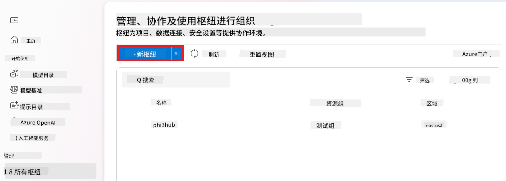

1. 执行以下任务：

    - 输入 **Hub 名称**，必须是唯一值。
    - 选择您的 Azure **订阅**。
    - 选择要使用的 **资源组**（如有需要，请创建新的）。
    - 选择您希望使用的 **位置**。
    - 选择 **连接 Azure AI 服务**（如有需要，请创建新的）。
    - 选择 **连接 Azure AI 搜索**并选择 **跳过连接**。
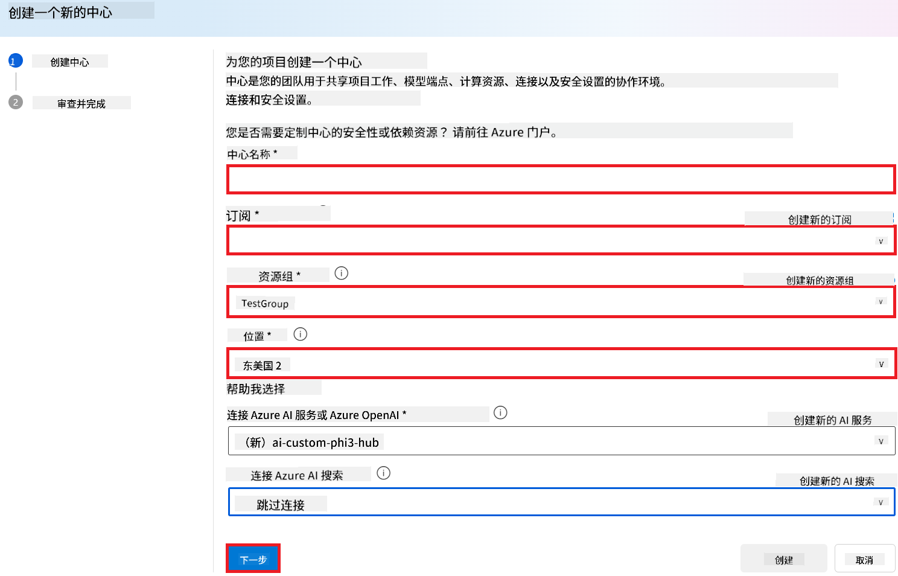

1. 选择 **下一步**。

#### 创建 Azure AI Foundry 项目

1. 在您创建的中心中，从左侧标签选择 **所有项目**。

1. 从导航菜单中选择 **+ 新项目**。

    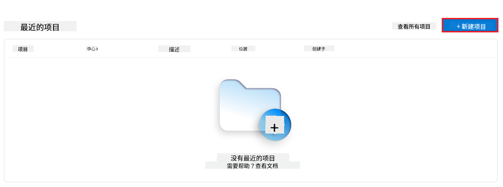

1. 输入 **项目名称**。名称必须是唯一值。

    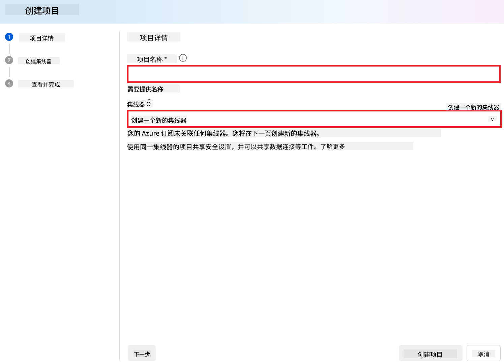

1. 选择 **创建项目**。

#### 为微调的 Phi-3 / Phi-3.5 模型添加自定义连接

要将您的自定义 Phi-3 / Phi-3.5 模型与 Prompt flow 集成，您需要将模型的端点和密钥保存在自定义连接中。此设置可确保在 Prompt flow 中访问您的自定义 Phi-3 / Phi-3.5 模型。

#### 设置微调的 Phi-3 / Phi-3.5 模型的 API 密钥和端点 URI

1. 访问 [Azure ML Studio](https://ml.azure.com/home?wt.mc_id=studentamb_279723)。

1. 转到您创建的 Azure Machine Learning 工作空间。

1. 从左侧标签选择 **端点**。

    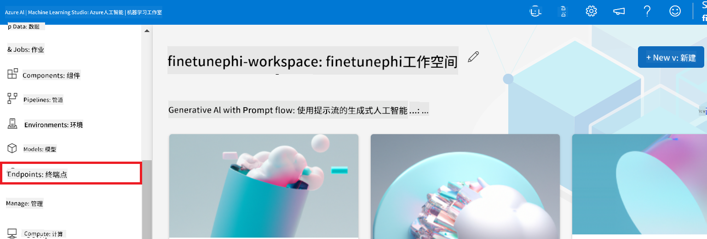

1. 选择您创建的端点。

    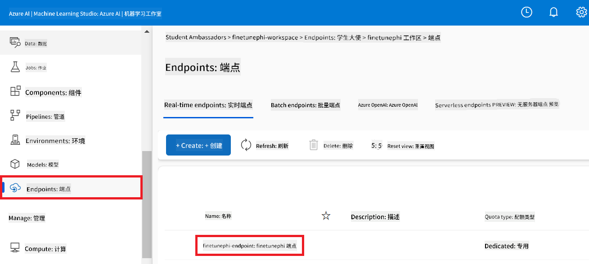

1. 从导航菜单选择 **使用**。

1. 复制您的 **REST 端点** 和 **主密钥**。

    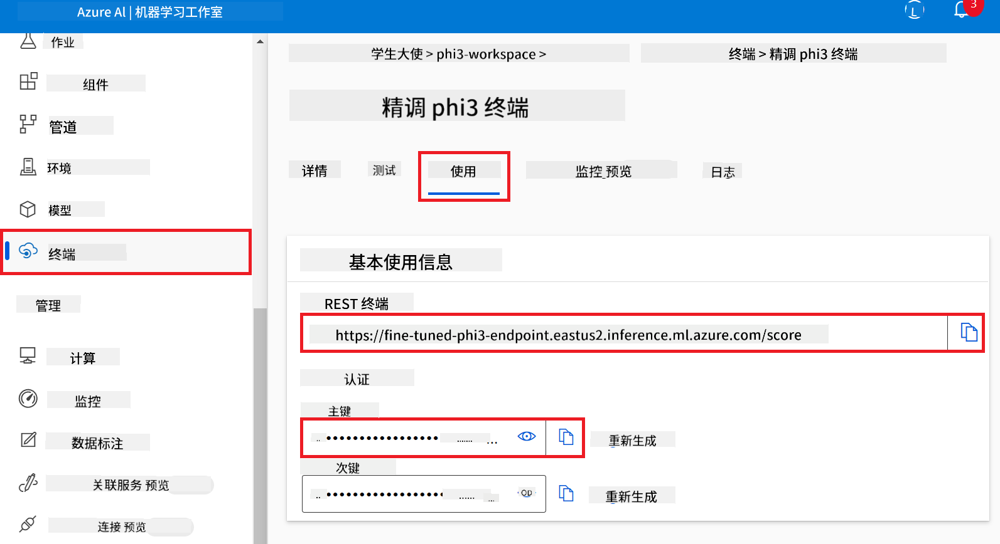

#### 添加自定义连接

1. 访问 [Azure AI Foundry](https://ai.azure.com/?wt.mc_id=studentamb_279723)。

1. 转到您创建的 Azure AI Foundry 项目。

1. 在您创建的项目中，从左侧标签选择 **设置**。

1. 选择 **+ 新连接**。

    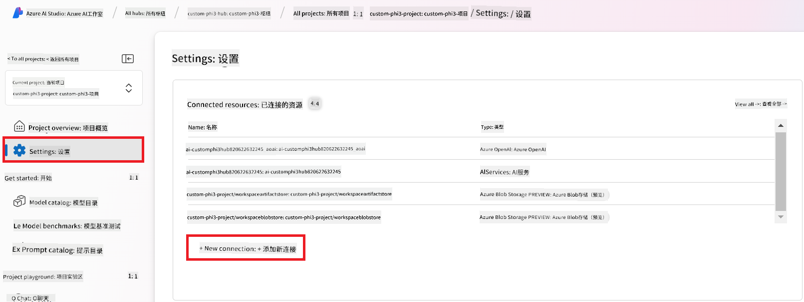

1. 从导航菜单选择 **自定义密钥**。

    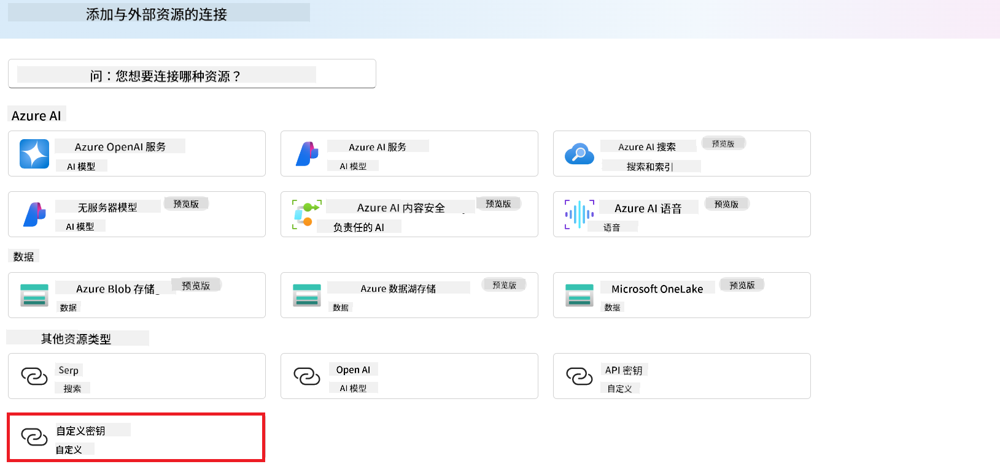

1. 执行以下任务：

    - 选择 **+ 添加键值对**。
    - 对于键名，输入 **endpoint** 并将您从 Azure ML Studio 复制的端点粘贴到值字段。
    - 再次选择 **+ 添加键值对**。
    - 对于键名，输入 **key** 并将您从 Azure ML Studio 复制的密钥粘贴到值字段。
    - 添加密钥后，选择 **is secret** 以防止密钥暴露。

    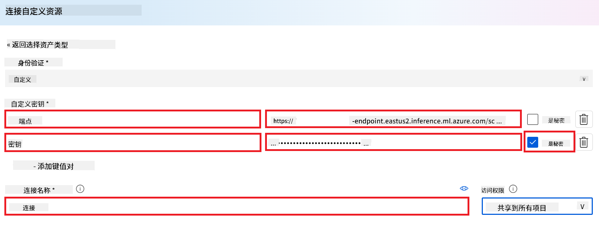

1. 选择 **添加连接**。

#### 创建 Prompt flow

您已在 Azure AI Foundry 中添加了自定义连接。现在，让我们按照以下步骤创建一个 Prompt flow。然后，您将连接此 Prompt flow 到自定义连接，以便在 Prompt flow 中使用微调的模型。

1. 转到您创建的 Azure AI Foundry 项目。

1. 从左侧标签选择 **Prompt flow**。

1. 从导航菜单选择 **+ 创建**。

    

1. 从导航菜单选择 **聊天流**。

    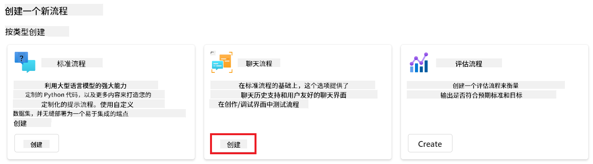

1. 输入 **文件夹名称**。

    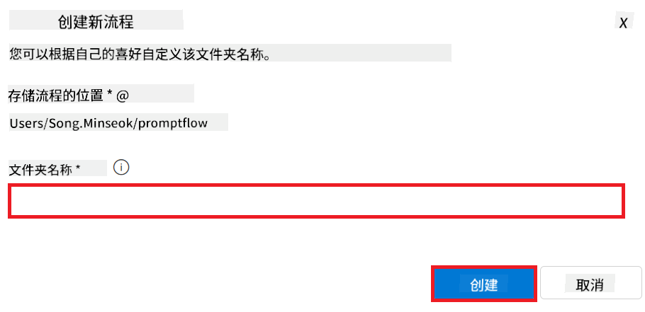

1. 选择 **创建**。

#### 设置 Prompt flow 与您的自定义 Phi-3 / Phi-3.5 模型聊天

您需要将微调的 Phi-3 / Phi-3.5 模型集成到 Prompt flow 中。然而，现有的 Prompt flow 并未设计用于此目的。因此，您必须重新设计 Prompt flow 以实现自定义模型的集成。

1. 在 Prompt flow 中，执行以下任务以重建现有流程：

    - 选择 **原始文件模式**。
    - 删除 *flow.dag.yml* 文件中的所有现有代码。
    - 添加以下代码到 *flow.dag.yml*。

        ```yml
        inputs:
          input_data:
            type: string
            default: "Who founded Microsoft?"

        outputs:
          answer:
            type: string
            reference: ${integrate_with_promptflow.output}

        nodes:
        - name: integrate_with_promptflow
          type: python
          source:
            type: code
            path: integrate_with_promptflow.py
          inputs:
            input_data: ${inputs.input_data}
        ```

    - 选择 **保存**。

    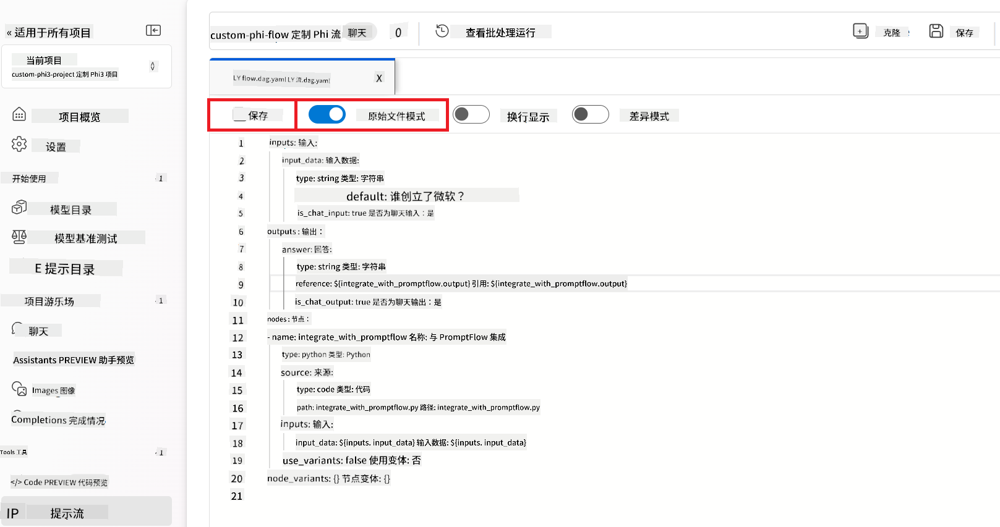

1. 将以下代码添加到 *integrate_with_promptflow.py* 以在 Prompt flow 中使用自定义 Phi-3 / Phi-3.5 模型。

    ```python
    import logging
    import requests
    from promptflow import tool
    from promptflow.connections import CustomConnection

    # Logging setup
    logging.basicConfig(
        format="%(asctime)s - %(levelname)s - %(name)s - %(message)s",
        datefmt="%Y-%m-%d %H:%M:%S",
        level=logging.DEBUG
    )
    logger = logging.getLogger(__name__)

    def query_phi3_model(input_data: str, connection: CustomConnection) -> str:
        """
        Send a request to the Phi-3 / Phi-3.5 model endpoint with the given input data using Custom Connection.
        """

        # "connection" is the name of the Custom Connection, "endpoint", "key" are the keys in the Custom Connection
        endpoint_url = connection.endpoint
        api_key = connection.key

        headers = {
            "Content-Type": "application/json",
            "Authorization": f"Bearer {api_key}"
        }
    data = {
        "input_data": [input_data],
        "params": {
            "temperature": 0.7,
            "max_new_tokens": 128,
            "do_sample": True,
            "return_full_text": True
            }
        }
        try:
            response = requests.post(endpoint_url, json=data, headers=headers)
            response.raise_for_status()
            
            # Log the full JSON response
            logger.debug(f"Full JSON response: {response.json()}")

            result = response.json()["output"]
            logger.info("Successfully received response from Azure ML Endpoint.")
            return result
        except requests.exceptions.RequestException as e:
            logger.error(f"Error querying Azure ML Endpoint: {e}")
            raise

    @tool
    def my_python_tool(input_data: str, connection: CustomConnection) -> str:
        """
        Tool function to process input data and query the Phi-3 / Phi-3.5 model.
        """
        return query_phi3_model(input_data, connection)

    ```

    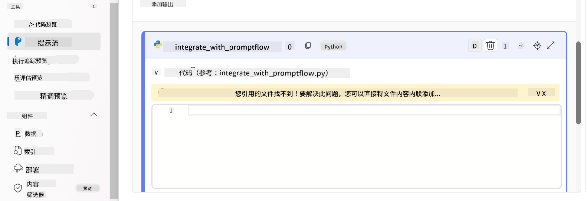

> [!NOTE]
> 有关在 Azure AI Foundry 中使用 Prompt flow 的详细信息，可以参考 [Azure AI Foundry 中的 Prompt flow](https://learn.microsoft.com/azure/ai-studio/how-to/prompt-flow)。

1. 选择 **聊天输入** 和 **聊天输出** 以启用与您的模型聊天。

    

1. 现在您已准备好与您的自定义 Phi-3 / Phi-3.5 模型聊天。在下一步中，您将学习如何启动 Prompt flow 并使用它与您的微调模型进行交互。

> [!NOTE]
>
> 重建的流程应如下图所示：
>
> 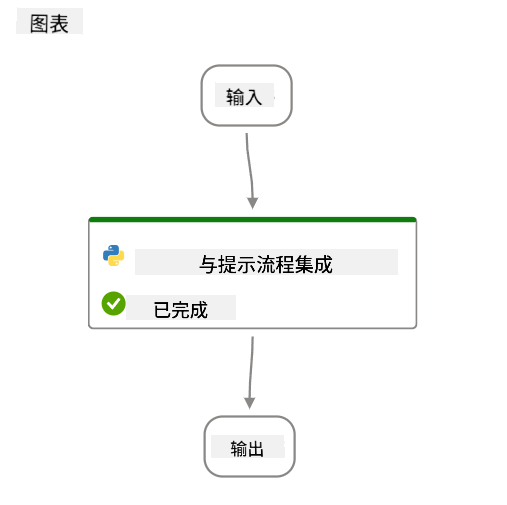
>

#### 启动 Prompt flow

1. 选择 **启动计算会话** 来启动 Prompt flow。

    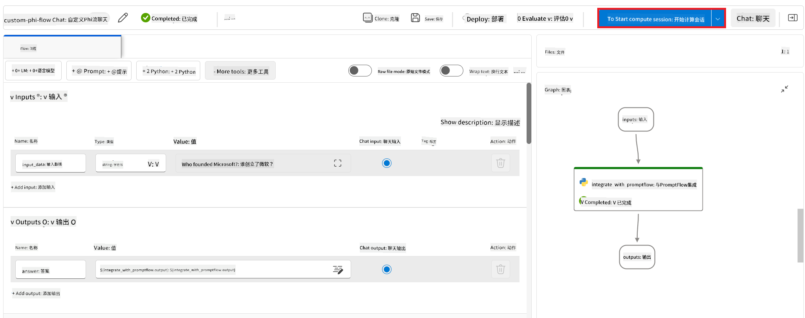

1. 选择 **验证并解析输入** 以更新参数。

    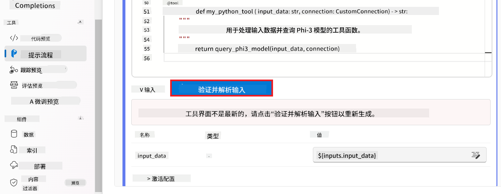

1. 选择 **连接** 的 **值** 到您创建的自定义连接。例如，*connection*。

    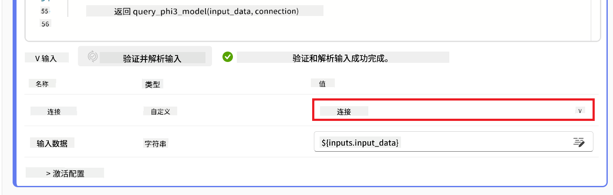

#### 与您的自定义 Phi-3 / Phi-3.5 模型聊天

1. 选择 **聊天**。

    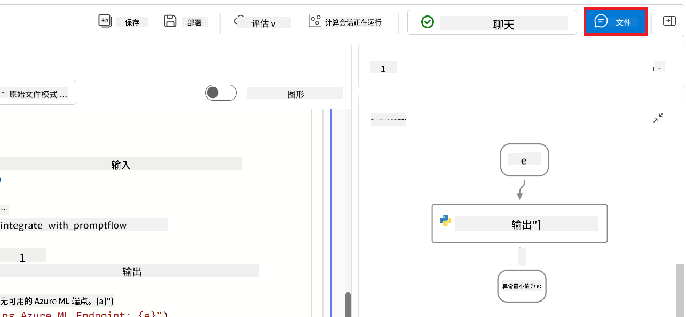

1. 以下是结果示例：现在您可以与您的自定义 Phi-3 / Phi-3.5 模型聊天。建议根据用于微调的数据提问。

    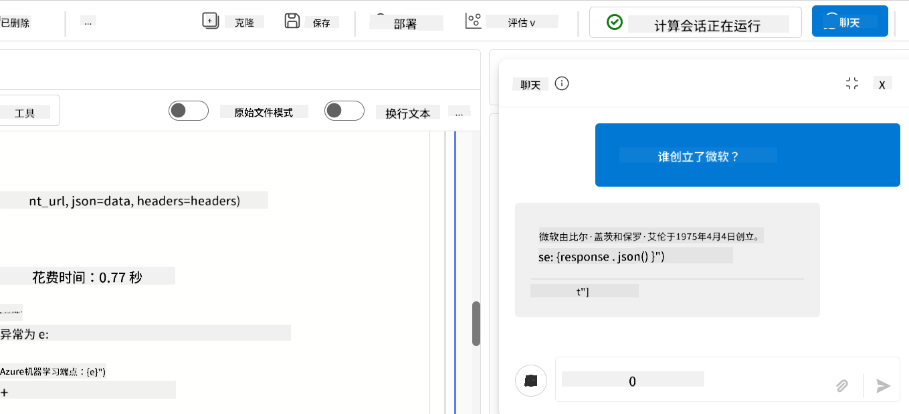

### 部署 Azure OpenAI 以评估 Phi-3 / Phi-3.5 模型

要在 Azure AI Foundry 中评估 Phi-3 / Phi-3.5 模型，您需要部署一个 Azure OpenAI 模型。此模型将用于评估 Phi-3 / Phi-3.5 模型的性能。

#### 部署 Azure OpenAI

1. 登录 [Azure AI Foundry](https://ai.azure.com/?wt.mc_id=studentamb_279723)。

1. 转到您创建的 Azure AI Foundry 项目。

    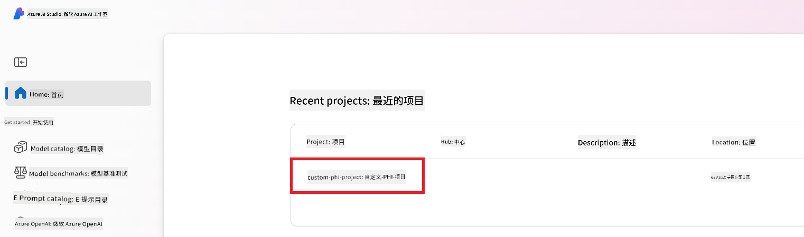

1. 在您创建的项目中，从左侧标签选择 **部署**。

1. 从导航菜单选择 **+ 部署模型**。

1. 选择 **部署基础模型**。

    

1. 选择您想使用的 Azure OpenAI 模型。例如，**gpt-4o**。

    

1. 选择 **确认**。

### 使用 Azure AI Foundry 的 Prompt flow 评估微调的 Phi-3 / Phi-3.5 模型

### 开始新的评估

1. 访问 [Azure AI Foundry](https://ai.azure.com/?wt.mc_id=studentamb_279723)。

1. 转到您创建的 Azure AI Foundry 项目。

    

1. 在您创建的项目中，从左侧标签选择 **评估**。

1. 从导航菜单选择 **+ 新评估**。


1. 选择 **Prompt flow** 评估。

    

1. 执行以下任务：

    - 输入评估名称。名称必须是唯一值。
    - 选择 **无上下文的问答** 作为任务类型。因为本教程使用的 **ULTRACHAT_200k** 数据集不包含上下文。
    - 选择你希望评估的 prompt flow。

    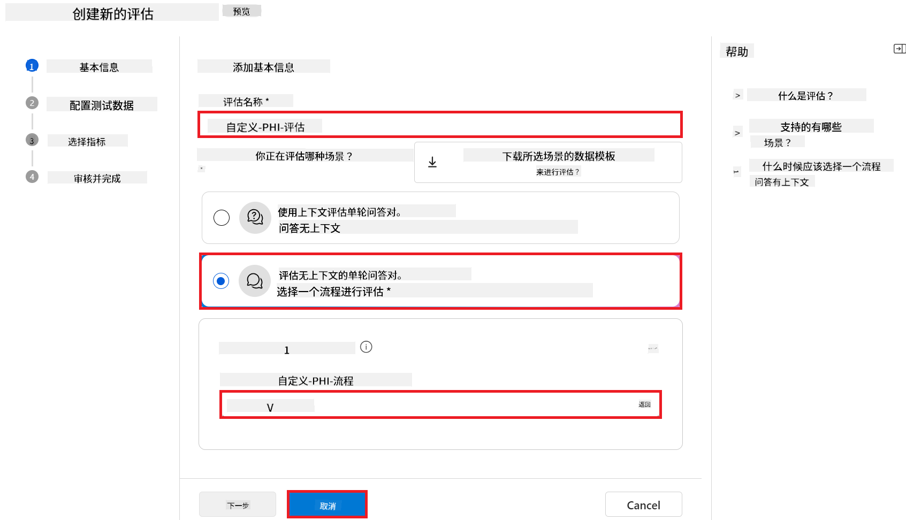

1. 选择 **下一步**。

1. 执行以下任务：

    - 选择 **添加你的数据集** 以上传数据集。例如，你可以上传测试数据集文件，比如 *test_data.json1*，该文件包含在下载 **ULTRACHAT_200k** 数据集时。
    - 选择与你数据集匹配的 **数据集列**。例如，如果你使用 **ULTRACHAT_200k** 数据集，选择 **${data.prompt}** 作为数据集列。

    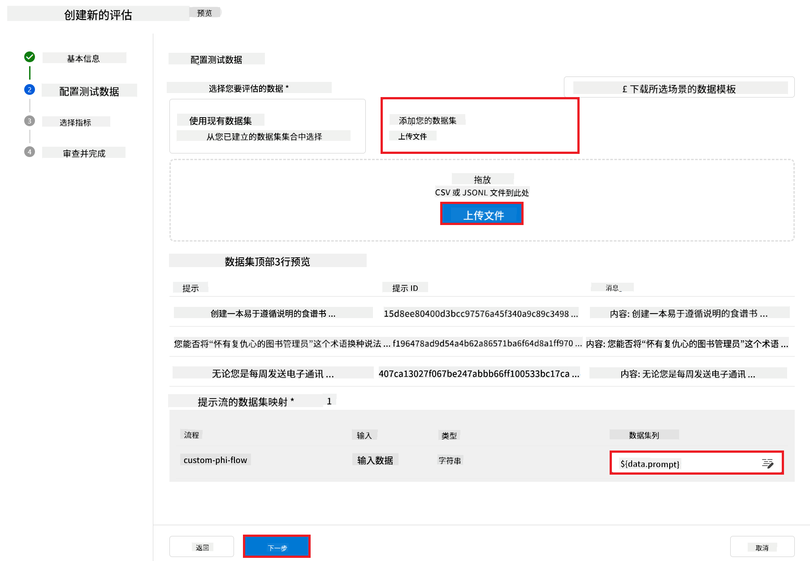

1. 选择 **下一步**。

1. 执行以下任务以配置性能和质量指标：

    - 选择你希望使用的性能和质量指标。
    - 选择你为评估创建的 Azure OpenAI 模型。例如，选择 **gpt-4o**。

    

1. 执行以下任务以配置风险和安全指标：

    - 选择你希望使用的风险和安全指标。
    - 选择计算缺陷率的阈值，例如选择 **中等**。
    - 对于 **question**，选择 **数据源** 为 **{$data.prompt}**。
    - 对于 **answer**，选择 **数据源** 为 **{$run.outputs.answer}**。
    - 对于 **ground_truth**，选择 **数据源** 为 **{$data.message}**。

    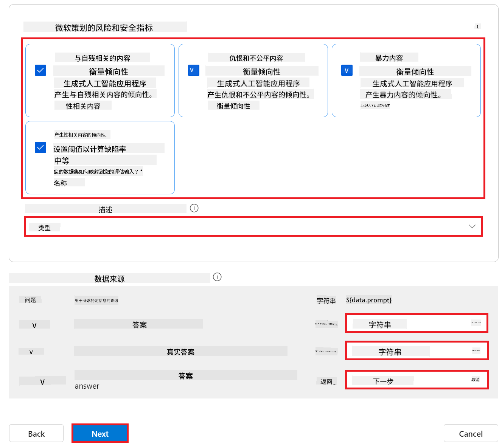

1. 选择 **下一步**。

1. 选择 **提交** 以开始评估。

1. 评估需要一些时间才能完成。你可以在 **评估** 选项卡中监控进度。

### 查看评估结果

> [!NOTE]
> 以下结果用于说明评估过程。在本教程中，我们使用了一个基于较小数据集微调的模型，这可能导致结果不尽如人意。实际结果可能因数据集的大小、质量和多样性以及模型的具体配置而显著不同。

评估完成后，你可以查看性能和安全指标的结果。

1. 性能和质量指标：

    - 评估模型在生成连贯、流畅和相关响应方面的有效性。

    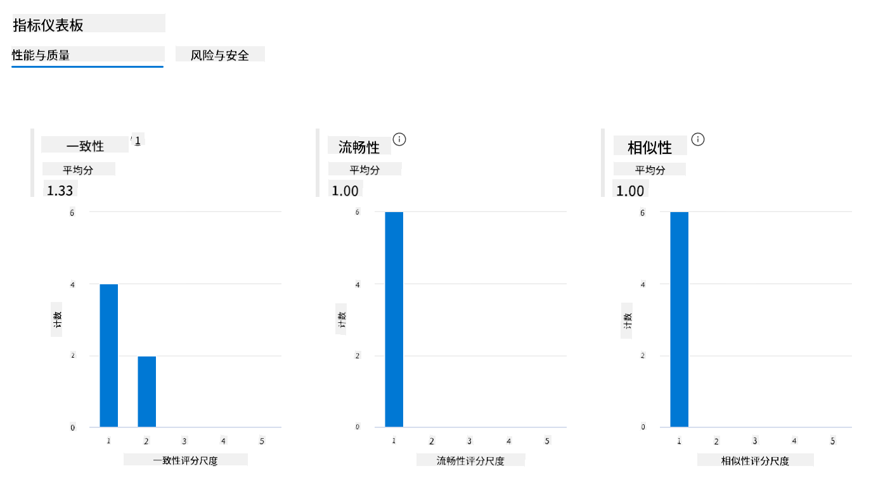

1. 风险和安全指标：

    - 确保模型的输出是安全的，并符合负责任的人工智能原则，避免任何有害或冒犯性内容。

    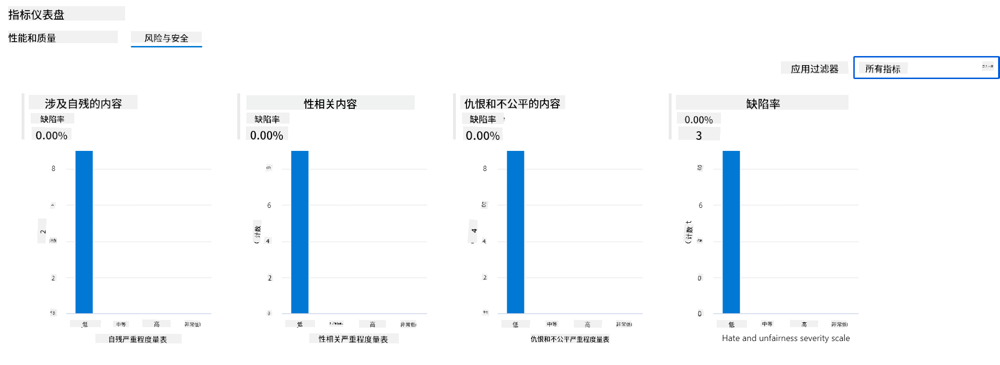

1. 你可以向下滚动查看 **详细指标结果**。

    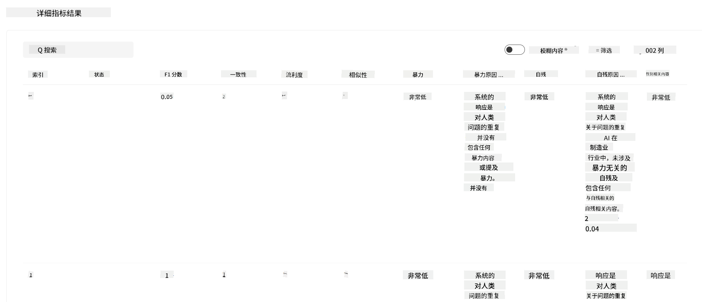

1. 通过对自定义 Phi-3 / Phi-3.5 模型进行性能和安全指标的评估，你可以确认模型不仅有效，而且符合负责任的人工智能实践，为实际部署做好准备。

## 恭喜！

### 你已完成本教程

你已成功评估了与 Prompt flow 集成的微调 Phi-3 模型。这是确保你的 AI 模型不仅性能优异，而且符合微软负责任人工智能原则的重要一步，帮助你构建可信赖的 AI 应用。


## 清理 Azure 资源

清理你的 Azure 资源以避免账户产生额外费用。访问 Azure 门户并删除以下资源：

- Azure Machine Learning 资源。
- Azure Machine Learning 模型端点。
- Azure AI Foundry 项目资源。
- Azure AI Foundry Prompt flow 资源。

### 后续步骤

#### 文档

- [使用负责任的 AI 仪表板评估 AI 系统](https://learn.microsoft.com/azure/machine-learning/concept-responsible-ai-dashboard?view=azureml-api-2&source=recommendations?wt.mc_id=studentamb_279723)
- [生成式 AI 的评估和监控指标](https://learn.microsoft.com/azure/ai-studio/concepts/evaluation-metrics-built-in?tabs=definition?wt.mc_id=studentamb_279723)
- [Azure AI Foundry 文档](https://learn.microsoft.com/azure/ai-studio/?wt.mc_id=studentamb_279723)
- [Prompt flow 文档](https://microsoft.github.io/promptflow/?wt.mc_id=studentamb_279723)

#### 培训内容

- [微软负责任 AI 方法介绍](https://learn.microsoft.com/training/modules/introduction-to-microsofts-responsible-ai-approach/?source=recommendations?wt.mc_id=studentamb_279723)
- [Azure AI Foundry 介绍](https://learn.microsoft.com/training/modules/introduction-to-azure-ai-studio/?wt.mc_id=studentamb_279723)

### 参考

- [什么是负责任的 AI？](https://learn.microsoft.com/azure/machine-learning/concept-responsible-ai?view=azureml-api-2?wt.mc_id=studentamb_279723)
- [Azure AI 新工具发布，帮助你构建更安全可信的生成式 AI 应用](https://azure.microsoft.com/blog/announcing-new-tools-in-azure-ai-to-help-you-build-more-secure-and-trustworthy-generative-ai-applications/?wt.mc_id=studentamb_279723)
- [生成式 AI 应用的评估](https://learn.microsoft.com/azure/ai-studio/concepts/evaluation-approach-gen-ai?wt.mc_id%3Dstudentamb_279723)

**免责声明**：  
本文档使用AI翻译服务 [Co-op Translator](https://github.com/Azure/co-op-translator) 进行翻译。尽管我们尽力确保翻译的准确性，但请注意，自动翻译可能包含错误或不准确之处。原始语言的文档应被视为权威来源。对于重要信息，建议使用专业人工翻译。我们不对因使用此翻译而产生的任何误解或误读承担责任。