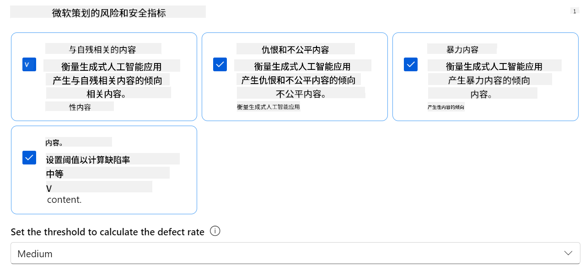
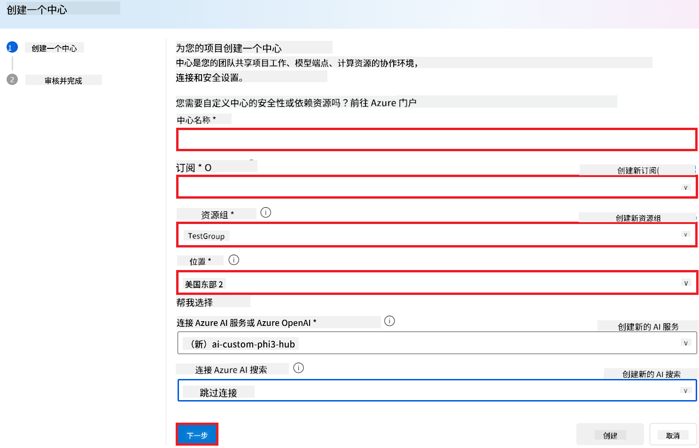
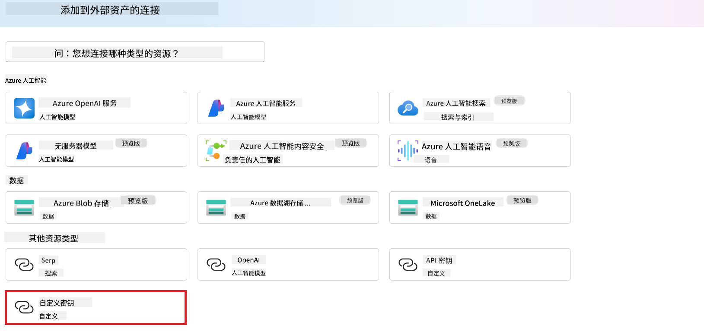
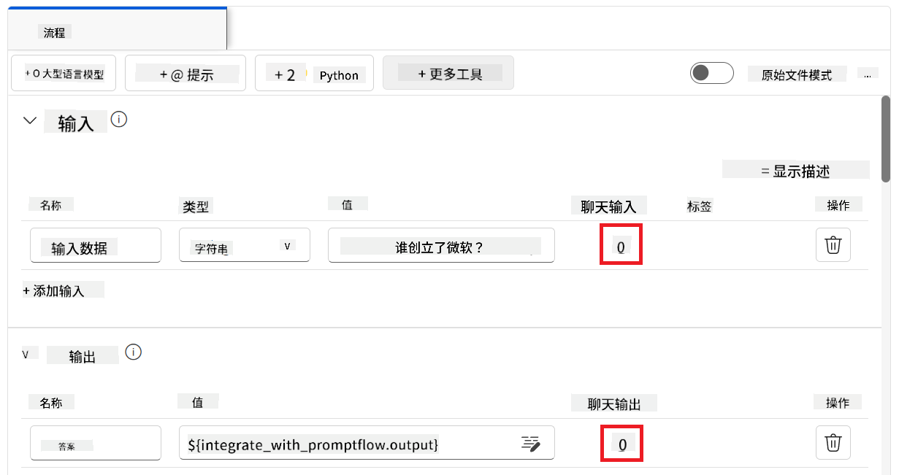
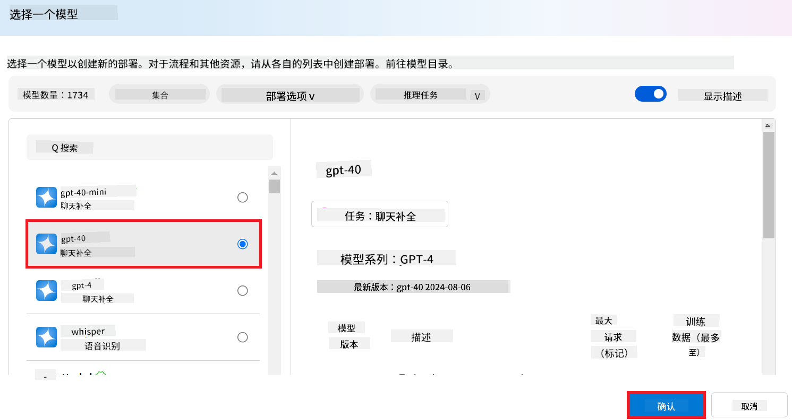
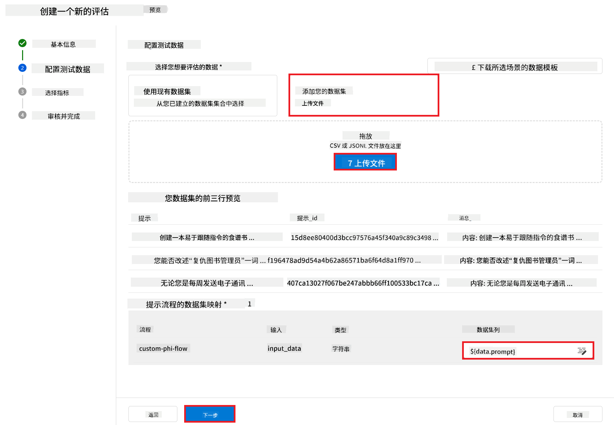
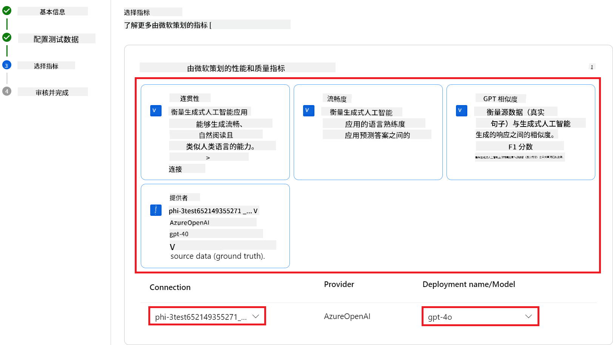

<!--
CO_OP_TRANSLATOR_METADATA:
{
  "original_hash": "80a853c08e4ee25ef9b4bfcedd8990da",
  "translation_date": "2025-05-07T14:24:59+00:00",
  "source_file": "md/02.Application/01.TextAndChat/Phi3/E2E_Phi-3-Evaluation_AIFoundry.md",
  "language_code": "zh"
}
-->
# 在 Azure AI Foundry 中评估微调后的 Phi-3 / Phi-3.5 模型，聚焦微软的负责任 AI 原则

本端到端（E2E）示例基于微软技术社区的指南“[在 Azure AI Foundry 中评估微调后的 Phi-3 / 3.5 模型，聚焦微软的负责任 AI](https://techcommunity.microsoft.com/blog/educatordeveloperblog/evaluate-fine-tuned-phi-3--3-5-models-in-azure-ai-studio-focusing-on-microsofts-/4227850?WT.mc_id=aiml-137032-kinfeylo)”。

## 概览

### 如何在 Azure AI Foundry 中评估微调后的 Phi-3 / Phi-3.5 模型的安全性和性能？

微调模型有时可能导致意外或不理想的响应。为了确保模型保持安全且有效，评估模型生成有害内容的可能性以及其产生准确、相关且连贯回答的能力非常重要。在本教程中，您将学习如何评估集成了 Prompt flow 的微调 Phi-3 / Phi-3.5 模型在 Azure AI Foundry 中的安全性和性能。

以下是 Azure AI Foundry 的评估流程。


*图片来源：[生成式 AI 应用评估](https://learn.microsoft.com/azure/ai-studio/concepts/evaluation-approach-gen-ai?wt.mc_id%3Dstudentamb_279723)*

> [!NOTE]
>
> 如需更多详细信息及探索 Phi-3 / Phi-3.5 的其他资源，请访问 [Phi-3CookBook](https://github.com/microsoft/Phi-3CookBook?wt.mc_id=studentamb_279723)。

### 先决条件

- [Python](https://www.python.org/downloads)
- [Azure 订阅](https://azure.microsoft.com/free?wt.mc_id=studentamb_279723)
- [Visual Studio Code](https://code.visualstudio.com)
- 微调后的 Phi-3 / Phi-3.5 模型

### 目录

1. [**场景 1：Azure AI Foundry 的 Prompt flow 评估简介**](../../../../../../md/02.Application/01.TextAndChat/Phi3)

    - [安全性评估简介](../../../../../../md/02.Application/01.TextAndChat/Phi3)
    - [性能评估简介](../../../../../../md/02.Application/01.TextAndChat/Phi3)

1. [**场景 2：在 Azure AI Foundry 中评估 Phi-3 / Phi-3.5 模型**](../../../../../../md/02.Application/01.TextAndChat/Phi3)

    - [开始之前](../../../../../../md/02.Application/01.TextAndChat/Phi3)
    - [部署 Azure OpenAI 以评估 Phi-3 / Phi-3.5 模型](../../../../../../md/02.Application/01.TextAndChat/Phi3)
    - [使用 Azure AI Foundry 的 Prompt flow 评估微调 Phi-3 / Phi-3.5 模型](../../../../../../md/02.Application/01.TextAndChat/Phi3)

1. [恭喜！](../../../../../../md/02.Application/01.TextAndChat/Phi3)

## **场景 1：Azure AI Foundry 的 Prompt flow 评估简介**

### 安全性评估简介

为了确保您的 AI 模型符合伦理且安全，评估其是否符合微软的负责任 AI 原则至关重要。在 Azure AI Foundry 中，安全性评估可帮助您评估模型对越狱攻击的脆弱性及其生成有害内容的可能性，这与这些原则直接相关。


*图片来源：[生成式 AI 应用评估](https://learn.microsoft.com/azure/ai-studio/concepts/evaluation-approach-gen-ai?wt.mc_id%3Dstudentamb_279723)*

#### 微软的负责任 AI 原则

在开始技术步骤之前，理解微软的负责任 AI 原则非常重要。这是一套旨在指导 AI 系统负责任开发、部署和运行的伦理框架。这些原则引导 AI 系统的负责任设计、开发和部署，确保 AI 技术的构建公正、透明且包容。这些原则是评估 AI 模型安全性的基础。

微软的负责任 AI 原则包括：

- **公平与包容**：AI 系统应公平对待所有人，避免对处境相似的群体产生不同影响。例如，当 AI 系统提供医疗治疗建议、贷款申请或就业推荐时，应对所有具有类似症状、财务状况或专业资格的人给出相同建议。

- **可靠性与安全性**：为了建立信任，AI 系统必须可靠、安全且一致地运行。这些系统应能按照最初设计的方式运行，安全响应意外情况，并抵御有害操控。它们的行为及能应对的各种情况反映了开发者在设计和测试阶段预见的情境范围。

- **透明度**：当 AI 系统帮助做出对人们生活产生重大影响的决策时，人们必须理解这些决策的依据。例如，银行可能使用 AI 系统判断个人的信用资格，公司可能使用 AI 系统筛选最合适的招聘候选人。

- **隐私与安全**：随着 AI 越来越普及，保护隐私和保障个人及企业信息安全变得更为重要且复杂。AI 需要访问数据以做出准确和有依据的预测与决策，因此隐私和数据安全需要特别关注。

- **问责制**：设计和部署 AI 系统的人必须对系统的运行负责。组织应参考行业标准制定问责规范，确保 AI 系统不是影响人们生活决策的最终权威，也确保人在高度自主的 AI 系统中保持有意义的控制权。


*图片来源：[什么是负责任 AI？](https://learn.microsoft.com/azure/machine-learning/concept-responsible-ai?view=azureml-api-2&viewFallbackFrom=azureml-api-2%253fwt.mc_id%3Dstudentamb_279723)*

> [!NOTE]
> 如需了解更多微软的负责任 AI 原则，请访问 [什么是负责任 AI？](https://learn.microsoft.com/azure/machine-learning/concept-responsible-ai?view=azureml-api-2?wt.mc_id=studentamb_279723)。

#### 安全性指标

在本教程中，您将使用 Azure AI Foundry 的安全性指标来评估微调后的 Phi-3 模型的安全性。这些指标帮助您评估模型生成有害内容的潜力及其对越狱攻击的脆弱性。安全性指标包括：

- **自我伤害相关内容**：评估模型是否倾向于产生自我伤害相关内容。
- **仇恨和不公正内容**：评估模型是否倾向于产生仇恨或不公正内容。
- **暴力内容**：评估模型是否倾向于产生暴力内容。
- **性相关内容**：评估模型是否倾向于产生不当的性内容。

评估这些方面可确保 AI 模型不会产生有害或冒犯性的内容，使其符合社会价值观和监管标准。



### 性能评估简介

为了确保您的 AI 模型表现符合预期，评估其性能指标非常重要。在 Azure AI Foundry 中，性能评估可以帮助您评估模型生成准确、相关且连贯回答的效果。


*图片来源：[生成式 AI 应用评估](https://learn.microsoft.com/azure/ai-studio/concepts/evaluation-approach-gen-ai?wt.mc_id%3Dstudentamb_279723)*

#### 性能指标

在本教程中，您将使用 Azure AI Foundry 的性能指标评估微调后的 Phi-3 / Phi-3.5 模型的性能。这些指标帮助您评估模型生成准确、相关且连贯回答的能力。性能指标包括：

- **依据性**：评估生成的答案与输入信息的匹配程度。
- **相关性**：评估生成回答与所提问题的相关程度。
- **连贯性**：评估生成文本的流畅度、自然度以及是否类似人类语言。
- **流利度**：评估生成文本的语言表达能力。
- **GPT 相似度**：比较生成回答与真实答案的相似度。
- **F1 分数**：计算生成回答与源数据之间共享词汇的比例。

这些指标帮助您评估模型在生成准确、相关和连贯回答方面的有效性。


## **场景 2：在 Azure AI Foundry 中评估 Phi-3 / Phi-3.5 模型**

### 开始之前

本教程是之前博客文章“[使用 Prompt Flow 微调并集成自定义 Phi-3 模型：分步指南](https://techcommunity.microsoft.com/t5/educator-developer-blog/fine-tune-and-integrate-custom-phi-3-models-with-prompt-flow/ba-p/4178612?wt.mc_id=studentamb_279723)”和“[在 Azure AI Foundry 中使用 Prompt Flow 微调并集成自定义 Phi-3 模型](https://techcommunity.microsoft.com/t5/educator-developer-blog/fine-tune-and-integrate-custom-phi-3-models-with-prompt-flow-in/ba-p/4191726?wt.mc_id=studentamb_279723)”的后续。在这些文章中，我们演示了如何在 Azure AI Foundry 中微调 Phi-3 / Phi-3.5 模型并将其集成到 Prompt flow。

在本教程中，您将部署 Azure OpenAI 模型作为评估器在 Azure AI Foundry 中使用，并利用它来评估您微调后的 Phi-3 / Phi-3.5 模型。

开始本教程之前，请确保您具备前面教程中描述的以下先决条件：

1. 用于评估微调 Phi-3 / Phi-3.5 模型的准备好数据集。
1. 已微调并部署到 Azure 机器学习的 Phi-3 / Phi-3.5 模型。
1. 已在 Azure AI Foundry 中将 Prompt flow 与微调的 Phi-3 / Phi-3.5 模型集成。

> [!NOTE]
> 您将使用位于数据文件夹中的 **ULTRACHAT_200k** 数据集里的 *test_data.jsonl* 文件，作为评估微调 Phi-3 / Phi-3.5 模型的数据集。

#### 在 Azure AI Foundry 中将自定义 Phi-3 / Phi-3.5 模型与 Prompt flow 集成（代码优先方法）

> [!NOTE]
> 如果您按照“[在 Azure AI Foundry 中使用 Prompt Flow 微调并集成自定义 Phi-3 模型](https://techcommunity.microsoft.com/t5/educator-developer-blog/fine-tune-and-integrate-custom-phi-3-models-with-prompt-flow-in/ba-p/4191726?wt.mc_id=studentamb_279723)”中描述的低代码方法操作，可以跳过本练习，直接进入下一步。
> 但如果您是按照“[使用 Prompt Flow 微调并集成自定义 Phi-3 模型：分步指南](https://techcommunity.microsoft.com/t5/educator-developer-blog/fine-tune-and-integrate-custom-phi-3-models-with-prompt-flow/ba-p/4178612?wt.mc_id=studentamb_279723)”中描述的代码优先方法微调并部署 Phi-3 / Phi-3.5 模型，那么将模型连接到 Prompt flow 的过程略有不同。您将在本练习中学习这一过程。

要继续操作，您需要将微调后的 Phi-3 / Phi-3.5 模型集成到 Azure AI Foundry 的 Prompt flow 中。

#### 创建 Azure AI Foundry Hub

在创建项目之前，您需要先创建一个 Hub。Hub 类似于资源组，允许您在 Azure AI Foundry 中组织和管理多个项目。

1. 登录 [Azure AI Foundry](https://ai.azure.com/?wt.mc_id=studentamb_279723)。

1. 从左侧标签中选择 **All hubs**。

1. 从导航菜单选择 **+ New hub**。

    

1. 执行以下操作：

    - 输入 **Hub 名称**，必须是唯一值。
    - 选择您的 Azure **订阅**。
    - 选择要使用的 **资源组**（如有需要可新建）。
    - 选择您想使用的 **区域**。
    - 选择要使用的 **连接 Azure AI 服务**（如有需要可新建）。
    - 选择 **连接 Azure AI 搜索**，选择 **跳过连接**。


1. 选择 **Next**。

#### 创建 Azure AI Foundry 项目

1. 在你创建的 Hub 中，从左侧标签选择 **All projects**。

1. 从导航菜单中选择 **+ New project**。

    

1. 输入 **Project name**，必须是唯一值。

    

1. 选择 **Create a project**。

#### 为微调的 Phi-3 / Phi-3.5 模型添加自定义连接

要将你的自定义 Phi-3 / Phi-3.5 模型集成到 Prompt flow 中，需要将模型的端点和密钥保存到自定义连接中。此设置确保在 Prompt flow 中能够访问你的自定义 Phi-3 / Phi-3.5 模型。

#### 设置微调的 Phi-3 / Phi-3.5 模型的 api key 和 endpoint uri

1. 访问 [Azure ML Studio](https://ml.azure.com/home?wt.mc_id=studentamb_279723)。

1. 进入你创建的 Azure 机器学习工作区。

1. 从左侧标签选择 **Endpoints**。

    

1. 选择你创建的端点。

    

1. 从导航菜单选择 **Consume**。

1. 复制你的 **REST endpoint** 和 **Primary key**。

    

#### 添加自定义连接

1. 访问 [Azure AI Foundry](https://ai.azure.com/?wt.mc_id=studentamb_279723)。

1. 进入你创建的 Azure AI Foundry 项目。

1. 在你创建的项目中，从左侧标签选择 **Settings**。

1. 选择 **+ New connection**。

    

1. 从导航菜单选择 **Custom keys**。

    

1. 执行以下操作：

    - 选择 **+ Add key value pairs**。
    - 在键名输入框输入 **endpoint**，并将从 Azure ML Studio 复制的端点粘贴到值字段。
    - 再次选择 **+ Add key value pairs**。
    - 在键名输入框输入 **key**，并将从 Azure ML Studio 复制的密钥粘贴到值字段。
    - 添加完键后，勾选 **is secret**，防止密钥泄露。

    

1. 选择 **Add connection**。

#### 创建 Prompt flow

你已经在 Azure AI Foundry 中添加了自定义连接。现在，按照以下步骤创建一个 Prompt flow。然后，将此 Prompt flow 连接到自定义连接，以便在 Prompt flow 中使用微调模型。

1. 进入你创建的 Azure AI Foundry 项目。

1. 从左侧标签选择 **Prompt flow**。

1. 从导航菜单选择 **+ Create**。

    

1. 从导航菜单选择 **Chat flow**。

    

1. 输入要使用的 **Folder name**。

    

1. 选择 **Create**。

#### 设置 Prompt flow 与你的自定义 Phi-3 / Phi-3.5 模型聊天

你需要将微调的 Phi-3 / Phi-3.5 模型集成到 Prompt flow 中。然而，现有的 Prompt flow 并非为此设计，因此你必须重新设计 Prompt flow 以实现自定义模型的集成。

1. 在 Prompt flow 中，执行以下操作重建现有流程：

    - 选择 **Raw file mode**。
    - 删除 *flow.dag.yml* 文件中所有现有代码。
    - 将以下代码添加到 *flow.dag.yml*。

        ```yml
        inputs:
          input_data:
            type: string
            default: "Who founded Microsoft?"

        outputs:
          answer:
            type: string
            reference: ${integrate_with_promptflow.output}

        nodes:
        - name: integrate_with_promptflow
          type: python
          source:
            type: code
            path: integrate_with_promptflow.py
          inputs:
            input_data: ${inputs.input_data}
        ```

    - 选择 **Save**。

    

1. 将以下代码添加到 *integrate_with_promptflow.py*，以在 Prompt flow 中使用自定义 Phi-3 / Phi-3.5 模型。

    ```python
    import logging
    import requests
    from promptflow import tool
    from promptflow.connections import CustomConnection

    # Logging setup
    logging.basicConfig(
        format="%(asctime)s - %(levelname)s - %(name)s - %(message)s",
        datefmt="%Y-%m-%d %H:%M:%S",
        level=logging.DEBUG
    )
    logger = logging.getLogger(__name__)

    def query_phi3_model(input_data: str, connection: CustomConnection) -> str:
        """
        Send a request to the Phi-3 / Phi-3.5 model endpoint with the given input data using Custom Connection.
        """

        # "connection" is the name of the Custom Connection, "endpoint", "key" are the keys in the Custom Connection
        endpoint_url = connection.endpoint
        api_key = connection.key

        headers = {
            "Content-Type": "application/json",
            "Authorization": f"Bearer {api_key}"
        }
    data = {
        "input_data": [input_data],
        "params": {
            "temperature": 0.7,
            "max_new_tokens": 128,
            "do_sample": True,
            "return_full_text": True
            }
        }
        try:
            response = requests.post(endpoint_url, json=data, headers=headers)
            response.raise_for_status()
            
            # Log the full JSON response
            logger.debug(f"Full JSON response: {response.json()}")

            result = response.json()["output"]
            logger.info("Successfully received response from Azure ML Endpoint.")
            return result
        except requests.exceptions.RequestException as e:
            logger.error(f"Error querying Azure ML Endpoint: {e}")
            raise

    @tool
    def my_python_tool(input_data: str, connection: CustomConnection) -> str:
        """
        Tool function to process input data and query the Phi-3 / Phi-3.5 model.
        """
        return query_phi3_model(input_data, connection)

    ```

    

> [!NOTE]
> 有关在 Azure AI Foundry 中使用 Prompt flow 的详细信息，请参阅 [Prompt flow in Azure AI Foundry](https://learn.microsoft.com/azure/ai-studio/how-to/prompt-flow)。

1. 选择 **Chat input** 和 **Chat output**，以启用与模型的聊天功能。

    

1. 现在你已经准备好与自定义的 Phi-3 / Phi-3.5 模型聊天。下一节练习中，你将学习如何启动 Prompt flow 并使用它与微调的 Phi-3 / Phi-3.5 模型对话。

> [!NOTE]
>
> 重建后的流程应如下图所示：
>
> 
>

#### 启动 Prompt flow

1. 选择 **Start compute sessions** 启动 Prompt flow。

    

1. 选择 **Validate and parse input** 更新参数。

    

1. 选择 **connection** 的 **Value**，指向你创建的自定义连接，例如 *connection*。

    

#### 与你的自定义 Phi-3 / Phi-3.5 模型聊天

1. 选择 **Chat**。

    

1. 以下是示例结果：现在你可以与自定义的 Phi-3 / Phi-3.5 模型聊天。建议基于用于微调的数据进行提问。

    

### 部署 Azure OpenAI 以评估 Phi-3 / Phi-3.5 模型

要在 Azure AI Foundry 中评估 Phi-3 / Phi-3.5 模型，需要部署一个 Azure OpenAI 模型。该模型将用于评估 Phi-3 / Phi-3.5 模型的性能。

#### 部署 Azure OpenAI

1. 登录 [Azure AI Foundry](https://ai.azure.com/?wt.mc_id=studentamb_279723)。

1. 进入你创建的 Azure AI Foundry 项目。

    

1. 在你创建的项目中，从左侧标签选择 **Deployments**。

1. 从导航菜单选择 **+ Deploy model**。

1. 选择 **Deploy base model**。

    

1. 选择你想使用的 Azure OpenAI 模型，例如 **gpt-4o**。

    

1. 选择 **Confirm**。

### 使用 Azure AI Foundry 的 Prompt flow 评估微调的 Phi-3 / Phi-3.5 模型

### 开始新的评估

1. 访问 [Azure AI Foundry](https://ai.azure.com/?wt.mc_id=studentamb_279723)。

1. 进入你创建的 Azure AI Foundry 项目。

    

1. 在你创建的项目中，从左侧标签选择 **Evaluation**。

1. 从导航菜单选择 **+ New evaluation**。


1. 选择 **Prompt flow** 评估。

    

1. 执行以下操作：

    - 输入评估名称，必须是唯一值。
    - 选择 **Question and answer without context** 作为任务类型。因为本教程使用的 **UlTRACHAT_200k** 数据集不包含上下文。
    - 选择你想评估的 prompt flow。

    

1. 选择 **Next**。

1. 执行以下操作：

    - 选择 **Add your dataset** 上传数据集。例如，你可以上传测试数据集文件，如下载 **ULTRACHAT_200k** 数据集时附带的 *test_data.json1*。
    - 选择与你的数据集对应的 **Dataset column**。例如，使用 **ULTRACHAT_200k** 数据集时，选择 **${data.prompt}** 作为数据集列。

    

1. 选择 **Next**。

1. 执行以下操作以配置性能和质量指标：

    - 选择你想使用的性能和质量指标。
    - 选择你为评估创建的 Azure OpenAI 模型。例如，选择 **gpt-4o**。

    

1. 执行以下操作以配置风险和安全指标：

    - 选择你想使用的风险和安全指标。
    - 选择用于计算缺陷率的阈值。例如，选择 **Medium**。
    - 对于 **question**，将 **Data source** 选择为 **{$data.prompt}**。
    - 对于 **answer**，将 **Data source** 选择为 **{$run.outputs.answer}**。
    - 对于 **ground_truth**，将 **Data source** 选择为 **{$data.message}**。

    

1. 选择 **Next**。

1. 选择 **Submit** 开始评估。

1. 评估需要一些时间完成。你可以在 **Evaluation** 选项卡中监控进度。

### 查看评估结果

> [!NOTE]
> 以下展示的结果仅用于说明评估流程。本教程中使用的模型是在相对较小的数据集上微调的，因此可能导致结果不理想。实际结果会因所用数据集的规模、质量、多样性以及模型的具体配置而有显著差异。

评估完成后，你可以查看性能和安全指标的结果。

1. 性能和质量指标：

    - 评估模型生成连贯、流畅且相关回答的效果。

    

1. 风险和安全指标：

    - 确保模型输出安全，符合负责任的 AI 原则，避免产生有害或冒犯性内容。

    

1. 你可以向下滚动查看 **详细指标结果**。

    

1. 通过对自定义的 Phi-3 / Phi-3.5 模型进行性能和安全指标的评估，你可以确认模型不仅有效，还符合负责任的 AI 实践，准备好进行实际部署。

## 恭喜！

### 你已完成本教程

你已成功评估了集成在 Azure AI Foundry 中的微调 Phi-3 模型。这是确保你的 AI 模型不仅表现出色，还遵守微软负责任 AI 原则的重要步骤，帮助你构建值得信赖且可靠的 AI 应用。


## 清理 Azure 资源

请清理你的 Azure 资源以避免额外费用。登录 Azure 门户，删除以下资源：

- Azure 机器学习资源。
- Azure 机器学习模型端点。
- Azure AI Foundry 项目资源。
- Azure AI Foundry Prompt flow 资源。

### 后续步骤

#### 文档

- [使用 Responsible AI 仪表板评估 AI 系统](https://learn.microsoft.com/azure/machine-learning/concept-responsible-ai-dashboard?view=azureml-api-2&source=recommendations?wt.mc_id=studentamb_279723)
- [生成式 AI 的评估和监控指标](https://learn.microsoft.com/azure/ai-studio/concepts/evaluation-metrics-built-in?tabs=definition?wt.mc_id=studentamb_279723)
- [Azure AI Foundry 文档](https://learn.microsoft.com/azure/ai-studio/?wt.mc_id=studentamb_279723)
- [Prompt flow 文档](https://microsoft.github.io/promptflow/?wt.mc_id=studentamb_279723)

#### 培训内容

- [微软负责任 AI 方法介绍](https://learn.microsoft.com/training/modules/introduction-to-microsofts-responsible-ai-approach/?source=recommendations?wt.mc_id=studentamb_279723)
- [Azure AI Foundry 介绍](https://learn.microsoft.com/training/modules/introduction-to-azure-ai-studio/?wt.mc_id=studentamb_279723)

### 参考资料

- [什么是负责任 AI？](https://learn.microsoft.com/azure/machine-learning/concept-responsible-ai?view=azureml-api-2?wt.mc_id=studentamb_279723)
- [宣布 Azure AI 新工具，助力构建更安全、更可信赖的生成式 AI 应用](https://azure.microsoft.com/blog/announcing-new-tools-in-azure-ai-to-help-you-build-more-secure-and-trustworthy-generative-ai-applications/?wt.mc_id=studentamb_279723)
- [生成式 AI 应用的评估](https://learn.microsoft.com/azure/ai-studio/concepts/evaluation-approach-gen-ai?wt.mc_id%3Dstudentamb_279723)

**免责声明**：  
本文件已使用 AI 翻译服务 [Co-op Translator](https://github.com/Azure/co-op-translator) 进行翻译。尽管我们力求准确，但请注意，自动翻译可能包含错误或不准确之处。原始语言版本的文件应被视为权威来源。对于重要信息，建议采用专业人工翻译。对于因使用本翻译而产生的任何误解或误释，我们不承担任何责任。