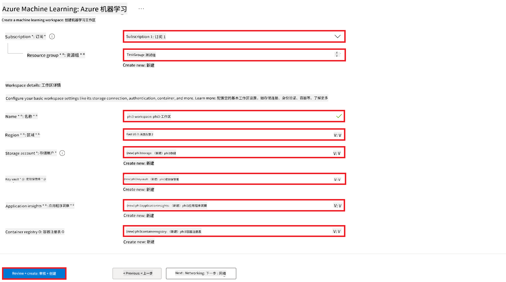
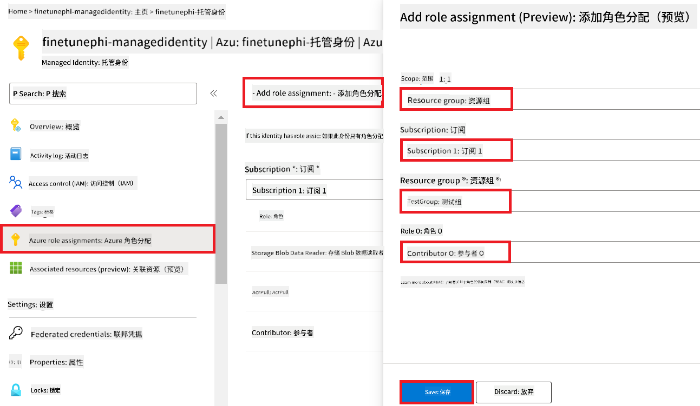
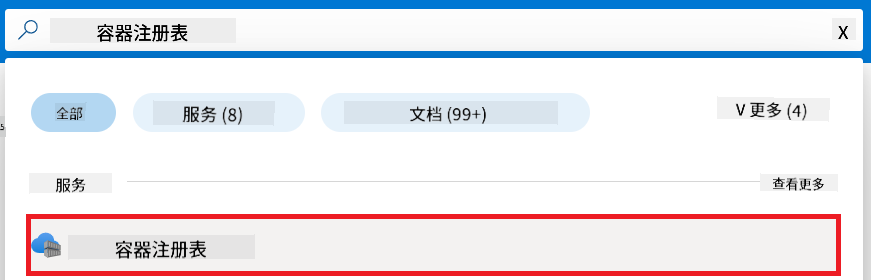
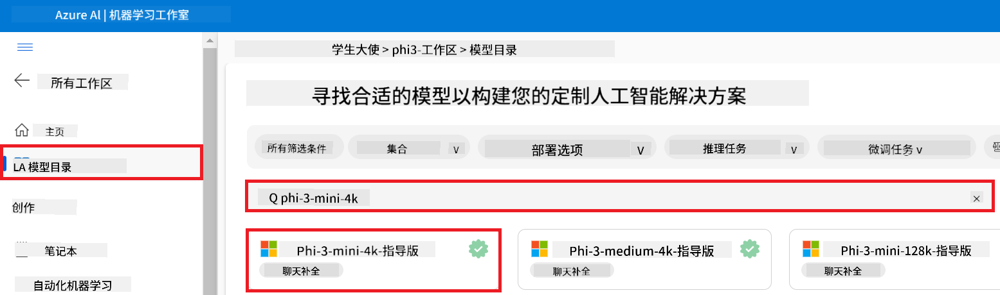
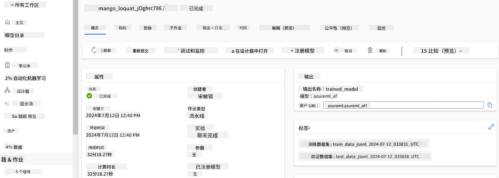
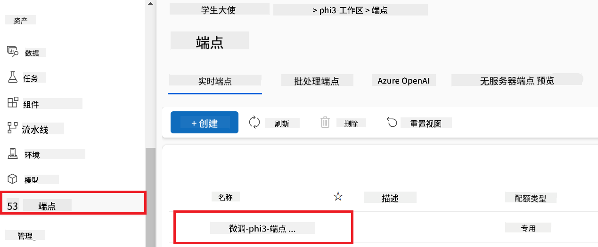

<!--
CO_OP_TRANSLATOR_METADATA:
{
  "original_hash": "ecbd9179a21edbaafaf114d47f09f3e3",
  "translation_date": "2025-07-17T01:06:52+00:00",
  "source_file": "md/02.Application/01.TextAndChat/Phi3/E2E_Phi-3-FineTuning_PromptFlow_Integration_AIFoundry.md",
  "language_code": "zh"
}
-->
# 使用 Azure AI Foundry 中的 Prompt flow 微调并集成自定义 Phi-3 模型

本端到端（E2E）示例基于微软技术社区的指南“[Fine-Tune and Integrate Custom Phi-3 Models with Prompt Flow in Azure AI Foundry](https://techcommunity.microsoft.com/t5/educator-developer-blog/fine-tune-and-integrate-custom-phi-3-models-with-prompt-flow-in/ba-p/4191726?WT.mc_id=aiml-137032-kinfeylo)”。它介绍了在 Azure AI Foundry 中微调、部署和集成自定义 Phi-3 模型与 Prompt flow 的流程。  
与需要本地运行代码的 E2E 示例“[Fine-Tune and Integrate Custom Phi-3 Models with Prompt Flow](./E2E_Phi-3-FineTuning_PromptFlow_Integration.md)”不同，本教程完全聚焦于在 Azure AI / ML Studio 中微调和集成模型。

## 概述

在本端到端示例中，您将学习如何微调 Phi-3 模型并将其与 Azure AI Foundry 中的 Prompt flow 集成。通过利用 Azure AI / ML Studio，您将建立一个用于部署和使用自定义 AI 模型的工作流。该示例分为三个场景：

**场景 1：设置 Azure 资源并准备微调**

**场景 2：微调 Phi-3 模型并在 Azure 机器学习工作室中部署**

**场景 3：与 Prompt flow 集成并在 Azure AI Foundry 中与自定义模型聊天**

以下是本端到端示例的整体架构图。


### 目录

1. **[场景 1：设置 Azure 资源并准备微调](../../../../../../md/02.Application/01.TextAndChat/Phi3)**  
    - [创建 Azure 机器学习工作区](../../../../../../md/02.Application/01.TextAndChat/Phi3)  
    - [申请 Azure 订阅中的 GPU 配额](../../../../../../md/02.Application/01.TextAndChat/Phi3)  
    - [添加角色分配](../../../../../../md/02.Application/01.TextAndChat/Phi3)  
    - [设置项目](../../../../../../md/02.Application/01.TextAndChat/Phi3)  
    - [准备微调数据集](../../../../../../md/02.Application/01.TextAndChat/Phi3)  

1. **[场景 2：微调 Phi-3 模型并在 Azure 机器学习工作室中部署](../../../../../../md/02.Application/01.TextAndChat/Phi3)**  
    - [微调 Phi-3 模型](../../../../../../md/02.Application/01.TextAndChat/Phi3)  
    - [部署微调后的 Phi-3 模型](../../../../../../md/02.Application/01.TextAndChat/Phi3)  

1. **[场景 3：与 Prompt flow 集成并在 Azure AI Foundry 中与自定义模型聊天](../../../../../../md/02.Application/01.TextAndChat/Phi3)**  
    - [将自定义 Phi-3 模型与 Prompt flow 集成](../../../../../../md/02.Application/01.TextAndChat/Phi3)  
    - [与自定义 Phi-3 模型聊天](../../../../../../md/02.Application/01.TextAndChat/Phi3)  

## 场景 1：设置 Azure 资源并准备微调

### 创建 Azure 机器学习工作区

1. 在门户页面顶部的 **搜索栏** 中输入 *azure machine learning*，然后从出现的选项中选择 **Azure Machine Learning**。

    

2. 从导航菜单中选择 **+ 创建**。

3. 从导航菜单中选择 **新建工作区**。

    

4. 执行以下操作：

    - 选择您的 Azure **订阅**。  
    - 选择要使用的 **资源组**（如有需要可新建）。  
    - 输入 **工作区名称**，必须是唯一值。  
    - 选择您想使用的 **区域**。  
    - 选择要使用的 **存储帐户**（如有需要可新建）。  
    - 选择要使用的 **密钥保管库**（如有需要可新建）。  
    - 选择要使用的 **应用程序洞察**（如有需要可新建）。  
    - 选择要使用的 **容器注册表**（如有需要可新建）。

    

5. 选择 **查看 + 创建**。

6. 选择 **创建**。

### 申请 Azure 订阅中的 GPU 配额

本教程中，您将学习如何使用 GPU 微调和部署 Phi-3 模型。微调时使用 *Standard_NC24ads_A100_v4* GPU，需要申请配额。部署时使用 *Standard_NC6s_v3* GPU，也需要申请配额。

> [!NOTE]  
> 只有按需付费订阅（标准订阅类型）有资格申请 GPU 配额，福利订阅当前不支持。

1. 访问 [Azure ML Studio](https://ml.azure.com/home?wt.mc_id=studentamb_279723)。

1. 按照以下步骤申请 *Standard NCADSA100v4 Family* 配额：

    - 从左侧标签选择 **配额**。  
    - 选择要使用的 **虚拟机系列**，例如选择包含 *Standard_NC24ads_A100_v4* GPU 的 **Standard NCADSA100v4 Family Cluster Dedicated vCPUs**。  
    - 从导航菜单选择 **申请配额**。

        

    - 在申请配额页面中，输入您想要的 **新核心限制**，例如 24。  
    - 在申请配额页面中，选择 **提交** 以申请 GPU 配额。

1. 按照以下步骤申请 *Standard NCSv3 Family* 配额：

    - 从左侧标签选择 **配额**。  
    - 选择要使用的 **虚拟机系列**，例如选择包含 *Standard_NC6s_v3* GPU 的 **Standard NCSv3 Family Cluster Dedicated vCPUs**。  
    - 从导航菜单选择 **申请配额**。  
    - 在申请配额页面中，输入您想要的 **新核心限制**，例如 24。  
    - 在申请配额页面中，选择 **提交** 以申请 GPU 配额。

### 添加角色分配

要微调和部署模型，您必须先创建一个用户分配托管身份（User Assigned Managed Identity，UAI），并为其分配相应权限。该 UAI 将用于部署时的身份验证。

#### 创建用户分配托管身份（UAI）

1. 在门户页面顶部的 **搜索栏** 中输入 *managed identities*，然后从出现的选项中选择 **Managed Identities**。

    

1. 选择 **+ 创建**。

    

1. 执行以下操作：

    - 选择您的 Azure **订阅**。  
    - 选择要使用的 **资源组**（如有需要可新建）。  
    - 选择您想使用的 **区域**。  
    - 输入 **名称**，必须是唯一值。

    

1. 选择 **查看 + 创建**。

1. 选择 **+ 创建**。

#### 为托管身份添加 Contributor 角色分配

1. 导航到您创建的托管身份资源。

1. 从左侧标签选择 **Azure 角色分配**。

1. 从导航菜单选择 **+ 添加角色分配**。

1. 在添加角色分配页面，执行以下操作：  
    - 将 **作用域** 设置为 **资源组**。  
    - 选择您的 Azure **订阅**。  
    - 选择要使用的 **资源组**。  
    - 将 **角色** 设置为 **Contributor**。

    

2. 选择 **保存**。

#### 为托管身份添加 Storage Blob Data Reader 角色分配

1. 在门户页面顶部的 **搜索栏** 中输入 *storage accounts*，然后从出现的选项中选择 **Storage accounts**。

    

1. 选择与您创建的 Azure 机器学习工作区关联的存储帐户，例如 *finetunephistorage*。

1. 按照以下步骤导航到添加角色分配页面：

    - 进入您创建的 Azure 存储帐户。  
    - 从左侧标签选择 **访问控制 (IAM)**。  
    - 从导航菜单选择 **+ 添加**。  
    - 选择 **添加角色分配**。

    

1. 在添加角色分配页面，执行以下操作：

    - 在角色页面的 **搜索栏** 中输入 *Storage Blob Data Reader*，并从选项中选择 **Storage Blob Data Reader**。  
    - 选择 **下一步**。  
    - 在成员页面，选择 **分配访问权限给** **托管身份**。  
    - 选择 **+ 选择成员**。  
    - 在选择托管身份页面，选择您的 Azure **订阅**。  
    - 选择要分配的 **托管身份**。  
    - 选择您创建的托管身份，例如 *finetunephi-managedidentity*。  
    - 选择 **选择**。

    

1. 选择 **查看 + 分配**。

#### 为托管身份添加 AcrPull 角色分配

1. 在门户页面顶部的 **搜索栏** 中输入 *container registries*，然后从出现的选项中选择 **Container registries**。

    

1. 选择与 Azure 机器学习工作区关联的容器注册表，例如 *finetunephicontainerregistry*。

1. 按照以下步骤导航到添加角色分配页面：

    - 从左侧标签选择 **访问控制 (IAM)**。  
    - 从导航菜单选择 **+ 添加**。  
    - 选择 **添加角色分配**。

1. 在添加角色分配页面，执行以下操作：

    - 在角色页面的 **搜索栏** 中输入 *AcrPull*，并从选项中选择 **AcrPull**。  
    - 选择 **下一步**。  
    - 在成员页面，选择 **分配访问权限给** **托管身份**。  
    - 选择 **+ 选择成员**。  
    - 在选择托管身份页面，选择您的 Azure **订阅**。  
    - 选择要分配的 **托管身份**。  
    - 选择您创建的托管身份，例如 *finetunephi-managedidentity*。  
    - 选择 **选择**。  
    - 选择 **查看 + 分配**。

### 设置项目

为了下载微调所需的数据集，您需要设置本地环境。

在本练习中，您将：

- 创建一个工作文件夹。  
- 创建虚拟环境。  
- 安装所需的包。  
- 创建一个 *download_dataset.py* 文件用于下载数据集。

#### 创建工作文件夹

1. 打开终端窗口，输入以下命令，在默认路径下创建一个名为 *finetune-phi* 的文件夹。

    ```console
    mkdir finetune-phi
    ```

2. 在终端中输入以下命令，进入您刚创建的 *finetune-phi* 文件夹。
#### 创建虚拟环境

1. 在终端中输入以下命令，创建一个名为 *.venv* 的虚拟环境。

    ```console
    python -m venv .venv
    ```

2. 在终端中输入以下命令，激活虚拟环境。

    ```console
    .venv\Scripts\activate.bat
    ```


> [!NOTE]
> 如果成功，你应该会在命令提示符前看到 *(.venv)*。

#### 安装所需的包

1. 在终端中输入以下命令，安装所需的包。

    ```console
    pip install datasets==2.19.1
    ```

#### 创建 `donload_dataset.py`

> [!NOTE]
> 完整的文件夹结构：
>
> ```text
> └── YourUserName
> .    └── finetune-phi
> .        └── download_dataset.py
> ```

1. 打开 **Visual Studio Code**。

1. 从菜单栏选择 **文件**。

1. 选择 **打开文件夹**。

1. 选择你创建的 *finetune-phi* 文件夹，路径为 *C:\Users\yourUserName\finetune-phi*。

    

1. 在 Visual Studio Code 左侧面板中右键点击，选择 **新建文件**，创建一个名为 *download_dataset.py* 的新文件。

    

### 准备微调数据集

在本练习中，你将运行 *download_dataset.py* 文件，将 *ultrachat_200k* 数据集下载到本地环境。然后你将使用这些数据集在 Azure 机器学习中微调 Phi-3 模型。

在本练习中，你将：

- 向 *download_dataset.py* 文件添加代码以下载数据集。
- 运行 *download_dataset.py* 文件，将数据集下载到本地环境。

#### 使用 *download_dataset.py* 下载数据集

1. 在 Visual Studio Code 中打开 *download_dataset.py* 文件。

1. 将以下代码添加到 *download_dataset.py* 文件中。

    ```python
    import json
    import os
    from datasets import load_dataset

    def load_and_split_dataset(dataset_name, config_name, split_ratio):
        """
        Load and split a dataset.
        """
        # Load the dataset with the specified name, configuration, and split ratio
        dataset = load_dataset(dataset_name, config_name, split=split_ratio)
        print(f"Original dataset size: {len(dataset)}")
        
        # Split the dataset into train and test sets (80% train, 20% test)
        split_dataset = dataset.train_test_split(test_size=0.2)
        print(f"Train dataset size: {len(split_dataset['train'])}")
        print(f"Test dataset size: {len(split_dataset['test'])}")
        
        return split_dataset

    def save_dataset_to_jsonl(dataset, filepath):
        """
        Save a dataset to a JSONL file.
        """
        # Create the directory if it does not exist
        os.makedirs(os.path.dirname(filepath), exist_ok=True)
        
        # Open the file in write mode
        with open(filepath, 'w', encoding='utf-8') as f:
            # Iterate over each record in the dataset
            for record in dataset:
                # Dump the record as a JSON object and write it to the file
                json.dump(record, f)
                # Write a newline character to separate records
                f.write('\n')
        
        print(f"Dataset saved to {filepath}")

    def main():
        """
        Main function to load, split, and save the dataset.
        """
        # Load and split the ULTRACHAT_200k dataset with a specific configuration and split ratio
        dataset = load_and_split_dataset("HuggingFaceH4/ultrachat_200k", 'default', 'train_sft[:1%]')
        
        # Extract the train and test datasets from the split
        train_dataset = dataset['train']
        test_dataset = dataset['test']

        # Save the train dataset to a JSONL file
        save_dataset_to_jsonl(train_dataset, "data/train_data.jsonl")
        
        # Save the test dataset to a separate JSONL file
        save_dataset_to_jsonl(test_dataset, "data/test_data.jsonl")

    if __name__ == "__main__":
        main()

    ```

1. 在终端中输入以下命令，运行脚本并将数据集下载到本地环境。

    ```console
    python download_dataset.py
    ```

1. 确认数据集已成功保存到本地的 *finetune-phi/data* 目录。

> [!NOTE]
>
> #### 关于数据集大小和微调时间的说明
>
> 本教程中，你只使用了数据集的 1%（`split='train[:1%]'`）。这大大减少了数据量，加快了上传和微调的速度。你可以调整这个比例，以在训练时间和模型性能之间找到合适的平衡。使用较小的数据子集可以缩短微调时间，使教程过程更易管理。

## 场景 2：微调 Phi-3 模型并在 Azure 机器学习工作室中部署

### 微调 Phi-3 模型

在本练习中，你将在 Azure 机器学习工作室中微调 Phi-3 模型。

在本练习中，你将：

- 创建用于微调的计算集群。
- 在 Azure 机器学习工作室中微调 Phi-3 模型。

#### 创建用于微调的计算集群

1. 访问 [Azure ML Studio](https://ml.azure.com/home?wt.mc_id=studentamb_279723)。

1. 从左侧标签选择 **计算**。

1. 从导航菜单选择 **计算集群**。

1. 选择 **+ 新建**。

    

1. 执行以下操作：

    - 选择你想使用的 **区域**。
    - 将 **虚拟机层级** 选择为 **专用**。
    - 将 **虚拟机类型** 选择为 **GPU**。
    - 将 **虚拟机大小** 过滤器设置为 **从所有选项中选择**。
    - 选择 **虚拟机大小** 为 **Standard_NC24ads_A100_v4**。

    

1. 选择 **下一步**。

1. 执行以下操作：

    - 输入 **计算名称**，必须是唯一值。
    - 将 **最小节点数** 设为 **0**。
    - 将 **最大节点数** 设为 **1**。
    - 将 **空闲秒数后缩减规模** 设为 **120**。

    

1. 选择 **创建**。

#### 微调 Phi-3 模型

1. 访问 [Azure ML Studio](https://ml.azure.com/home?wt.mc_id=studentamb_279723)。

1. 选择你创建的 Azure 机器学习工作区。

    

1. 执行以下操作：

    - 从左侧标签选择 **模型目录**。
    - 在 **搜索栏** 输入 *phi-3-mini-4k*，然后从出现的选项中选择 **Phi-3-mini-4k-instruct**。

    

1. 从导航菜单选择 **微调**。

    

1. 执行以下操作：

    - 将 **选择任务类型** 设为 **聊天补全**。
    - 选择 **+ 选择数据** 上传 **训练数据**。
    - 将验证数据上传类型设为 **提供不同的验证数据**。
    - 选择 **+ 选择数据** 上传 **验证数据**。

    

    > [!TIP]
    >
    > 你可以选择 **高级设置**，自定义如 **learning_rate** 和 **lr_scheduler_type** 等配置，以根据具体需求优化微调过程。

1. 选择 **完成**。

1. 在本练习中，你成功使用 Azure 机器学习微调了 Phi-3 模型。请注意，微调过程可能需要较长时间。运行微调任务后，需要等待其完成。你可以通过导航到 Azure 机器学习工作区左侧的作业标签，监控微调任务状态。在后续系列中，你将部署微调后的模型并将其与 Prompt flow 集成。

    

### 部署微调后的 Phi-3 模型

为了将微调后的 Phi-3 模型与 Prompt flow 集成，需要部署模型，使其可用于实时推理。此过程包括注册模型、创建在线端点和部署模型。

在本练习中，你将：

- 在 Azure 机器学习工作区注册微调后的模型。
- 创建在线端点。
- 部署已注册的微调 Phi-3 模型。

#### 注册微调后的模型

1. 访问 [Azure ML Studio](https://ml.azure.com/home?wt.mc_id=studentamb_279723)。

1. 选择你创建的 Azure 机器学习工作区。

    

1. 从左侧标签选择 **模型**。
1. 选择 **+ 注册**。
1. 选择 **从作业输出注册**。

    

1. 选择你创建的作业。

    

1. 选择 **下一步**。

1. 将 **模型类型** 设为 **MLflow**。

1. 确认已选择 **作业输出**，通常会自动选中。

    

2. 选择 **下一步**。

3. 选择 **注册**。

    

4. 你可以通过左侧标签的 **模型** 菜单查看已注册的模型。

    

#### 部署微调后的模型

1. 进入你创建的 Azure 机器学习工作区。

1. 从左侧标签选择 **端点**。

1. 从导航菜单选择 **实时端点**。

    

1. 选择 **创建**。

1. 选择你已注册的模型。

    

1. 选择 **选择**。

1. 执行以下操作：

    - 将 **虚拟机** 选择为 *Standard_NC6s_v3*。
    - 选择你想使用的 **实例数量**，例如 *1*。
    - 将 **端点** 选择为 **新建**，以创建新端点。
    - 输入 **端点名称**，必须是唯一值。
    - 输入 **部署名称**，必须是唯一值。

    

1. 选择 **部署**。

> [!WARNING]
> 为避免产生额外费用，请确保在 Azure 机器学习工作区删除已创建的端点。
>

#### 在 Azure 机器学习工作区检查部署状态

1. 进入你创建的 Azure 机器学习工作区。

1. 从左侧标签选择 **端点**。

1. 选择你创建的端点。

    

1. 在此页面，你可以管理部署过程中的端点。

> [!NOTE]
> 部署完成后，确保 **实时流量** 设置为 **100%**。如果不是，请选择 **更新流量** 进行调整。流量设置为 0% 时，无法测试模型。
>
> 
>

## 场景 3：与 Prompt flow 集成并在 Azure AI Foundry 中与自定义模型聊天

### 将自定义 Phi-3 模型与 Prompt flow 集成

成功部署微调模型后，你现在可以将其与 Prompt Flow 集成，在实时应用中使用你的模型，实现多种交互式任务。

在本练习中，你将：

- 创建 Azure AI Foundry Hub。
- 创建 Azure AI Foundry 项目。
- 创建 Prompt flow。
- 为微调后的 Phi-3 模型添加自定义连接。
- 设置 Prompt flow，与自定义 Phi-3 模型进行聊天。
> [!NOTE]  
> 你也可以使用 Azure ML Studio 集成 Promptflow。相同的集成流程同样适用于 Azure ML Studio。
#### 创建 Azure AI Foundry Hub

在创建项目之前，您需要先创建一个 Hub。Hub 类似于资源组，允许您在 Azure AI Foundry 中组织和管理多个项目。

1. 访问 [Azure AI Foundry](https://ai.azure.com/?WT.mc_id=aiml-137032-kinfeylo)。

1. 从左侧标签中选择 **All hubs**。

1. 从导航菜单中选择 **+ New hub**。

    

1. 执行以下操作：

    - 输入 **Hub name**，必须是唯一值。
    - 选择您的 Azure **Subscription**。
    - 选择要使用的 **Resource group**（如有需要可新建）。
    - 选择您想使用的 **Location**。
    - 选择要连接的 **Connect Azure AI Services**（如有需要可新建）。
    - 选择 **Connect Azure AI Search** 并选择 **Skip connecting**。

    

1. 选择 **Next**。

#### 创建 Azure AI Foundry 项目

1. 在您创建的 Hub 中，从左侧标签选择 **All projects**。

1. 从导航菜单选择 **+ New project**。

    

1. 输入 **Project name**，必须是唯一值。

    

1. 选择 **Create a project**。

#### 为微调后的 Phi-3 模型添加自定义连接

要将您的自定义 Phi-3 模型与 Prompt flow 集成，您需要将模型的端点和密钥保存到自定义连接中。此设置确保您可以在 Prompt flow 中访问自定义的 Phi-3 模型。

#### 设置微调后 Phi-3 模型的 api key 和 endpoint uri

1. 访问 [Azure ML Studio](https://ml.azure.com/home?WT.mc_id=aiml-137032-kinfeylo)。

1. 进入您创建的 Azure 机器学习工作区。

1. 从左侧标签选择 **Endpoints**。

    

1. 选择您创建的端点。

    

1. 从导航菜单选择 **Consume**。

1. 复制您的 **REST endpoint** 和 **Primary key**。

    

#### 添加自定义连接

1. 访问 [Azure AI Foundry](https://ai.azure.com/?WT.mc_id=aiml-137032-kinfeylo)。

1. 进入您创建的 Azure AI Foundry 项目。

1. 在您创建的项目中，从左侧标签选择 **Settings**。

1. 选择 **+ New connection**。

    

1. 从导航菜单选择 **Custom keys**。

    

1. 执行以下操作：

    - 选择 **+ Add key value pairs**。
    - 在键名中输入 **endpoint**，并将您从 Azure ML Studio 复制的端点粘贴到值字段。
    - 再次选择 **+ Add key value pairs**。
    - 在键名中输入 **key**，并将您从 Azure ML Studio 复制的密钥粘贴到值字段。
    - 添加密钥后，选择 **is secret** 以防止密钥泄露。

    

1. 选择 **Add connection**。

#### 创建 Prompt flow

您已在 Azure AI Foundry 中添加了自定义连接。接下来，让我们按照以下步骤创建一个 Prompt flow。然后，您将把这个 Prompt flow 连接到自定义连接，以便在 Prompt flow 中使用微调后的模型。

1. 进入您创建的 Azure AI Foundry 项目。

1. 从左侧标签选择 **Prompt flow**。

1. 从导航菜单选择 **+ Create**。

    

1. 从导航菜单选择 **Chat flow**。

    

1. 输入要使用的 **Folder name**。

    

2. 选择 **Create**。

#### 设置 Prompt flow 以与您的自定义 Phi-3 模型聊天

您需要将微调后的 Phi-3 模型集成到 Prompt flow 中。但现有的 Prompt flow 并非为此设计，因此您必须重新设计 Prompt flow，以实现自定义模型的集成。

1. 在 Prompt flow 中，执行以下操作以重建现有流程：

    - 选择 **Raw file mode**。
    - 删除 *flow.dag.yml* 文件中所有现有代码。
    - 将以下代码添加到 *flow.dag.yml* 文件中。

        ```yml
        inputs:
          input_data:
            type: string
            default: "Who founded Microsoft?"

        outputs:
          answer:
            type: string
            reference: ${integrate_with_promptflow.output}

        nodes:
        - name: integrate_with_promptflow
          type: python
          source:
            type: code
            path: integrate_with_promptflow.py
          inputs:
            input_data: ${inputs.input_data}
        ```

    - 选择 **Save**。

    

1. 将以下代码添加到 *integrate_with_promptflow.py* 文件中，以便在 Prompt flow 中使用自定义 Phi-3 模型。

    ```python
    import logging
    import requests
    from promptflow import tool
    from promptflow.connections import CustomConnection

    # Logging setup
    logging.basicConfig(
        format="%(asctime)s - %(levelname)s - %(name)s - %(message)s",
        datefmt="%Y-%m-%d %H:%M:%S",
        level=logging.DEBUG
    )
    logger = logging.getLogger(__name__)

    def query_phi3_model(input_data: str, connection: CustomConnection) -> str:
        """
        Send a request to the Phi-3 model endpoint with the given input data using Custom Connection.
        """

        # "connection" is the name of the Custom Connection, "endpoint", "key" are the keys in the Custom Connection
        endpoint_url = connection.endpoint
        api_key = connection.key

        headers = {
            "Content-Type": "application/json",
            "Authorization": f"Bearer {api_key}"
        }
        data = {
            "input_data": {
                "input_string": [
                    {"role": "user", "content": input_data}
                ],
                "parameters": {
                    "temperature": 0.7,
                    "max_new_tokens": 128
                }
            }
        }
        try:
            response = requests.post(endpoint_url, json=data, headers=headers)
            response.raise_for_status()
            
            # Log the full JSON response
            logger.debug(f"Full JSON response: {response.json()}")

            result = response.json()["output"]
            logger.info("Successfully received response from Azure ML Endpoint.")
            return result
        except requests.exceptions.RequestException as e:
            logger.error(f"Error querying Azure ML Endpoint: {e}")
            raise

    @tool
    def my_python_tool(input_data: str, connection: CustomConnection) -> str:
        """
        Tool function to process input data and query the Phi-3 model.
        """
        return query_phi3_model(input_data, connection)

    ```

    

> [!NOTE]
> 
> 有关在 Azure AI Foundry 中使用 Prompt flow 的详细信息，请参阅 [Prompt flow in Azure AI Foundry](https://learn.microsoft.com/azure/ai-studio/how-to/prompt-flow)。

1. 选择 **Chat input** 和 **Chat output**，以启用与模型的聊天功能。

    

1. 现在，您已准备好与自定义 Phi-3 模型聊天。在接下来的练习中，您将学习如何启动 Prompt flow 并使用它与微调后的 Phi-3 模型进行对话。

> [!NOTE]
>
> 重建后的流程应如下图所示：
>
> 
>

### 与您的自定义 Phi-3 模型聊天

现在您已经微调并将自定义 Phi-3 模型集成到 Prompt flow 中，您可以开始与它进行交互了。本练习将指导您如何设置并启动与模型的聊天。通过这些步骤，您将能够充分利用微调后的 Phi-3 模型，完成各种任务和对话。

- 使用 Prompt flow 与您的自定义 Phi-3 模型聊天。

#### 启动 Prompt flow

1. 选择 **Start compute sessions** 以启动 Prompt flow。

    

1. 选择 **Validate and parse input** 以更新参数。

    

1. 选择 **connection** 的 **Value**，即您创建的自定义连接。例如，*connection*。

    

#### 与您的自定义模型聊天

1. 选择 **Chat**。

    

1. 以下是示例结果：现在您可以与自定义 Phi-3 模型聊天。建议基于用于微调的数据提问。

    

**免责声明**：  
本文件使用 AI 翻译服务 [Co-op Translator](https://github.com/Azure/co-op-translator) 进行翻译。虽然我们力求准确，但请注意，自动翻译可能包含错误或不准确之处。原始文件的母语版本应被视为权威来源。对于重要信息，建议使用专业人工翻译。对于因使用本翻译而产生的任何误解或误释，我们不承担任何责任。