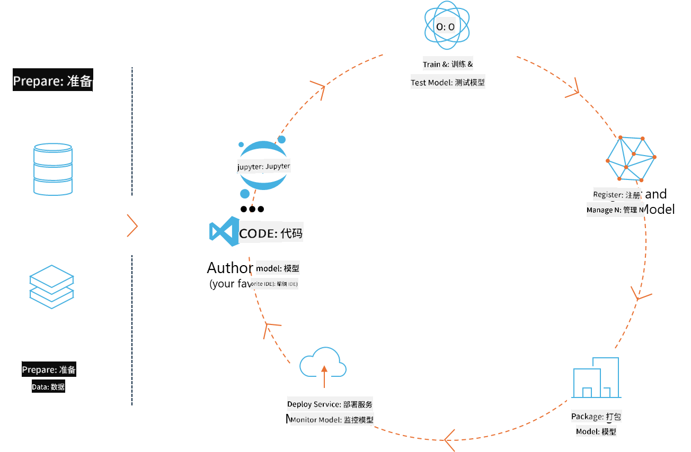
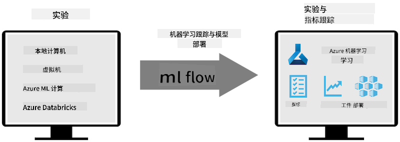
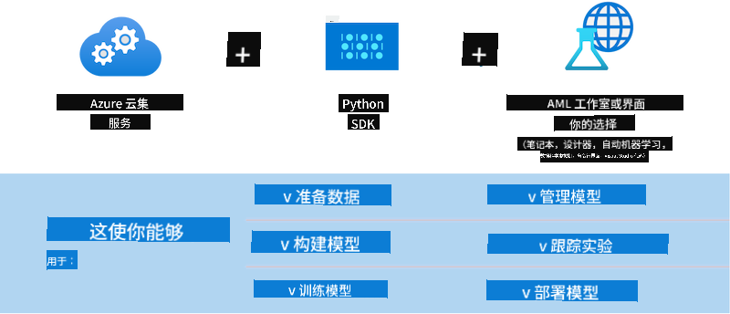

<!--
CO_OP_TRANSLATOR_METADATA:
{
  "original_hash": "f61c383bbf0c3dac97e43f833c258731",
  "translation_date": "2025-05-07T13:57:53+00:00",
  "source_file": "md/02.Application/01.TextAndChat/Phi3/E2E_Phi-3-MLflow.md",
  "language_code": "zh"
}
-->
# MLflow

[MLflow](https://mlflow.org/) 是一个开源平台，旨在管理端到端的机器学习生命周期。



MLflow 用于管理机器学习生命周期，包括实验、可复现性、部署和中央模型注册。目前 MLflow 提供四个组件。

- **MLflow Tracking：** 记录和查询实验、代码、数据配置和结果。
- **MLflow Projects：** 以一种格式打包数据科学代码，以便在任何平台上复现运行。
- **MLflow Models：** 在多种服务环境中部署机器学习模型。
- **Model Registry：** 在中央仓库中存储、注释和管理模型。

它具备追踪实验、将代码打包成可复现运行、共享和部署模型的能力。MLflow 集成在 Databricks 中，支持多种机器学习库，具有库无关性。它可以与任何机器学习库和任何编程语言一起使用，因为它提供了 REST API 和命令行工具以方便操作。



MLflow 的主要功能包括：

- **实验追踪：** 记录和比较参数与结果。
- **模型管理：** 将模型部署到各种服务和推理平台。
- **模型注册：** 协作管理 MLflow 模型的生命周期，包括版本控制和注释。
- **项目：** 打包机器学习代码以便共享或生产使用。

MLflow 还支持 MLOps 循环，包括准备数据、注册和管理模型、打包模型以供执行、部署服务以及监控模型。它旨在简化从原型到生产工作流的过程，尤其是在云端和边缘环境中。

## 端到端示例 - 构建包装器并将 Phi-3 作为 MLflow 模型使用

在这个端到端示例中，我们将展示两种不同的方法，围绕 Phi-3 小型语言模型（SLM）构建包装器，然后将其作为 MLflow 模型在本地或云端运行，例如在 Azure Machine Learning 工作区中。



| 项目 | 说明 | 位置 |
| ------------ | ----------- | -------- |
| Transformer Pipeline | 如果你想使用带有 MLflow 实验性 transformers 版本的 HuggingFace 模型，Transformer Pipeline 是构建包装器的最简单选项。 | [**TransformerPipeline.ipynb**](../../../../../../code/06.E2E/E2E_Phi-3-MLflow_TransformerPipeline.ipynb) |
| Custom Python Wrapper | 在撰写本文时，transformer pipeline 尚不支持使用实验性 optimum Python 包为 ONNX 格式的 HuggingFace 模型生成 MLflow 包装器。针对这种情况，你可以构建自定义的 Python 包装器来适配 MLflow 模型。 | [**CustomPythonWrapper.ipynb**](../../../../../../code/06.E2E/E2E_Phi-3-MLflow_CustomPythonWrapper.ipynb) |

## 项目：Transformer Pipeline

1. 你需要安装 MLflow 和 HuggingFace 相关的 Python 包：

    ``` Python
    import mlflow
    import transformers
    ```

2. 接下来，通过引用 HuggingFace 注册表中的目标 Phi-3 模型，初始化一个 transformer pipeline。正如 _Phi-3-mini-4k-instruct_ 的模型卡所示，其任务类型是“文本生成”：

    ``` Python
    pipeline = transformers.pipeline(
        task = "text-generation",
        model = "microsoft/Phi-3-mini-4k-instruct"
    )
    ```

3. 现在你可以将 Phi-3 模型的 transformer pipeline 保存为 MLflow 格式，并提供额外信息，比如目标 artifact 路径、特定模型配置设置和推理 API 类型：

    ``` Python
    model_info = mlflow.transformers.log_model(
        transformers_model = pipeline,
        artifact_path = "phi3-mlflow-model",
        model_config = model_config,
        task = "llm/v1/chat"
    )
    ```

## 项目：Custom Python Wrapper

1. 我们这里可以利用微软的 [ONNX Runtime generate() API](https://github.com/microsoft/onnxruntime-genai) 来进行 ONNX 模型的推理及 token 的编码/解码。你需要根据目标计算环境选择 _onnxruntime_genai_ 包，以下示例以 CPU 为目标：

    ``` Python
    import mlflow
    from mlflow.models import infer_signature
    import onnxruntime_genai as og
    ```

1. 我们的自定义类实现了两个方法：_load_context()_ 用于初始化 Phi-3 Mini 4K Instruct 的 **ONNX 模型**、**生成器参数** 和 **分词器**；_predict()_ 用于根据输入提示生成输出 token：

    ``` Python
    class Phi3Model(mlflow.pyfunc.PythonModel):
        def load_context(self, context):
            # Retrieving model from the artifacts
            model_path = context.artifacts["phi3-mini-onnx"]
            model_options = {
                 "max_length": 300,
                 "temperature": 0.2,         
            }
        
            # Defining the model
            self.phi3_model = og.Model(model_path)
            self.params = og.GeneratorParams(self.phi3_model)
            self.params.set_search_options(**model_options)
            
            # Defining the tokenizer
            self.tokenizer = og.Tokenizer(self.phi3_model)
    
        def predict(self, context, model_input):
            # Retrieving prompt from the input
            prompt = model_input["prompt"][0]
            self.params.input_ids = self.tokenizer.encode(prompt)
    
            # Generating the model's response
            response = self.phi3_model.generate(self.params)
    
            return self.tokenizer.decode(response[0][len(self.params.input_ids):])
    ```

1. 现在你可以使用 _mlflow.pyfunc.log_model()_ 函数生成 Phi-3 模型的自定义 Python 包装器（pickle 格式），同时包含原始 ONNX 模型及所需依赖：

    ``` Python
    model_info = mlflow.pyfunc.log_model(
        artifact_path = artifact_path,
        python_model = Phi3Model(),
        artifacts = {
            "phi3-mini-onnx": "cpu_and_mobile/cpu-int4-rtn-block-32-acc-level-4",
        },
        input_example = input_example,
        signature = infer_signature(input_example, ["Run"]),
        extra_pip_requirements = ["torch", "onnxruntime_genai", "numpy"],
    )
    ```

## 生成的 MLflow 模型签名

1. 在上面 Transformer Pipeline 项目的第 3 步中，我们将 MLflow 模型的任务设置为 “_llm/v1/chat_”。这样的设置会生成一个模型的 API 包装器，与 OpenAI 的 Chat API 兼容，如下所示：

    ``` Python
    {inputs: 
      ['messages': Array({content: string (required), name: string (optional), role: string (required)}) (required), 'temperature': double (optional), 'max_tokens': long (optional), 'stop': Array(string) (optional), 'n': long (optional), 'stream': boolean (optional)],
    outputs: 
      ['id': string (required), 'object': string (required), 'created': long (required), 'model': string (required), 'choices': Array({finish_reason: string (required), index: long (required), message: {content: string (required), name: string (optional), role: string (required)} (required)}) (required), 'usage': {completion_tokens: long (required), prompt_tokens: long (required), total_tokens: long (required)} (required)],
    params: 
      None}
    ```

1. 因此，你可以用以下格式提交提示：

    ``` Python
    messages = [{"role": "user", "content": "What is the capital of Spain?"}]
    ```

1. 然后，使用兼容 OpenAI API 的后处理，例如 _response[0][‘choices’][0][‘message’][‘content’]_，将输出美化为类似下面的格式：

    ``` JSON
    Question: What is the capital of Spain?
    
    Answer: The capital of Spain is Madrid. It is the largest city in Spain and serves as the political, economic, and cultural center of the country. Madrid is located in the center of the Iberian Peninsula and is known for its rich history, art, and architecture, including the Royal Palace, the Prado Museum, and the Plaza Mayor.
    
    Usage: {'prompt_tokens': 11, 'completion_tokens': 73, 'total_tokens': 84}
    ```

1. 在上面 Custom Python Wrapper 项目的第 3 步中，我们让 MLflow 包根据给定的输入示例自动生成模型签名。我们的 MLflow 包装器签名将如下所示：

    ``` Python
    {inputs: 
      ['prompt': string (required)],
    outputs: 
      [string (required)],
    params: 
      None}
    ```

1. 因此，我们的提示需要包含一个名为 "prompt" 的字典键，类似这样：

    ``` Python
    {"prompt": "<|system|>You are a stand-up comedian.<|end|><|user|>Tell me a joke about atom<|end|><|assistant|>",}
    ```

1. 模型的输出将以字符串格式提供：

    ``` JSON
    Alright, here's a little atom-related joke for you!
    
    Why don't electrons ever play hide and seek with protons?
    
    Because good luck finding them when they're always "sharing" their electrons!
    
    Remember, this is all in good fun, and we're just having a little atomic-level humor!
    ```

**免责声明**：  
本文件使用 AI 翻译服务 [Co-op Translator](https://github.com/Azure/co-op-translator) 进行翻译。虽然我们力求准确，但请注意自动翻译可能包含错误或不准确之处。原始文件的母语版本应被视为权威来源。对于关键信息，建议使用专业人工翻译。我们不对因使用本翻译而产生的任何误解或误释承担责任。