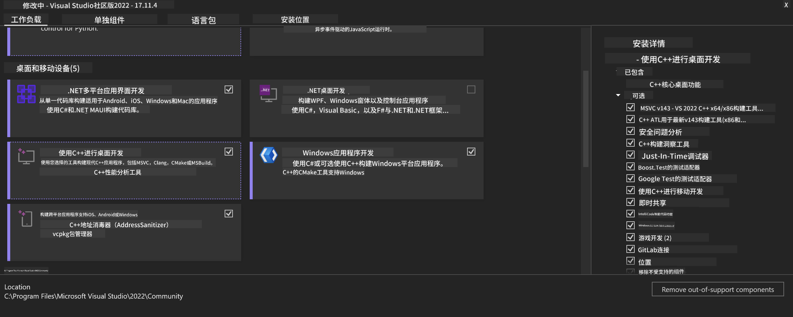
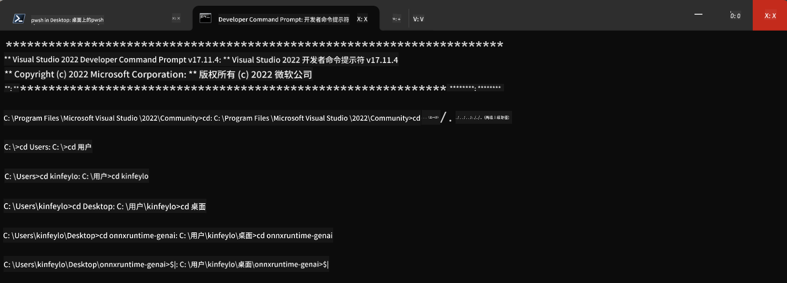

<!--
CO_OP_TRANSLATOR_METADATA:
{
  "original_hash": "9fe95f5575ecf5985eb9f67d205d0136",
  "translation_date": "2025-04-03T07:35:53+00:00",
  "source_file": "md\\02.Application\\01.TextAndChat\\Phi3\\ORTWindowGPUGuideline.md",
  "language_code": "zh"
}
-->
# **OnnxRuntime GenAI Windows GPU 指南**

本指南提供了在 Windows 上使用 GPU 设置和使用 ONNX Runtime (ORT) 的步骤，旨在帮助您利用 GPU 加速模型，提高性能和效率。

文档内容包括：

- 环境设置：安装 CUDA、cuDNN 和 ONNX Runtime 等必要依赖的说明。
- 配置：如何配置环境和 ONNX Runtime 以有效利用 GPU 资源。
- 优化建议：关于如何微调 GPU 设置以获得最佳性能的建议。

### **1. Python 3.10.x / 3.11.8**

   ***注意*** 建议使用 [miniforge](https://github.com/conda-forge/miniforge/releases/latest/download/Miniforge3-Windows-x86_64.exe) 作为您的 Python 环境

   ```bash

   conda create -n pydev python==3.11.8

   conda activate pydev

   ```

   ***提醒*** 如果您已安装任何与 Python ONNX 相关的库，请先卸载它们

### **2. 使用 winget 安装 CMake**

   ```bash

   winget install -e --id Kitware.CMake

   ```

### **3. 安装 Visual Studio 2022 - 带有 C++ 的桌面开发**

   ***注意*** 如果您不需要编译，可以跳过此步骤



### **4. 安装 NVIDIA 驱动**

1. **NVIDIA GPU 驱动** [https://www.nvidia.com/en-us/drivers/](https://www.nvidia.com/en-us/drivers/)

2. **NVIDIA CUDA 12.4** [https://developer.nvidia.com/cuda-12-4-0-download-archive](https://developer.nvidia.com/cuda-12-4-0-download-archive)

3. **NVIDIA CUDNN 9.4** [https://developer.nvidia.com/cudnn-downloads](https://developer.nvidia.com/cudnn-downloads)

***提醒*** 请使用默认设置进行安装

### **5. 设置 NVIDIA 环境变量**

将 NVIDIA CUDNN 9.4 的 lib、bin、include 文件复制到 NVIDIA CUDA 12.4 的 lib、bin、include 文件夹中

- 将 *'C:\Program Files\NVIDIA\CUDNN\v9.4\bin\12.6'* 文件复制到 *'C:\Program Files\NVIDIA GPU Computing Toolkit\CUDA\v12.4\bin'*

- 将 *'C:\Program Files\NVIDIA\CUDNN\v9.4\include\12.6'* 文件复制到 *'C:\Program Files\NVIDIA GPU Computing Toolkit\CUDA\v12.4\include'*

- 将 *'C:\Program Files\NVIDIA\CUDNN\v9.4\lib\12.6'* 文件复制到 *'C:\Program Files\NVIDIA GPU Computing Toolkit\CUDA\v12.4\lib\x64'*

### **6. 下载 Phi-3.5-mini-instruct-onnx**

   ```bash

   winget install -e --id Git.Git

   winget install -e --id GitHub.GitLFS

   git lfs install

   git clone https://huggingface.co/microsoft/Phi-3.5-mini-instruct-onnx

   ```

### **7. 运行 InferencePhi35Instruct.ipynb**

   打开 [Notebook](../../../../../../code/09.UpdateSamples/Aug/ortgpu-phi35-instruct.ipynb) 并执行


### **8. 编译 ORT GenAI GPU**

   ***注意*** 
   
   1. 请先卸载所有与 onnx、onnxruntime 和 onnxruntime-genai 相关的内容

   
   ```bash

   pip list 
   
   ```

   然后卸载所有 onnxruntime 库，例如：

   
   ```bash

   pip uninstall onnxruntime

   pip uninstall onnxruntime-genai

   pip uninstall onnxruntume-genai-cuda
   
   ```

   2. 检查 Visual Studio 扩展支持 

   检查 C:\Program Files\NVIDIA GPU Computing Toolkit\CUDA\v12.4\extras，确保找到 C:\Program Files\NVIDIA GPU Computing Toolkit\CUDA\v12.4\extras\visual_studio_integration 文件夹。
   
   如果未找到，请检查其他 CUDA 工具包驱动文件夹，并将 visual_studio_integration 文件夹及其内容复制到 C:\Program Files\NVIDIA GPU Computing Toolkit\CUDA\v12.4\extras\visual_studio_integration。

   - 如果您不需要编译，可以跳过此步骤

   ```bash

   git clone https://github.com/microsoft/onnxruntime-genai

   ```

   - 下载 [https://github.com/microsoft/onnxruntime/releases/download/v1.19.2/onnxruntime-win-x64-gpu-1.19.2.zip](https://github.com/microsoft/onnxruntime/releases/download/v1.19.2/onnxruntime-win-x64-gpu-1.19.2.zip)

   - 解压 onnxruntime-win-x64-gpu-1.19.2.zip，并将其重命名为 **ort**，然后将 ort 文件夹复制到 onnxruntime-genai

   - 使用 Windows Terminal，打开 VS 2022 的开发者命令提示符，并进入 onnxruntime-genai 目录



   - 使用您的 Python 环境进行编译

   
   ```bash

   cd onnxruntime-genai

   python build.py --use_cuda  --cuda_home "C:\Program Files\NVIDIA GPU Computing Toolkit\CUDA\v12.4" --config Release
 

   cd build/Windows/Release/Wheel

   pip install .whl

   ```

**免责声明**：  
本文档使用AI翻译服务 [Co-op Translator](https://github.com/Azure/co-op-translator) 进行翻译。尽管我们努力确保翻译的准确性，但请注意，自动翻译可能包含错误或不准确之处。应以原始语言的文档作为权威来源。对于关键信息，建议使用专业人工翻译。对于因使用此翻译而产生的任何误解或误读，我们不承担责任。