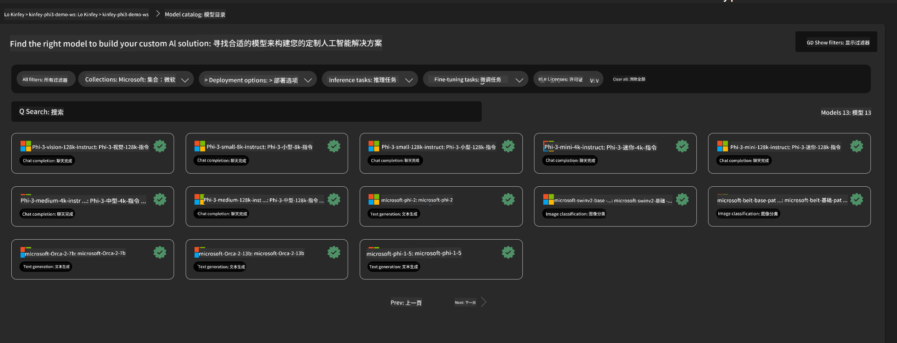
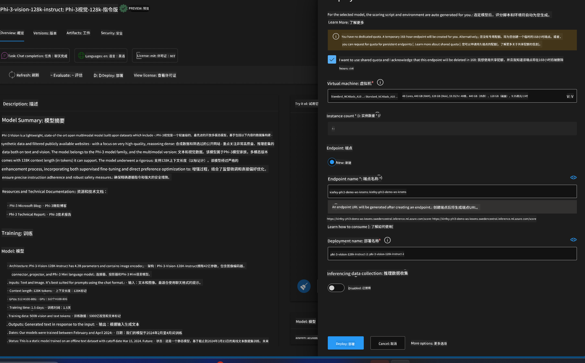
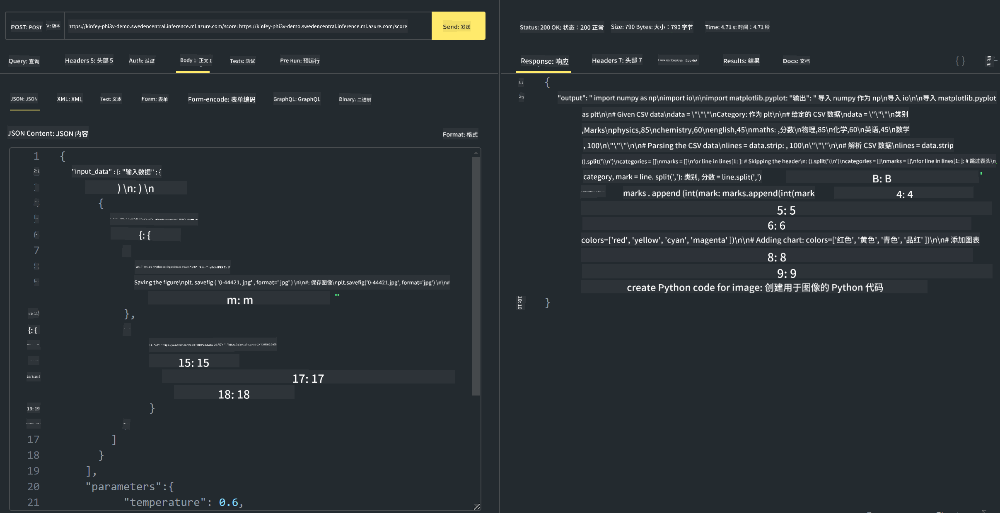

<!--
CO_OP_TRANSLATOR_METADATA:
{
  "original_hash": "20cb4e6ac1686248e8be913ccf6c2bc2",
  "translation_date": "2025-05-07T13:52:40+00:00",
  "source_file": "md/02.Application/02.Code/Phi3/VSCodeExt/HOL/AIPC/03.DeployPhi3VisionOnAzure.md",
  "language_code": "zh"
}
-->
# **实验3 - 在Azure机器学习服务上部署Phi-3-vision**

我们使用NPU完成本地代码的生产部署，然后希望通过它引入PHI-3-VISION的能力，实现从图片生成代码。

在本介绍中，我们可以快速在Azure机器学习服务中构建一个模型即服务的Phi-3 Vision服务。

***Note***：Phi-3 Vision需要计算能力来更快地生成内容，我们需要云计算能力来帮助实现这一点。

### **1. 创建Azure机器学习服务**

我们需要在Azure门户中创建一个Azure机器学习服务。如果想了解如何操作，请访问此链接 [https://learn.microsoft.com/azure/machine-learning/quickstart-create-resources?view=azureml-api-2](https://learn.microsoft.com/azure/machine-learning/quickstart-create-resources?view=azureml-api-2)

### **2. 在Azure机器学习服务中选择Phi-3 Vision**



### **3. 在Azure中部署Phi-3-Vision**



### **4. 在Postman中测试端点**



***Note***

1. 传输的参数必须包含Authorization、azureml-model-deployment和Content-Type。你需要查看部署信息来获取这些参数。

2. 传输参数时，Phi-3-Vision需要传输图片链接。请参考GPT-4-Vision的参数传递方式，例如

```json

{
  "input_data":{
    "input_string":[
      {
        "role":"user",
        "content":[ 
          {
            "type": "text",
            "text": "You are a Python coding assistant.Please create Python code for image "
          },
          {
              "type": "image_url",
              "image_url": {
                "url": "https://ajaytech.co/wp-content/uploads/2019/09/index.png"
              }
          }
        ]
      }
    ],
    "parameters":{
          "temperature": 0.6,
          "top_p": 0.9,
          "do_sample": false,
          "max_new_tokens": 2048
    }
  }
}

```

3. 使用Post方法调用**/score**

**恭喜**！你已完成PHI-3-VISION的快速部署，并尝试了如何通过图片生成代码。接下来，我们可以结合NPU和云端构建应用。

**免责声明**：  
本文件使用 AI 翻译服务 [Co-op Translator](https://github.com/Azure/co-op-translator) 进行翻译。虽然我们力求准确，但请注意自动翻译可能存在错误或不准确之处。原始文件的母语版本应被视为权威来源。对于重要信息，建议使用专业人工翻译。对于因使用本翻译而产生的任何误解或误释，我们不承担任何责任。