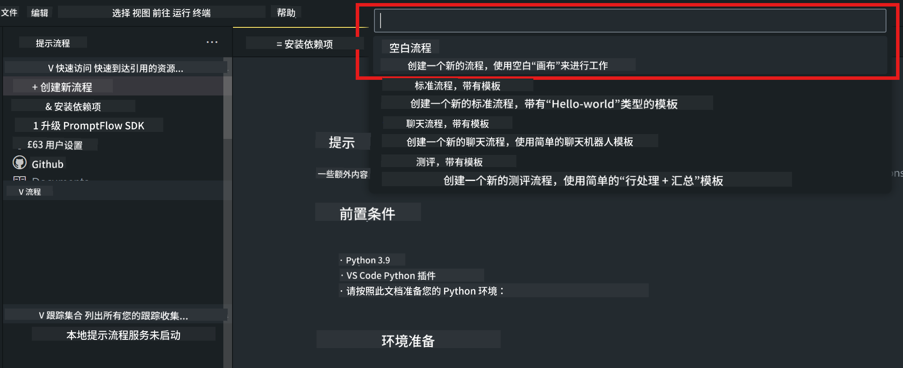
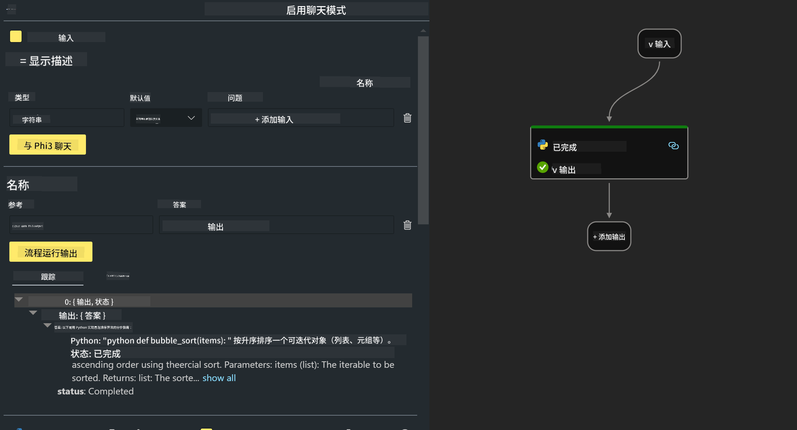
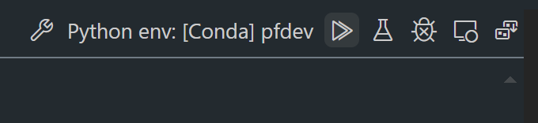

<!--
CO_OP_TRANSLATOR_METADATA:
{
  "original_hash": "830eb246b6fa04f22004b271f3294cfc",
  "translation_date": "2025-04-03T07:48:46+00:00",
  "source_file": "md\\02.Application\\02.Code\\Phi3\\VSCodeExt\\HOL\\Apple\\02.PromptflowWithMLX.md",
  "language_code": "zh"
}
-->
# **实验 2 - 在 AIPC 中运行 Phi-3-mini 的 Prompt flow**

## **什么是 Prompt flow**

Prompt flow 是一套开发工具，旨在简化基于 LLM 的 AI 应用的端到端开发周期，从构思、原型设计、测试、评估到生产部署和监控。它使提示工程更加简单，并帮助您构建具有生产质量的 LLM 应用。

通过 Prompt flow，您可以：

- 创建将 LLM、提示、Python 代码和其他工具链接在一起的可执行工作流。

- 轻松调试和迭代您的工作流，特别是与 LLM 的交互。

- 使用更大的数据集评估您的工作流，计算质量和性能指标。

- 将测试和评估集成到您的 CI/CD 系统中，以确保工作流的质量。

- 将工作流轻松部署到您选择的服务平台或集成到应用的代码库中。

- （可选但强烈推荐）通过在 Azure AI 上使用 Prompt flow 的云版本，与您的团队协作。


## **在 Apple Silicon 上构建生成代码的工作流**

***注意***：如果您尚未完成环境安装，请访问 [实验 0 - 安装](./01.Installations.md)

1. 在 Visual Studio Code 中打开 Prompt flow 扩展并创建一个空的工作流项目



2. 添加输入和输出参数，并将 Python 代码添加为新的工作流




您可以参考以下结构 (flow.dag.yaml) 来构建您的工作流

```yaml

inputs:
  prompt:
    type: string
    default: Write python code for Fibonacci serie. Please use markdown as output
outputs:
  result:
    type: string
    reference: ${gen_code_by_phi3.output}
nodes:
- name: gen_code_by_phi3
  type: python
  source:
    type: code
    path: gen_code_by_phi3.py
  inputs:
    prompt: ${inputs.prompt}


```

3. 量化 phi-3-mini

我们希望能够更好地在本地设备上运行 SLM。通常，我们对模型进行量化（INT4、FP16、FP32）

```bash

python -m mlx_lm.convert --hf-path microsoft/Phi-3-mini-4k-instruct

```

**注意：** 默认文件夹是 mlx_model 

4. 在 ***Chat_With_Phi3.py*** 中添加代码

```python


from promptflow import tool

from mlx_lm import load, generate


# The inputs section will change based on the arguments of the tool function, after you save the code
# Adding type to arguments and return value will help the system show the types properly
# Please update the function name/signature per need
@tool
def my_python_tool(prompt: str) -> str:

    model_id = './mlx_model_phi3_mini'

    model, tokenizer = load(model_id)

    # <|user|>\nWrite python code for Fibonacci serie. Please use markdown as output<|end|>\n<|assistant|>

    response = generate(model, tokenizer, prompt="<|user|>\n" + prompt  + "<|end|>\n<|assistant|>", max_tokens=2048, verbose=True)

    return response


```

4. 您可以通过 Debug 或 Run 测试工作流，检查生成代码是否正常



5. 在终端中以开发 API 的形式运行工作流

```

pf flow serve --source ./ --port 8080 --host localhost   

```

您可以在 Postman / Thunder Client 中进行测试


### **注意事项**

1. 第一次运行需要较长时间，建议通过 Hugging face CLI 下载 phi-3 模型。

2. 考虑到 Intel NPU 的计算能力有限，建议使用 Phi-3-mini-4k-instruct。

3. 我们使用 Intel NPU 加速进行 INT4 转换量化，但如果您重新运行服务，需要删除缓存和 nc_workshop 文件夹。


## **资源**

1. 学习 Promptflow [https://microsoft.github.io/promptflow/](https://microsoft.github.io/promptflow/)

2. 学习 Intel NPU 加速 [https://github.com/intel/intel-npu-acceleration-library](https://github.com/intel/intel-npu-acceleration-library)

3. 示例代码，下载 [本地 NPU Agent 示例代码](../../../../../../../../../code/07.Lab/01/AIPC/local-npu-agent)

**免责声明**:  
本文档使用AI翻译服务 [Co-op Translator](https://github.com/Azure/co-op-translator) 进行翻译。虽然我们努力确保翻译的准确性，但请注意，自动翻译可能包含错误或不准确之处。应以原始语言的原始文档作为权威来源。对于重要信息，建议使用专业人工翻译。对于因使用此翻译而产生的任何误解或误读，我们不承担责任。