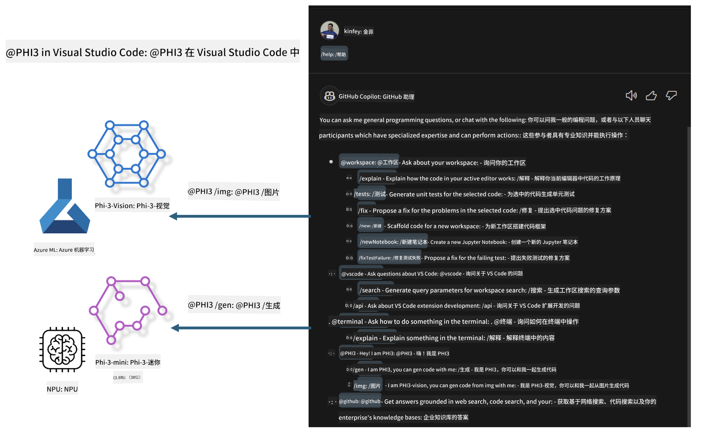

<!--
CO_OP_TRANSLATOR_METADATA:
{
  "original_hash": "00b7a699de8ac405fa821f4c0f7fc0ab",
  "translation_date": "2025-07-17T03:34:25+00:00",
  "source_file": "md/02.Application/02.Code/Phi3/VSCodeExt/README.md",
  "language_code": "zh"
}
-->
# **使用 Microsoft Phi-3 系列构建属于你的 Visual Studio Code GitHub Copilot Chat**

你用过 GitHub Copilot Chat 中的 workspace agent 吗？想为你的团队打造专属的代码助手吗？本实操实验希望结合开源模型，打造企业级的代码业务代理。

## **基础**

### **为什么选择 Microsoft Phi-3**

Phi-3 是一个系列家族，包括基于不同训练参数的 phi-3-mini、phi-3-small 和 phi-3-medium，适用于文本生成、对话完成和代码生成。还有基于视觉的 phi-3-vision。它适合企业或不同团队创建离线生成式 AI 解决方案。

推荐阅读此链接 [https://github.com/microsoft/PhiCookBook/blob/main/md/01.Introduction/01/01.PhiFamily.md](https://github.com/microsoft/PhiCookBook/blob/main/md/01.Introduction/01/01.PhiFamily.md)

### **Microsoft GitHub Copilot Chat**

GitHub Copilot Chat 扩展为你提供了一个聊天界面，让你可以直接在 VS Code 中与 GitHub Copilot 互动，获得与编码相关的问题答案，无需查阅文档或在线论坛。

Copilot Chat 可能会使用语法高亮、缩进和其他格式化功能来增强生成回复的清晰度。根据用户提问的类型，结果可能包含 Copilot 用于生成回复的上下文链接，如源代码文件或文档，或访问 VS Code 功能的按钮。

- Copilot Chat 融入你的开发流程，在你需要时提供帮助：

- 直接从编辑器或终端启动内联聊天，编码时获得帮助

- 使用聊天视图，随时拥有 AI 助手在旁协助

- 启动快速聊天，快速提问，迅速回到工作中

你可以在多种场景下使用 GitHub Copilot Chat，例如：

- 回答如何最佳解决问题的编码问题

- 解释他人代码并提出改进建议

- 提出代码修复方案

- 生成单元测试用例

- 生成代码文档

推荐阅读此链接 [https://code.visualstudio.com/docs/copilot/copilot-chat](https://code.visualstudio.com/docs/copilot/copilot-chat?WT.mc_id=aiml-137032-kinfeylo)

###  **Microsoft GitHub Copilot Chat @workspace**

在 Copilot Chat 中引用 **@workspace**，可以让你针对整个代码库提问。Copilot 会根据问题智能检索相关文件和符号，并在回答中以链接和代码示例的形式引用它们。

为了回答你的问题，**@workspace** 会搜索开发者在 VS Code 中浏览代码库时会用到的相同资源：

- 工作区中的所有文件，除了被 .gitignore 忽略的文件

- 目录结构，包括嵌套的文件夹和文件名

- 如果工作区是 GitHub 仓库且被代码搜索索引，则使用 GitHub 的代码搜索索引

- 工作区中的符号和定义

- 当前选中的文本或活动编辑器中可见的文本

注意：如果你打开了被忽略的文件或选中了其中的文本，.gitignore 会被忽略。

推荐阅读此链接 [[https://code.visualstudio.com/docs/copilot/copilot-chat](https://code.visualstudio.com/docs/copilot/workspace-context?WT.mc_id=aiml-137032-kinfeylo)]

## **了解更多关于本实验**

GitHub Copilot 大幅提升了企业的编程效率，每个企业都希望定制 GitHub Copilot 的相关功能。许多企业基于自身业务场景和开源模型，定制了类似 GitHub Copilot 的扩展。对于企业来说，定制扩展更易于控制，但这也会影响用户体验。毕竟 GitHub Copilot 在处理通用场景和专业性方面功能更强。如果能保持体验一致，定制企业自己的扩展会更好。GitHub Copilot Chat 提供了相关 API，方便企业在聊天体验上进行扩展。保持一致的体验并拥有定制功能，能带来更好的用户体验。

本实验主要结合 Phi-3 模型与本地 NPU 及 Azure 混合，构建 GitHub Copilot Chat 中的自定义 Agent ***@PHI3***，帮助企业开发者完成代码生成***(@PHI3 /gen)***及基于图像生成代码***(@PHI3 /img)***。

### ***注意：***

本实验目前在 Intel CPU 和 Apple Silicon 的 AIPC 上实现，我们将持续更新 Qualcomm 版本的 NPU。

## **实验**

| 名称 | 描述 | AIPC | Apple |
| ------------ | ----------- | -------- |-------- |
| Lab0 - 安装(✅) | 配置并安装相关环境和安装工具 | [Go](./HOL/AIPC/01.Installations.md) |[Go](./HOL/Apple/01.Installations.md) |
| Lab1 - 使用 Phi-3-mini 运行 Prompt flow (✅) | 结合 AIPC / Apple Silicon，使用本地 NPU 通过 Phi-3-mini 创建代码生成 | [Go](./HOL/AIPC/02.PromptflowWithNPU.md) |  [Go](./HOL/Apple/02.PromptflowWithMLX.md) |
| Lab2 - 在 Azure 机器学习服务上部署 Phi-3-vision(✅) | 通过部署 Azure 机器学习服务的模型目录 - Phi-3-vision 图像生成代码 | [Go](./HOL/AIPC/03.DeployPhi3VisionOnAzure.md) |[Go](./HOL/Apple/03.DeployPhi3VisionOnAzure.md) |
| Lab3 - 在 GitHub Copilot Chat 中创建 @phi-3 agent(✅)  | 在 GitHub Copilot Chat 中创建自定义 Phi-3 agent，完成代码生成、图形生成代码、RAG 等 | [Go](./HOL/AIPC/04.CreatePhi3AgentInVSCode.md) | [Go](./HOL/Apple/04.CreatePhi3AgentInVSCode.md) |
| 示例代码 (✅)  | 下载示例代码 | [Go](../../../../../../../code/07.Lab/01/AIPC) | [Go](../../../../../../../code/07.Lab/01/Apple) |

## **资源**

1. Phi-3 Cookbook [https://github.com/microsoft/Phi-3CookBook](https://github.com/microsoft/Phi-3CookBook)

2. 了解更多关于 GitHub Copilot [https://learn.microsoft.com/training/paths/copilot/](https://learn.microsoft.com/training/paths/copilot/?WT.mc_id=aiml-137032-kinfeylo)

3. 了解更多关于 GitHub Copilot Chat [https://learn.microsoft.com/training/paths/accelerate-app-development-using-github-copilot/](https://learn.microsoft.com/training/paths/accelerate-app-development-using-github-copilot/?WT.mc_id=aiml-137032-kinfeylo)

4. 了解更多关于 GitHub Copilot Chat API [https://code.visualstudio.com/api/extension-guides/chat](https://code.visualstudio.com/api/extension-guides/chat?WT.mc_id=aiml-137032-kinfeylo)

5. 了解更多关于 Azure AI Foundry [https://learn.microsoft.com/training/paths/create-custom-copilots-ai-studio/](https://learn.microsoft.com/training/paths/create-custom-copilots-ai-studio/?WT.mc_id=aiml-137032-kinfeylo)

6. 了解更多关于 Azure AI Foundry 的模型目录 [https://learn.microsoft.com/azure/ai-studio/how-to/model-catalog-overview](https://learn.microsoft.com/azure/ai-studio/how-to/model-catalog-overview)

**免责声明**：  
本文件使用 AI 翻译服务 [Co-op Translator](https://github.com/Azure/co-op-translator) 进行翻译。虽然我们力求准确，但请注意自动翻译可能包含错误或不准确之处。原始语言的文档应被视为权威来源。对于重要信息，建议使用专业人工翻译。对于因使用本翻译而产生的任何误解或误释，我们概不负责。