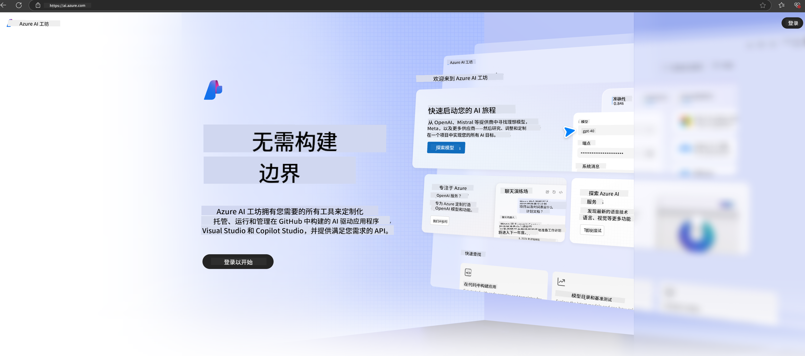

<!--
CO_OP_TRANSLATOR_METADATA:
{
  "original_hash": "6525689374197af33b41a93811e473a2",
  "translation_date": "2025-04-03T07:59:05+00:00",
  "source_file": "md\\02.QuickStart\\AzureAIFoundry_QuickStart.md",
  "language_code": "zh"
}
-->
# **在 Azure AI Foundry 中使用 Phi-3**

随着生成式 AI 的发展，我们希望通过一个统一的平台来管理不同的 LLM 和 SLM、企业数据集成、微调/RAG 操作，以及整合 LLM 和 SLM 后对不同企业业务的评估等，以便更好地实现生成式 AI 的智能应用。[Azure AI Foundry](https://ai.azure.com) 是一个企业级生成式 AI 应用平台。

借助 Azure AI Foundry，您可以评估大型语言模型 (LLM) 的响应，并通过提示流协调提示应用组件以实现更好的性能。该平台支持从概念验证快速扩展到完整的生产环境，并提供持续的监控和优化，以支持长期成功。

通过简单的步骤，我们可以快速在 Azure AI Foundry 上部署 Phi-3 模型，然后利用 Azure AI Foundry 完成与 Phi-3 相关的 Playground/Chat、微调、评估等相关工作。

## **1. 准备工作**

如果您已经在本地安装了 [Azure Developer CLI](https://learn.microsoft.com/azure/developer/azure-developer-cli/overview?WT.mc_id=aiml-138114-kinfeylo)，那么使用此模板只需在新目录中运行以下命令即可。

## 手动创建

创建一个 Microsoft Azure AI Foundry 项目和 Hub 是组织和管理您的 AI 工作的好方法。以下是入门的分步指南：

### 在 Azure AI Foundry 中创建项目

1. **访问 Azure AI Foundry**：登录 Azure AI Foundry 门户。
2. **创建项目**：
   - 如果您已经在某个项目中，请选择页面左上角的 "Azure AI Foundry" 返回首页。
   - 点击 "+ 创建项目"。
   - 输入项目名称。
   - 如果您已有 Hub，它会被默认选中。如果您有多个 Hub，可以从下拉菜单中选择其他的。如果您想创建一个新的 Hub，选择 "创建新 Hub" 并输入名称。
   - 点击 "创建"。

### 在 Azure AI Foundry 中创建 Hub

1. **访问 Azure AI Foundry**：使用您的 Azure 账户登录。
2. **创建 Hub**：
   - 从左侧菜单选择管理中心。
   - 点击 "所有资源"，然后点击 "+ 新项目" 下拉箭头，选择 "+ 新 Hub"。
   - 在 "创建新 Hub" 对话框中，输入 Hub 名称（例如，contoso-hub），并根据需要修改其他字段。
   - 点击 "下一步"，审核信息后点击 "创建"。

有关更详细的说明，您可以参考官方 [Microsoft 文档](https://learn.microsoft.com/azure/ai-studio/how-to/create-projects)。

创建成功后，您可以通过 [ai.azure.com](https://ai.azure.com/) 访问您创建的工作室。

在一个 AI Foundry 中可以存在多个项目。在 AI Foundry 中创建项目以做好准备。

创建 Azure AI Foundry [快速入门](https://learn.microsoft.com/azure/ai-studio/quickstarts/get-started-code)

## **2. 在 Azure AI Foundry 中部署 Phi 模型**

点击项目的 Explore 选项，进入模型目录并选择 Phi-3。

选择 Phi-3-mini-4k-instruct。

点击“部署”以部署 Phi-3-mini-4k-instruct 模型。

> [!NOTE]
>
> 部署时可以选择计算能力。

## **3. 在 Azure AI Foundry 中使用 Playground 与 Phi 进行聊天**

进入部署页面，选择 Playground，与 Azure AI Foundry 的 Phi-3 进行聊天。

## **4. 从 Azure AI Foundry 部署模型**

要从 Azure 模型目录部署模型，可以按照以下步骤操作：

- 登录 Azure AI Foundry。
- 从 Azure AI Foundry 模型目录中选择您要部署的模型。
- 在模型的详情页面，选择“部署”，然后选择“使用 Azure AI 内容安全的无服务器 API”。
- 选择您要部署模型的项目。要使用无服务器 API，您的工作区必须位于 East US 2 或 Sweden Central 区域。您可以自定义部署名称。
- 在部署向导中，选择“定价和条款”以了解定价和使用条款。
- 点击“部署”。等待部署完成，系统会将您重定向到部署页面。
- 点击“在 Playground 中打开”开始与模型交互。
- 您可以返回部署页面，选择部署，并记录端点的目标 URL 和密钥，您可以使用这些信息调用部署并生成结果。
- 您始终可以通过导航到“构建”选项卡并从“组件”部分选择“部署”，找到端点的详细信息、URL 和访问密钥。

> [!NOTE]
> 请注意，您的账户必须在资源组上具有 Azure AI 开发者角色权限才能执行这些步骤。

## **5. 在 Azure AI Foundry 中使用 Phi API**

您可以通过 Postman 的 GET 请求访问 https://{您的项目名称}.region.inference.ml.azure.com/swagger.json，并结合密钥了解提供的接口。

您可以非常方便地获取请求参数以及响应参数。

**免责声明**：  
本文档使用 AI 翻译服务 [Co-op Translator](https://github.com/Azure/co-op-translator) 进行翻译。虽然我们尽力确保翻译的准确性，但请注意，自动翻译可能包含错误或不准确之处。原始文档的母语版本应被视为权威来源。对于关键信息，建议使用专业人工翻译。我们不对因使用此翻译而导致的任何误解或错误解释承担责任。