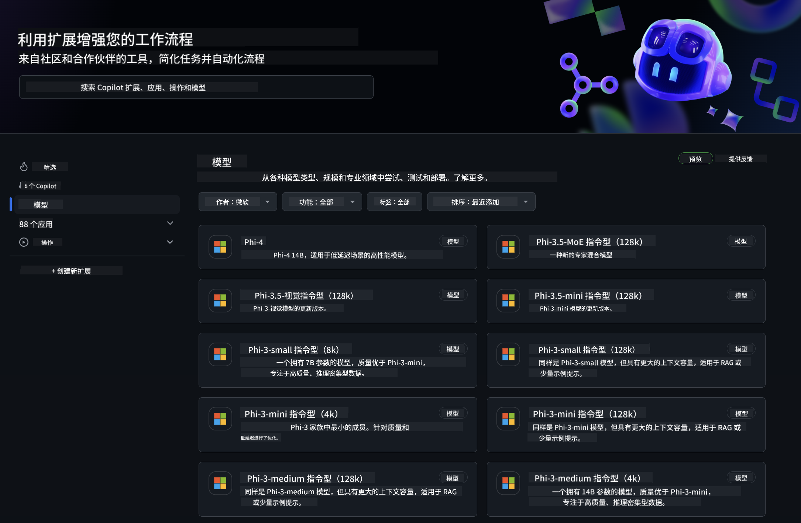
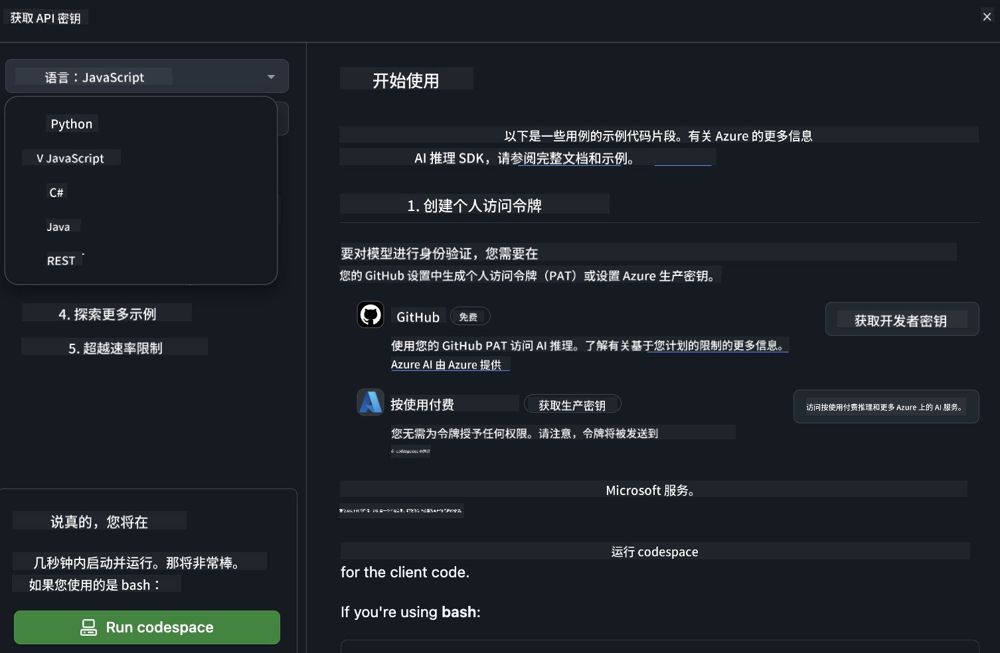
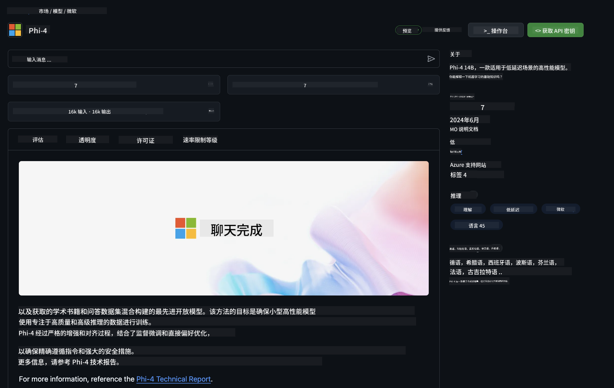

<!--
CO_OP_TRANSLATOR_METADATA:
{
  "original_hash": "5113634b77370af6790f9697d5d7de90",
  "translation_date": "2025-05-07T13:08:31+00:00",
  "source_file": "md/02.QuickStart/GitHubModel_QuickStart.md",
  "language_code": "zh"
}
-->
## GitHub 模型 - 限量公开测试版

欢迎使用 [GitHub Models](https://github.com/marketplace/models)！我们已为您准备好一切，随时可以探索托管在 Azure AI 上的 AI 模型。



想了解更多关于 GitHub Models 上可用模型的信息，请访问 [GitHub Model Marketplace](https://github.com/marketplace/models)

## 可用模型

每个模型都有专属的 Playground 和示例代码


### GitHub Model Catalog 中的 Phi-3 模型

[Phi-3-Medium-128k-Instruct](https://github.com/marketplace/models/azureml/Phi-3-medium-128k-instruct)

[Phi-3-medium-4k-instruct](https://github.com/marketplace/models/azureml/Phi-3-medium-4k-instruct)

[Phi-3-mini-128k-instruct](https://github.com/marketplace/models/azureml/Phi-3-mini-128k-instruct)

[Phi-3-mini-4k-instruct](https://github.com/marketplace/models/azureml/Phi-3-mini-4k-instruct)

[Phi-3-small-128k-instruct](https://github.com/marketplace/models/azureml/Phi-3-small-128k-instruct)

[Phi-3-small-8k-instruct](https://github.com/marketplace/models/azureml/Phi-3-small-8k-instruct)

## 快速开始

这里有一些基础示例，您可以直接运行。它们都位于 samples 目录下。如果想直接跳到您喜欢的编程语言，可以在以下语言中找到示例：

- Python
- JavaScript
- cURL

此外，还有专门的 Codespaces 环境用来运行示例和模型。



## 示例代码

以下是几个用例的示例代码片段。有关 Azure AI Inference SDK 的更多信息，请参阅完整文档和示例。

## 设置

1. 创建个人访问令牌  
您不需要为令牌授予任何权限。请注意，令牌会发送到 Microsoft 服务。

要使用下面的代码片段，请创建一个环境变量，将您的令牌设置为客户端代码的密钥。

如果您使用的是 bash：  
```
export GITHUB_TOKEN="<your-github-token-goes-here>"
```  
如果您使用的是 powershell：  

```
$Env:GITHUB_TOKEN="<your-github-token-goes-here>"
```  

如果您使用的是 Windows 命令提示符：  

```
set GITHUB_TOKEN=<your-github-token-goes-here>
```

## Python 示例

### 安装依赖  
使用 pip 安装 Azure AI Inference SDK（要求：Python >=3.8）：  

```
pip install azure-ai-inference
```  
### 运行基础代码示例

该示例展示了如何调用聊天补全 API。它使用了 GitHub AI 模型推理端点和您的 GitHub 令牌。调用是同步的。

```
import os
from azure.ai.inference import ChatCompletionsClient
from azure.ai.inference.models import SystemMessage, UserMessage
from azure.core.credentials import AzureKeyCredential

endpoint = "https://models.inference.ai.azure.com"
# Replace Model_Name 
model_name = "Phi-3-small-8k-instruct"
token = os.environ["GITHUB_TOKEN"]

client = ChatCompletionsClient(
    endpoint=endpoint,
    credential=AzureKeyCredential(token),
)

response = client.complete(
    messages=[
        SystemMessage(content="You are a helpful assistant."),
        UserMessage(content="What is the capital of France?"),
    ],
    model=model_name,
    temperature=1.,
    max_tokens=1000,
    top_p=1.
)

print(response.choices[0].message.content)
```

### 运行多轮对话

该示例演示了如何使用聊天补全 API 进行多轮对话。当在聊天应用中使用模型时，您需要管理对话历史，并将最新消息发送给模型。

```
import os
from azure.ai.inference import ChatCompletionsClient
from azure.ai.inference.models import AssistantMessage, SystemMessage, UserMessage
from azure.core.credentials import AzureKeyCredential

token = os.environ["GITHUB_TOKEN"]
endpoint = "https://models.inference.ai.azure.com"
# Replace Model_Name
model_name = "Phi-3-small-8k-instruct"

client = ChatCompletionsClient(
    endpoint=endpoint,
    credential=AzureKeyCredential(token),
)

messages = [
    SystemMessage(content="You are a helpful assistant."),
    UserMessage(content="What is the capital of France?"),
    AssistantMessage(content="The capital of France is Paris."),
    UserMessage(content="What about Spain?"),
]

response = client.complete(messages=messages, model=model_name)

print(response.choices[0].message.content)
```

### 流式输出

为了更好的用户体验，您可能希望对模型响应进行流式处理，这样第一个 token 可以尽早显示，避免等待较长响应时间。

```
import os
from azure.ai.inference import ChatCompletionsClient
from azure.ai.inference.models import SystemMessage, UserMessage
from azure.core.credentials import AzureKeyCredential

token = os.environ["GITHUB_TOKEN"]
endpoint = "https://models.inference.ai.azure.com"
# Replace Model_Name
model_name = "Phi-3-small-8k-instruct"

client = ChatCompletionsClient(
    endpoint=endpoint,
    credential=AzureKeyCredential(token),
)

response = client.complete(
    stream=True,
    messages=[
        SystemMessage(content="You are a helpful assistant."),
        UserMessage(content="Give me 5 good reasons why I should exercise every day."),
    ],
    model=model_name,
)

for update in response:
    if update.choices:
        print(update.choices[0].delta.content or "", end="")

client.close()
```

## JavaScript

### 安装依赖

安装 Node.js。

将以下文本复制并保存为您文件夹内的 package.json 文件。

```
{
  "type": "module",
  "dependencies": {
    "@azure-rest/ai-inference": "latest",
    "@azure/core-auth": "latest",
    "@azure/core-sse": "latest"
  }
}
```

注意：仅在流式获取聊天补全响应时需要 @azure/core-sse。

在该文件夹打开终端窗口，运行 npm install。

下面的每个代码片段，请复制内容到 sample.js 文件中，并通过 node sample.js 运行。

### 运行基础代码示例

该示例展示了如何调用聊天补全 API。它使用了 GitHub AI 模型推理端点和您的 GitHub 令牌。调用是同步的。

```
import ModelClient from "@azure-rest/ai-inference";
import { AzureKeyCredential } from "@azure/core-auth";

const token = process.env["GITHUB_TOKEN"];
const endpoint = "https://models.inference.ai.azure.com";
// Update your modelname
const modelName = "Phi-3-small-8k-instruct";

export async function main() {

  const client = new ModelClient(endpoint, new AzureKeyCredential(token));

  const response = await client.path("/chat/completions").post({
    body: {
      messages: [
        { role:"system", content: "You are a helpful assistant." },
        { role:"user", content: "What is the capital of France?" }
      ],
      model: modelName,
      temperature: 1.,
      max_tokens: 1000,
      top_p: 1.
    }
  });

  if (response.status !== "200") {
    throw response.body.error;
  }
  console.log(response.body.choices[0].message.content);
}

main().catch((err) => {
  console.error("The sample encountered an error:", err);
});
```

### 运行多轮对话

该示例演示了如何使用聊天补全 API 进行多轮对话。当在聊天应用中使用模型时，您需要管理对话历史，并将最新消息发送给模型。

```
import ModelClient from "@azure-rest/ai-inference";
import { AzureKeyCredential } from "@azure/core-auth";

const token = process.env["GITHUB_TOKEN"];
const endpoint = "https://models.inference.ai.azure.com";
// Update your modelname
const modelName = "Phi-3-small-8k-instruct";

export async function main() {

  const client = new ModelClient(endpoint, new AzureKeyCredential(token));

  const response = await client.path("/chat/completions").post({
    body: {
      messages: [
        { role: "system", content: "You are a helpful assistant." },
        { role: "user", content: "What is the capital of France?" },
        { role: "assistant", content: "The capital of France is Paris." },
        { role: "user", content: "What about Spain?" },
      ],
      model: modelName,
    }
  });

  if (response.status !== "200") {
    throw response.body.error;
  }

  for (const choice of response.body.choices) {
    console.log(choice.message.content);
  }
}

main().catch((err) => {
  console.error("The sample encountered an error:", err);
});
```

### 流式输出

为了更好的用户体验，您可能希望对模型响应进行流式处理，这样第一个 token 可以尽早显示，避免等待较长响应时间。

```
import ModelClient from "@azure-rest/ai-inference";
import { AzureKeyCredential } from "@azure/core-auth";
import { createSseStream } from "@azure/core-sse";

const token = process.env["GITHUB_TOKEN"];
const endpoint = "https://models.inference.ai.azure.com";
// Update your modelname
const modelName = "Phi-3-small-8k-instruct";

export async function main() {

  const client = new ModelClient(endpoint, new AzureKeyCredential(token));

  const response = await client.path("/chat/completions").post({
    body: {
      messages: [
        { role: "system", content: "You are a helpful assistant." },
        { role: "user", content: "Give me 5 good reasons why I should exercise every day." },
      ],
      model: modelName,
      stream: true
    }
  }).asNodeStream();

  const stream = response.body;
  if (!stream) {
    throw new Error("The response stream is undefined");
  }

  if (response.status !== "200") {
    stream.destroy();
    throw new Error(`Failed to get chat completions, http operation failed with ${response.status} code`);
  }

  const sseStream = createSseStream(stream);

  for await (const event of sseStream) {
    if (event.data === "[DONE]") {
      return;
    }
    for (const choice of (JSON.parse(event.data)).choices) {
        process.stdout.write(choice.delta?.content ?? ``);
    }
  }
}

main().catch((err) => {
  console.error("The sample encountered an error:", err);
});
```

## REST

### 运行基础代码示例

将以下内容粘贴到 shell 中：

```
curl -X POST "https://models.inference.ai.azure.com/chat/completions" \
    -H "Content-Type: application/json" \
    -H "Authorization: Bearer $GITHUB_TOKEN" \
    -d '{
        "messages": [
            {
                "role": "system",
                "content": "You are a helpful assistant."
            },
            {
                "role": "user",
                "content": "What is the capital of France?"
            }
        ],
        "model": "Phi-3-small-8k-instruct"
    }'
```

### 运行多轮对话

调用聊天补全 API 并传递聊天历史：

```
curl -X POST "https://models.inference.ai.azure.com/chat/completions" \
    -H "Content-Type: application/json" \
    -H "Authorization: Bearer $GITHUB_TOKEN" \
    -d '{
        "messages": [
            {
                "role": "system",
                "content": "You are a helpful assistant."
            },
            {
                "role": "user",
                "content": "What is the capital of France?"
            },
            {
                "role": "assistant",
                "content": "The capital of France is Paris."
            },
            {
                "role": "user",
                "content": "What about Spain?"
            }
        ],
        "model": "Phi-3-small-8k-instruct"
    }'
```

### 流式输出

这是调用端点并流式获取响应的示例。

```
curl -X POST "https://models.inference.ai.azure.com/chat/completions" \
    -H "Content-Type: application/json" \
    -H "Authorization: Bearer $GITHUB_TOKEN" \
    -d '{
        "messages": [
            {
                "role": "system",
                "content": "You are a helpful assistant."
            },
            {
                "role": "user",
                "content": "Give me 5 good reasons why I should exercise every day."
            }
        ],
        "stream": true,
        "model": "Phi-3-small-8k-instruct"
    }'
```

## GitHub Models 免费使用及速率限制



[playground 和免费 API 使用的速率限制](https://docs.github.com/en/github-models/prototyping-with-ai-models#rate-limits) 旨在帮助您试验模型并原型化 AI 应用。若超出这些限制，且想将应用规模化，您必须从 Azure 账户中配置资源，并通过 Azure 认证，而非使用 GitHub 个人访问令牌。代码中无需做其他更改。请使用此链接了解如何突破 Azure AI 免费层限制。

### 免责声明

请记住，与模型交互时您正在进行 AI 试验，因此内容可能存在错误。

该功能受多种限制（包括每分钟请求数、每日请求数、每次请求的 token 数量以及并发请求数）约束，且不适合生产环境使用。

GitHub Models 使用 Azure AI 内容安全服务。此过滤器在 GitHub Models 体验中无法关闭。如果您选择通过付费服务使用模型，请根据需求配置内容过滤器。

该服务遵循 GitHub 预发布条款。

**免责声明**：  
本文件由 AI 翻译服务 [Co-op Translator](https://github.com/Azure/co-op-translator) 翻译。虽然我们力求准确，但请注意自动翻译可能包含错误或不准确之处。原始语言的原文应被视为权威来源。对于重要信息，建议使用专业人工翻译。我们不对因使用本翻译而产生的任何误解或曲解承担责任。