<!--
CO_OP_TRANSLATOR_METADATA:
{
  "original_hash": "c1559c5af6caccf6f623fd43a6b3a9a3",
  "translation_date": "2025-05-07T13:12:22+00:00",
  "source_file": "md/03.FineTuning/FineTuning_AIFoundry.md",
  "language_code": "zh"
}
-->
# 使用 Azure AI Foundry 微调 Phi-3

让我们一起了解如何使用 Azure AI Foundry 微调微软的 Phi-3 Mini 语言模型。微调可以让你将 Phi-3 Mini 适配到特定任务，使其更加强大且具备更好的上下文理解能力。

## 注意事项

- **能力：** 哪些模型支持微调？基础模型可以微调实现哪些功能？
- **成本：** 微调的定价模式是怎样的？
- **可定制性：** 我可以在多大程度上修改基础模型？具体有哪些方式？
- **便利性：** 微调是如何进行的？需要编写自定义代码吗？需要自备计算资源吗？
- **安全性：** 微调模型存在安全风险吗？是否有防护措施防止意外伤害？

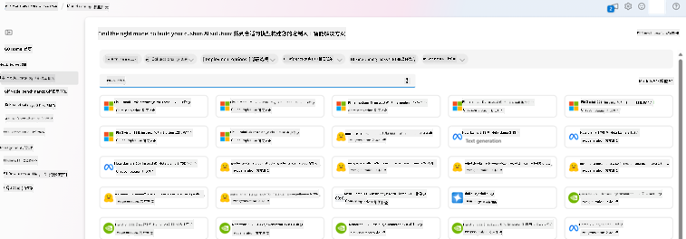

## 微调准备

### 前提条件

> [!NOTE]
> 对于 Phi-3 系列模型，按需付费的微调服务仅支持在 **East US 2** 区域创建的 hub。

- 一个 Azure 订阅。如果你还没有 Azure 订阅，请创建一个[付费 Azure 账户](https://azure.microsoft.com/pricing/purchase-options/pay-as-you-go)开始使用。

- 一个 [AI Foundry 项目](https://ai.azure.com?WT.mc_id=aiml-138114-kinfeylo)。
- Azure 角色访问控制（Azure RBAC）用于授予对 Azure AI Foundry 操作的访问权限。要执行本文的步骤，用户账户必须在资源组上被分配 __Azure AI Developer 角色__。

### 订阅提供程序注册

确认订阅已注册 `Microsoft.Network` 资源提供程序。

1. 登录 [Azure 门户](https://portal.azure.com)。
1. 从左侧菜单选择 **Subscriptions**。
1. 选择你想使用的订阅。
1. 从左侧菜单选择 **AI project settings** > **Resource providers**。
1. 确认列表中包含 **Microsoft.Network**，如果没有则添加。

### 数据准备

准备训练和验证数据以微调模型。训练和验证数据集包含你希望模型如何执行的输入输出示例。

确保所有训练示例符合推理时的预期格式。为了有效微调模型，确保数据集平衡且多样化。

这包括保持数据平衡，涵盖各种场景，并定期优化训练数据以符合实际需求，从而获得更准确且均衡的模型响应。

不同类型的模型需要不同格式的训练数据。

### 聊天补全

你使用的训练和验证数据**必须**是 JSON Lines（JSONL）格式。对于 `Phi-3-mini-128k-instruct`，微调数据集必须采用聊天补全 API 使用的对话格式。

### 示例文件格式

```json
    {"messages": [{"role": "system", "content": "You are an Xbox customer support agent whose primary goal is to help users with issues they are experiencing with their Xbox devices. You are friendly and concise. You only provide factual answers to queries, and do not provide answers that are not related to Xbox."}, {"role": "user", "content": "Is Xbox better than PlayStation?"}, {"role": "assistant", "content": "I apologize, but I cannot provide personal opinions. My primary job is to assist you with any issues related to your Xbox device. Do you have any Xbox-related issues that need addressing?"}]}
    {"messages": [{"role": "system", "content": "You are an Xbox customer support agent whose primary goal is to help users with issues they are experiencing with their Xbox devices. You are friendly and concise. You only provide factual answers to queries, and do not provide answers that are not related to Xbox."}, {"role": "user", "content": "Can I play PC games on my Xbox?"}, {"role": "assistant", "content": "While Xbox consoles don't natively support PC games, they can play an array of Xbox games, many of which are also available on PC. Can I assist you with finding games compatible with your Xbox device?"}]}
    {"messages": [{"role": "system", "content": "You are an Xbox customer support agent whose primary goal is to help users with issues they are experiencing with their Xbox devices. You are friendly and concise. You only provide factual answers to queries, and do not provide answers that are not related to Xbox."}, {"role": "user", "content": "I'm having trouble connecting my Xbox to the Wi-Fi."}, {"role": "assistant", "content": "No worries, let's go through the network settings on your Xbox. Can you please tell me what happens when you try to connect it to the Wi-Fi?"}]}
```

支持的文件类型为 JSON Lines。文件会上传到默认数据存储，并在你的项目中可用。

## 使用 Azure AI Foundry 微调 Phi-3

Azure AI Foundry 允许你通过微调过程，将大型语言模型定制到你的专属数据集。微调带来显著价值，使模型针对特定任务和应用进行优化，提升性能、降低成本、减少延迟，并生成更符合需求的输出。


### 创建新项目

1. 登录 [Azure AI Foundry](https://ai.azure.com)。

1. 选择 **+New project** 创建新项目。

    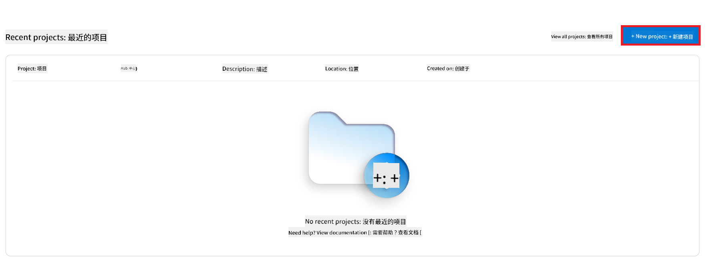

1. 执行以下操作：

    - 项目 **Hub name**，必须是唯一值。
    - 选择要使用的 **Hub**（如无则新建）。

    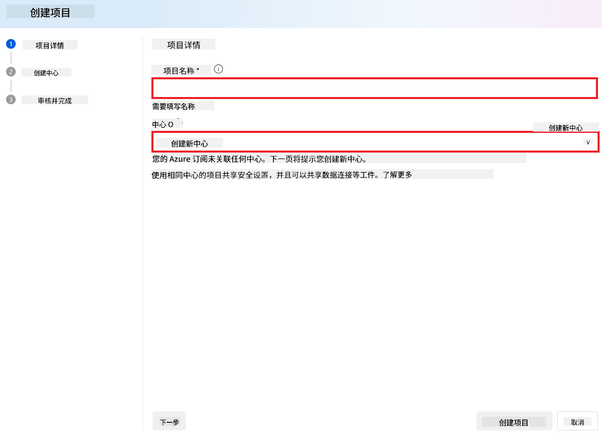

1. 创建新 hub 时，执行以下操作：

    - 输入 **Hub name**，必须唯一。
    - 选择你的 Azure **Subscription**。
    - 选择要使用的 **Resource group**（如无则新建）。
    - 选择你想使用的 **Location**。
    - 选择要连接的 **Connect Azure AI Services**（如无则新建）。
    - 选择 **Connect Azure AI Search** 并选择 **Skip connecting**。

    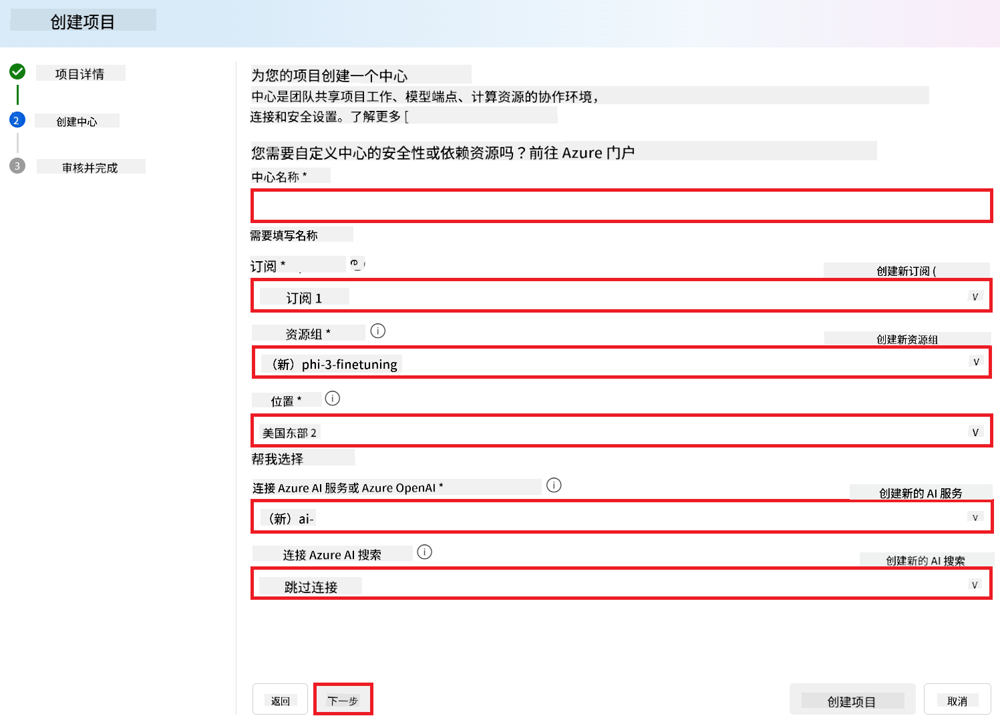

1. 选择 **Next**。
1. 选择 **Create a project**。

### 数据准备

微调前，收集或创建与你任务相关的数据集，如聊天指令、问答对或其他相关文本。清洗并预处理数据，去除噪声，处理缺失值，并对文本进行分词。

### 在 Azure AI Foundry 中微调 Phi-3 模型

> [!NOTE]
> Phi-3 模型的微调目前仅支持位于 East US 2 区域的项目。

1. 从左侧标签选择 **Model catalog**。

1. 在 **搜索栏** 输入 *phi-3*，选择你想使用的 phi-3 模型。

    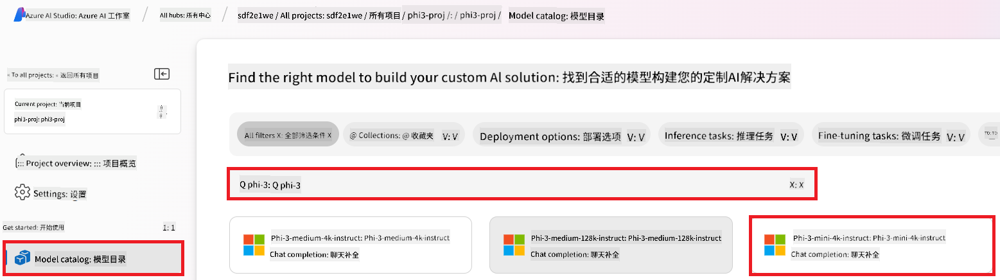

1. 选择 **Fine-tune**。

    

1. 输入 **Fine-tuned model name**。

    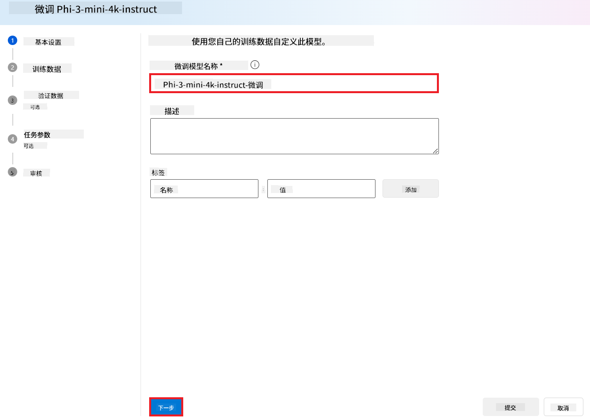

1. 选择 **Next**。

1. 执行以下操作：

    - 选择 **task type** 为 **Chat completion**。
    - 选择你想使用的 **Training data**。可以通过 Azure AI Foundry 上传数据，或从本地环境上传。

    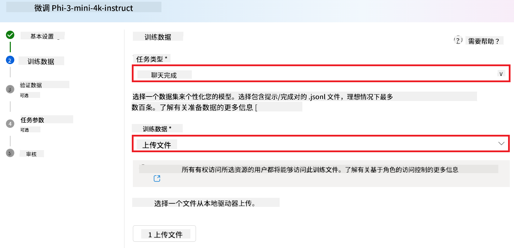

1. 选择 **Next**。

1. 上传你想使用的 **Validation data**，或者选择 **Automatic split of training data**。

    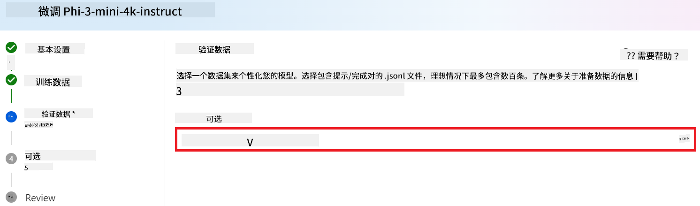

1. 选择 **Next**。

1. 执行以下操作：

    - 选择想使用的 **Batch size multiplier**。
    - 选择想使用的 **Learning rate**。
    - 选择想使用的 **Epochs**。

    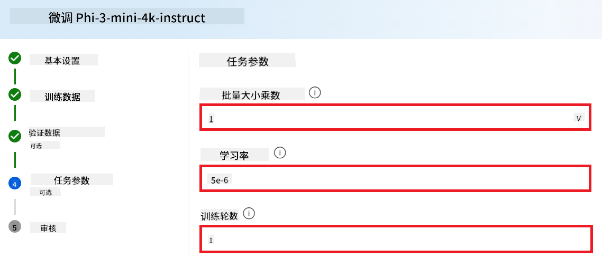

1. 选择 **Submit** 开始微调。

    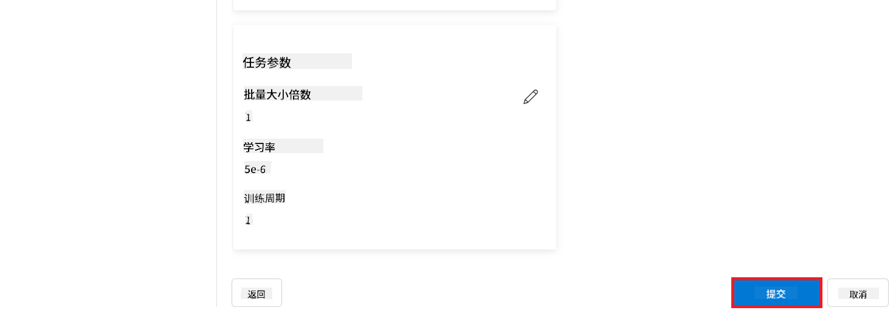

1. 微调完成后，状态将显示为 **Completed**，如图所示。此时你可以部署模型，并在自己的应用、Playground 或 Prompt Flow 中使用。更多信息请参见[如何使用 Azure AI Foundry 部署 Phi-3 系列小型语言模型](https://learn.microsoft.com/azure/ai-studio/how-to/deploy-models-phi-3?tabs=phi-3-5&pivots=programming-language-python)。

    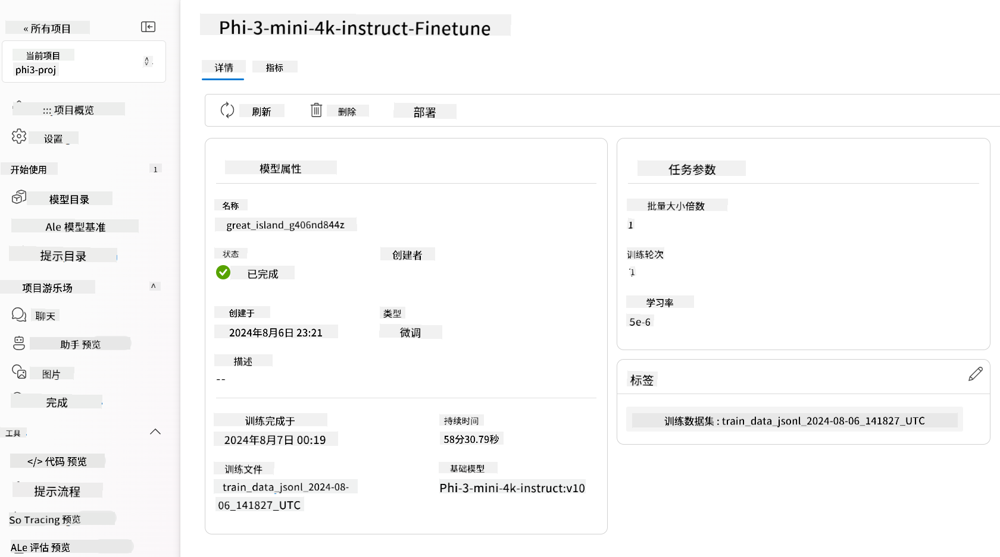

> [!NOTE]
> 想了解更详细的 Phi-3 微调信息，请访问[在 Azure AI Foundry 中微调 Phi-3 模型](https://learn.microsoft.com/azure/ai-studio/how-to/fine-tune-phi-3?tabs=phi-3-mini)。

## 清理微调模型

你可以在 [Azure AI Foundry](https://ai.azure.com) 的微调模型列表或模型详情页删除微调模型。选择要删除的微调模型后，点击删除按钮即可。

> [!NOTE]
> 如果自定义模型已有部署，则无法删除。必须先删除模型部署，才能删除自定义模型。

## 成本与配额

### Phi-3 模型微调即服务的成本与配额考虑

Phi 模型的微调即服务由微软提供，并集成在 Azure AI Foundry 中。你可以在[部署](https://learn.microsoft.com/azure/ai-studio/how-to/deploy-models-phi-3?tabs=phi-3-5&pivots=programming-language-python)或微调模型时，在部署向导的“Pricing and terms”标签页查看定价信息。

## 内容过滤

按需付费服务部署的模型受 Azure AI 内容安全保护。部署到实时端点时，可以选择关闭此功能。启用 Azure AI 内容安全后，输入提示和输出结果都会经过一系列分类模型的检测，旨在发现并阻止有害内容的输出。内容过滤系统会检测并处理输入提示和输出结果中的特定类别潜在有害内容。了解更多关于 [Azure AI 内容安全](https://learn.microsoft.com/azure/ai-studio/concepts/content-filtering)。

**微调配置**

超参数：定义学习率、批量大小和训练轮数等超参数。

**损失函数**

选择适合任务的损失函数（例如交叉熵）。

**优化器**

选择训练时用于梯度更新的优化器（例如 Adam）。

**微调流程**

- 加载预训练模型：加载 Phi-3 Mini 检查点。
- 添加自定义层：添加任务相关层（例如聊天指令的分类头）。

**训练模型**

使用准备好的数据集微调模型。监控训练进度并根据需要调整超参数。

**评估与验证**

验证集：将数据划分为训练集和验证集。

**性能评估**

使用准确率、F1 分数或困惑度等指标评估模型表现。

## 保存微调模型

**检查点**

保存微调后的模型检查点以备后用。

## 部署

- 作为 Web 服务部署：在 Azure AI Foundry 中将微调模型部署为 Web 服务。
- 测试端点：向部署的端点发送测试请求，验证功能。

## 迭代与改进

迭代：如果性能不理想，可通过调整超参数、增加数据量或延长训练轮数来迭代优化。

## 监控与优化

持续监控模型表现，并根据需要进行优化。

## 定制与扩展

自定义任务：Phi-3 Mini 可针对聊天指令以外的多种任务进行微调，探索更多应用场景！
实验：尝试不同架构、层组合和技术以提升性能。

> [!NOTE]
> 微调是一个迭代过程。不断实验、学习并调整你的模型，以实现特定任务的最佳效果！

**免责声明**：  
本文件使用 AI 翻译服务 [Co-op Translator](https://github.com/Azure/co-op-translator) 进行翻译。虽然我们力求准确，但请注意，自动翻译可能存在错误或不准确之处。原始文件的母语版本应被视为权威来源。对于重要信息，建议使用专业人工翻译。对于因使用本翻译而产生的任何误解或误释，我们不承担任何责任。