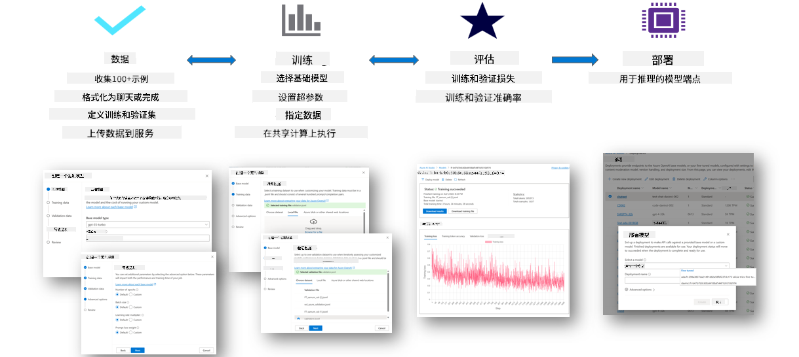
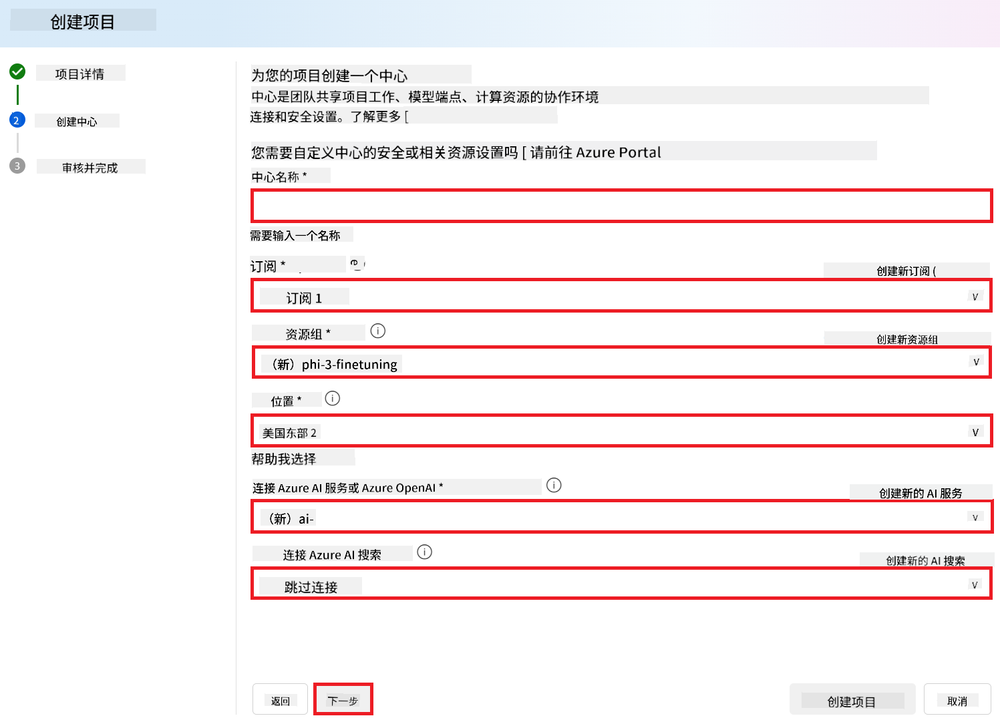
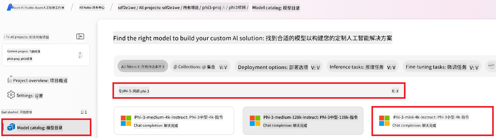
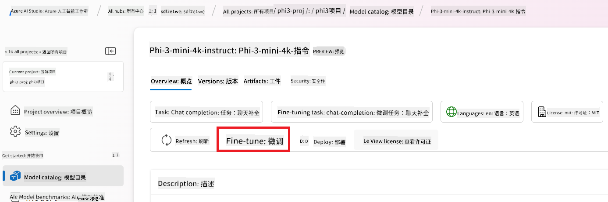
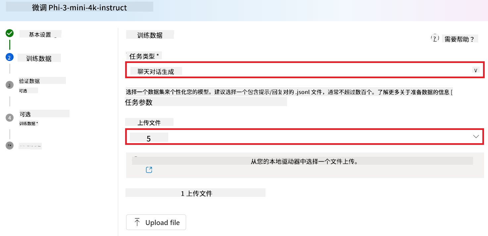
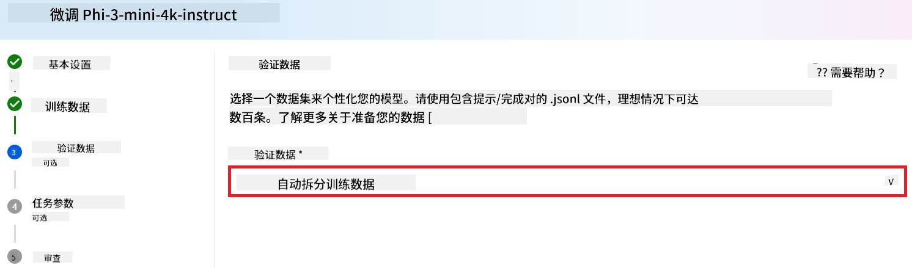
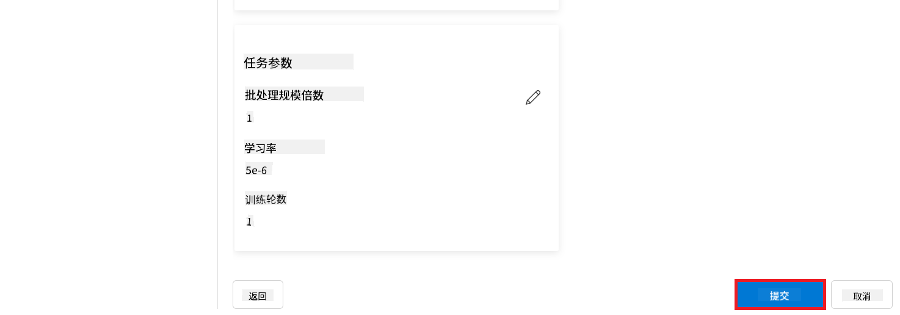
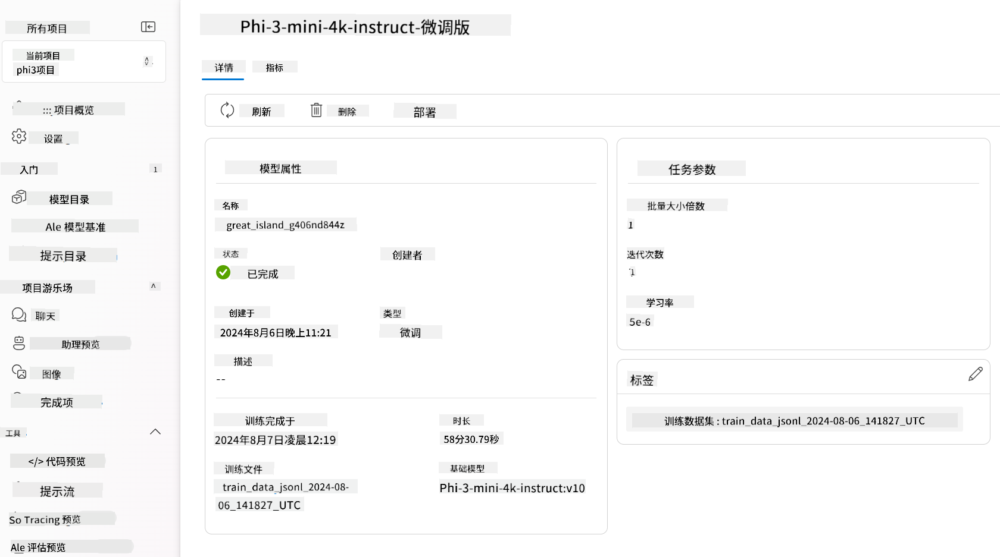

<!--
CO_OP_TRANSLATOR_METADATA:
{
  "original_hash": "94e7d7ab455720bab75ead5c28521c97",
  "translation_date": "2025-04-03T08:04:11+00:00",
  "source_file": "md\\03.FineTuning\\FineTuning_AIFoundry.md",
  "language_code": "zh"
}
-->
# 使用 Azure AI Foundry 微调 Phi-3 模型

让我们探索如何使用 Azure AI Foundry 微调微软的 Phi-3 Mini 语言模型。微调可以让您根据特定任务调整 Phi-3 Mini，使其更加强大和上下文感知。

## 注意事项

- **能力**：哪些模型可以微调？基础模型可以通过微调实现什么功能？
- **成本**：微调的定价模式是什么？
- **可定制性**：我可以以何种方式修改基础模型？
- **便利性**：微调的实际操作过程是怎样的？是否需要编写自定义代码？是否需要自备计算资源？
- **安全性**：微调后的模型可能存在安全风险——是否有任何防护措施以防止意外伤害？


## 微调准备工作

### 先决条件

> [!NOTE]
> 对于 Phi-3 系列模型，仅在 **East US 2** 区域创建的中心支持按需付费的微调服务。

- 一个 Azure 订阅。如果您还没有 Azure 订阅，请创建一个 [付费 Azure 账户](https://azure.microsoft.com/pricing/purchase-options/pay-as-you-go) 开始使用。

- 一个 [AI Foundry 项目](https://ai.azure.com?WT.mc_id=aiml-138114-kinfeylo)。
- Azure 基于角色的访问控制 (Azure RBAC) 用于授予对 Azure AI Foundry 操作的访问权限。要执行本文中的步骤，您的用户账户必须被分配为资源组上的 __Azure AI Developer 角色__。

### 订阅提供程序注册

验证订阅是否已注册到 `Microsoft.Network` 资源提供程序。

1. 登录 [Azure 门户](https://portal.azure.com)。
1. 从左侧菜单中选择 **Subscriptions**。
1. 选择您要使用的订阅。
1. 从左侧菜单中选择 **AI project settings** > **Resource providers**。
1. 确认 **Microsoft.Network** 是否在资源提供程序列表中。如果不在，请添加它。

### 数据准备

准备您的训练和验证数据以微调模型。您的训练数据和验证数据集需要包含输入和输出示例，以说明您希望模型如何表现。

确保所有训练示例都符合推理的预期格式。为了有效地微调模型，请确保数据集的平衡性和多样性。

这包括保持数据平衡，涵盖各种场景，并定期优化训练数据以符合实际需求，从而获得更准确和均衡的模型响应。

不同的模型类型需要不同格式的训练数据。

### 对话补全

您使用的训练和验证数据**必须**格式化为 JSON Lines (JSONL) 文档。对于 `Phi-3-mini-128k-instruct`，微调数据集必须采用 Chat completions API 使用的对话格式。

### 示例文件格式

```json
    {"messages": [{"role": "system", "content": "You are an Xbox customer support agent whose primary goal is to help users with issues they are experiencing with their Xbox devices. You are friendly and concise. You only provide factual answers to queries, and do not provide answers that are not related to Xbox."}, {"role": "user", "content": "Is Xbox better than PlayStation?"}, {"role": "assistant", "content": "I apologize, but I cannot provide personal opinions. My primary job is to assist you with any issues related to your Xbox device. Do you have any Xbox-related issues that need addressing?"}]}
    {"messages": [{"role": "system", "content": "You are an Xbox customer support agent whose primary goal is to help users with issues they are experiencing with their Xbox devices. You are friendly and concise. You only provide factual answers to queries, and do not provide answers that are not related to Xbox."}, {"role": "user", "content": "Can I play PC games on my Xbox?"}, {"role": "assistant", "content": "While Xbox consoles don't natively support PC games, they can play an array of Xbox games, many of which are also available on PC. Can I assist you with finding games compatible with your Xbox device?"}]}
    {"messages": [{"role": "system", "content": "You are an Xbox customer support agent whose primary goal is to help users with issues they are experiencing with their Xbox devices. You are friendly and concise. You only provide factual answers to queries, and do not provide answers that are not related to Xbox."}, {"role": "user", "content": "I'm having trouble connecting my Xbox to the Wi-Fi."}, {"role": "assistant", "content": "No worries, let's go through the network settings on your Xbox. Can you please tell me what happens when you try to connect it to the Wi-Fi?"}]}
```

支持的文件类型是 JSON Lines。这些文件会上传到默认数据存储并在您的项目中可用。

## 使用 Azure AI Foundry 微调 Phi-3

Azure AI Foundry 通过微调过程让您可以根据个人数据集调整大型语言模型。微调可以显著提升模型的定制化和针对性应用能力，从而提高性能、降低成本、减少延迟并生成更符合需求的输出。



### 创建新项目

1. 登录 [Azure AI Foundry](https://ai.azure.com)。

1. 选择 **+New project** 创建一个新项目。

    

1. 执行以下任务：

    - 项目 **Hub name**。必须是唯一值。
    - 选择要使用的 **Hub**（如有需要，可新建）。

    

1. 执行以下任务以创建新的中心：

    - 输入 **Hub name**，必须是唯一值。
    - 选择您的 Azure **Subscription**。
    - 选择要使用的 **Resource group**（如有需要，可新建）。
    - 选择您想使用的 **Location**。
    - 选择要使用的 **Connect Azure AI Services**（如有需要，可新建）。
    - 选择 **Connect Azure AI Search**，并选择 **Skip connecting**。

    

1. 选择 **Next**。
1. 选择 **Create a project**。

### 数据准备

在微调之前，收集或创建与任务相关的数据集，例如聊天指令、问答对或其他相关文本数据。清理并预处理这些数据，包括去除噪声、处理缺失值以及对文本进行分词。

### 在 Azure AI Foundry 中微调 Phi-3 模型

> [!NOTE]
> Phi-3 模型的微调目前仅支持位于 East US 2 的项目。

1. 从左侧选项卡中选择 **Model catalog**。

1. 在 **搜索栏** 中输入 *phi-3*，然后选择您想使用的 phi-3 模型。

    

1. 选择 **Fine-tune**。

    

1. 输入 **Fine-tuned model name**。

    

1. 选择 **Next**。

1. 执行以下任务：

    - 将 **task type** 选择为 **Chat completion**。
    - 选择您想使用的 **Training data**。您可以通过 Azure AI Foundry 的数据上传或从本地环境上传。

    

1. 选择 **Next**。

1. 上传您想使用的 **Validation data**，或者选择 **Automatic split of training data**。

    

1. 选择 **Next**。

1. 执行以下任务：

    - 选择您想使用的 **Batch size multiplier**。
    - 选择您想使用的 **Learning rate**。
    - 选择您想使用的 **Epochs**。

    

1. 选择 **Submit** 开始微调过程。

    

1. 微调完成后，状态会显示为 **Completed**，如下图所示。现在您可以部署模型，并在您的应用程序、沙盒或提示流中使用它。有关更多信息，请参阅 [如何使用 Azure AI Foundry 部署 Phi-3 系列小型语言模型](https://learn.microsoft.com/azure/ai-studio/how-to/deploy-models-phi-3?tabs=phi-3-5&pivots=programming-language-python)。

    

> [!NOTE]
> 有关微调 Phi-3 的更多详细信息，请访问 [在 Azure AI Foundry 中微调 Phi-3 模型](https://learn.microsoft.com/azure/ai-studio/how-to/fine-tune-phi-3?tabs=phi-3-mini)。

## 清理微调模型

您可以从 [Azure AI Foundry](https://ai.azure.com) 的微调模型列表或模型详细信息页面中删除微调模型。在微调页面中选择要删除的模型，然后点击删除按钮。

> [!NOTE]
> 如果自定义模型已有部署，您无法删除它。必须先删除模型部署，才能删除自定义模型。

## 成本和配额

### Phi-3 模型微调服务的成本和配额考量

作为服务提供的 Phi 模型由微软提供，并集成到 Azure AI Foundry 中使用。您可以在 [部署](https://learn.microsoft.com/azure/ai-studio/how-to/deploy-models-phi-3?tabs=phi-3-5&pivots=programming-language-python)或微调模型时，通过部署向导的“定价和条款”选项卡找到定价信息。

## 内容过滤

按需付费部署的服务模型受 Azure AI 内容安全保护。当部署到实时端点时，您可以选择退出此功能。启用 Azure AI 内容安全后，提示和完成都会通过一组分类模型进行检测，以防止输出有害内容。内容过滤系统会检测并对输入提示和输出完成中可能有害的特定类别内容采取行动。了解更多 [Azure AI 内容安全](https://learn.microsoft.com/azure/ai-studio/concepts/content-filtering)。

**微调配置**

超参数：定义超参数，例如学习率、批量大小和训练周期数。

**损失函数**

为您的任务选择合适的损失函数（例如，交叉熵）。

**优化器**

选择一个优化器（例如 Adam）来在训练期间更新梯度。

**微调过程**

- 加载预训练模型：加载 Phi-3 Mini 的检查点。
- 添加自定义层：添加任务特定的层（例如，用于聊天指令的分类头）。

**训练模型**
使用准备好的数据集微调模型。监控训练进度并根据需要调整超参数。

**评估与验证**

验证集：将数据分为训练集和验证集。

**评估性能**

使用准确率、F1 分数或困惑度等指标评估模型性能。

## 保存微调模型

**检查点**
保存微调后的模型检查点以供将来使用。

## 部署

- 部署为 Web 服务：将微调后的模型作为 Web 服务部署到 Azure AI Foundry。
- 测试端点：向部署的端点发送测试查询以验证其功能。

## 迭代与改进

迭代：如果性能不令人满意，请通过调整超参数、增加数据或延长训练周期进行迭代。

## 监控与优化

持续监控模型行为并根据需要进行优化。

## 定制与扩展

自定义任务：Phi-3 Mini 可微调用于聊天指令以外的多种任务。探索其他用例！
实验：尝试不同的架构、层组合和技术来提升性能。

> [!NOTE]
> 微调是一个迭代过程。实验、学习并调整模型，以实现特定任务的最佳结果！

**免责声明**：  
本文档使用 AI 翻译服务 [Co-op Translator](https://github.com/Azure/co-op-translator) 进行翻译。尽管我们努力确保翻译的准确性，但请注意，自动翻译可能会包含错误或不准确之处。原始语言的文档应被视为权威来源。对于关键信息，建议使用专业人工翻译。因使用此翻译而导致的任何误解或误读，我们不承担任何责任。