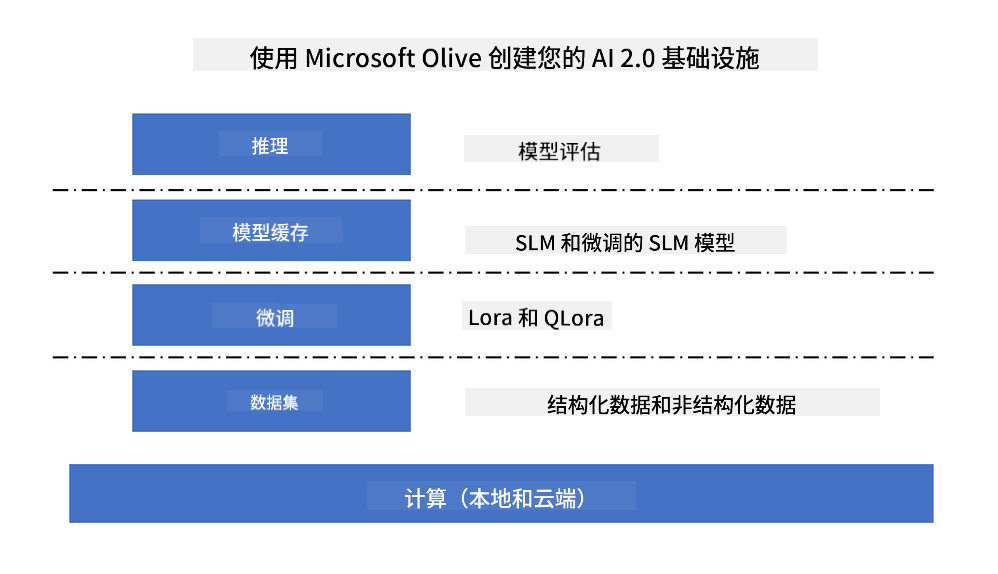
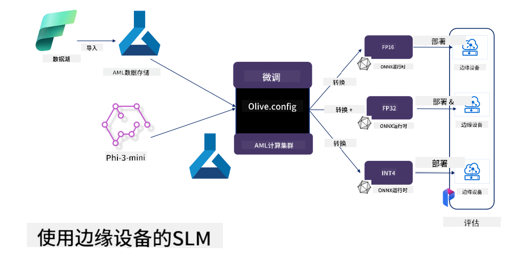

<!--
CO_OP_TRANSLATOR_METADATA:
{
  "original_hash": "727978e690ed9c055f594a4bfe01d75c",
  "translation_date": "2025-04-03T08:08:41+00:00",
  "source_file": "md\\03.FineTuning\\FineTuning_MicrosoftOlive.md",
  "language_code": "zh"
}
-->
# **使用 Microsoft Olive 微调 Phi-3**

[Olive](https://github.com/microsoft/OLive?WT.mc_id=aiml-138114-kinfeylo) 是一个易于使用的硬件感知模型优化工具，它集成了业界领先的技术，涵盖模型压缩、优化和编译。

它旨在简化机器学习模型的优化过程，确保模型能够最大化利用特定硬件架构的效率。

无论您是开发基于云的应用程序还是边缘设备，Olive 都能帮助您轻松高效地优化模型。

## 主要功能：
- Olive 集成并自动化了针对目标硬件的优化技术。
- 没有单一的优化技术可以适用于所有场景，因此 Olive 允许通过扩展性让行业专家加入他们的优化创新。

## 降低工程工作量：
- 开发人员通常需要学习并使用多个硬件厂商特定的工具链来准备和优化训练后的模型以进行部署。
- Olive 简化了这一体验，通过自动化优化技术来针对目标硬件完成优化。

## 即用型端到端优化解决方案：

通过整合和调优集成的技术，Olive 提供了一个统一的端到端优化解决方案。
它在优化模型时会考虑约束条件，如准确性和延迟。

## 使用 Microsoft Olive 进行微调

Microsoft Olive 是一个非常易于使用的开源模型优化工具，既可以用于微调，也可以用于生成式人工智能领域的参考。只需简单配置，结合使用开源的小型语言模型和相关运行环境（AzureML / 本地 GPU、CPU、DirectML），即可通过自动优化完成模型的微调或参考，并找到最佳模型部署到云端或边缘设备。帮助企业在本地和云端构建自己的行业垂直模型。



## 使用 Microsoft Olive 微调 Phi-3 



## Phi-3 Olive 示例代码和案例
在此示例中，您将使用 Olive：

- 微调一个 LoRA 适配器，将短语分类为 Sad、Joy、Fear、Surprise。
- 将适配器权重合并到基础模型中。
- 优化并将模型量化为 int4。

[示例代码](../../code/03.Finetuning/olive-ort-example/README.md)

### 安装 Microsoft Olive

Microsoft Olive 的安装非常简单，可用于 CPU、GPU、DirectML 和 Azure ML。

```bash
pip install olive-ai
```

如果您希望使用 CPU 运行 ONNX 模型，可以使用：

```bash
pip install olive-ai[cpu]
```

如果您希望使用 GPU 运行 ONNX 模型，可以使用：

```python
pip install olive-ai[gpu]
```

如果您希望使用 Azure ML，可以使用：

```python
pip install git+https://github.com/microsoft/Olive#egg=olive-ai[azureml]
```

**注意**
操作系统要求：Ubuntu 20.04 / 22.04 

### **Microsoft Olive 的 Config.json**

安装完成后，您可以通过配置文件设置不同的模型相关参数，包括数据、计算、训练、部署和模型生成。

**1. 数据**

在 Microsoft Olive 上，支持在本地数据和云端数据上进行训练，并可通过设置进行配置。

*本地数据设置*

您可以简单地设置需要进行微调的数据集，通常是 json 格式，并适配数据模板。这需要根据模型的要求进行调整（例如，适配 Microsoft Phi-3-mini 所需的格式。如果您有其他模型，请参考其他模型的微调格式进行处理）。

```json

    "data_configs": [
        {
            "name": "dataset_default_train",
            "type": "HuggingfaceContainer",
            "load_dataset_config": {
                "params": {
                    "data_name": "json", 
                    "data_files":"dataset/dataset-classification.json",
                    "split": "train"
                }
            },
            "pre_process_data_config": {
                "params": {
                    "dataset_type": "corpus",
                    "text_cols": [
                            "phrase",
                            "tone"
                    ],
                    "text_template": "### Text: {phrase}\n### The tone is:\n{tone}",
                    "corpus_strategy": "join",
                    "source_max_len": 2048,
                    "pad_to_max_len": false,
                    "use_attention_mask": false
                }
            }
        }
    ],
```

**云数据源设置**

通过链接 Azure AI Studio/Azure Machine Learning Service 的数据存储，可以将云端的数据引入。您可以选择通过 Microsoft Fabric 和 Azure Data 将不同的数据源引入 Azure AI Studio/Azure Machine Learning Service，以支持微调数据。

```json

    "data_configs": [
        {
            "name": "dataset_default_train",
            "type": "HuggingfaceContainer",
            "load_dataset_config": {
                "params": {
                    "data_name": "json", 
                    "data_files": {
                        "type": "azureml_datastore",
                        "config": {
                            "azureml_client": {
                                "subscription_id": "Your Azure Subscrition ID",
                                "resource_group": "Your Azure Resource Group",
                                "workspace_name": "Your Azure ML Workspaces name"
                            },
                            "datastore_name": "workspaceblobstore",
                            "relative_path": "Your train_data.json Azure ML Location"
                        }
                    },
                    "split": "train"
                }
            },
            "pre_process_data_config": {
                "params": {
                    "dataset_type": "corpus",
                    "text_cols": [
                            "Question",
                            "Best Answer"
                    ],
                    "text_template": "<|user|>\n{Question}<|end|>\n<|assistant|>\n{Best Answer}\n<|end|>",
                    "corpus_strategy": "join",
                    "source_max_len": 2048,
                    "pad_to_max_len": false,
                    "use_attention_mask": false
                }
            }
        }
    ],
    
```

**2. 计算配置**

如果需要在本地运行，可以直接使用本地数据资源。如果需要使用 Azure AI Studio / Azure Machine Learning Service 的资源，则需要配置相关的 Azure 参数、计算能力名称等。

```json

    "systems": {
        "aml": {
            "type": "AzureML",
            "config": {
                "accelerators": ["gpu"],
                "hf_token": true,
                "aml_compute": "Your Azure AI Studio / Azure Machine Learning Service Compute Name",
                "aml_docker_config": {
                    "base_image": "Your Azure AI Studio / Azure Machine Learning Service docker",
                    "conda_file_path": "conda.yaml"
                }
            }
        },
        "azure_arc": {
            "type": "AzureML",
            "config": {
                "accelerators": ["gpu"],
                "aml_compute": "Your Azure AI Studio / Azure Machine Learning Service Compute Name",
                "aml_docker_config": {
                    "base_image": "Your Azure AI Studio / Azure Machine Learning Service docker",
                    "conda_file_path": "conda.yaml"
                }
            }
        }
    },
```

***注意***

由于是在 Azure AI Studio/Azure Machine Learning Service 上通过容器运行，因此需要配置所需的环境。这在 conda.yaml 环境中进行配置。

```yaml

name: project_environment
channels:
  - defaults
dependencies:
  - python=3.8.13
  - pip=22.3.1
  - pip:
      - einops
      - accelerate
      - azure-keyvault-secrets
      - azure-identity
      - bitsandbytes
      - datasets
      - huggingface_hub
      - peft
      - scipy
      - sentencepiece
      - torch>=2.2.0
      - transformers
      - git+https://github.com/microsoft/Olive@jiapli/mlflow_loading_fix#egg=olive-ai[gpu]
      - --extra-index-url https://aiinfra.pkgs.visualstudio.com/PublicPackages/_packaging/ORT-Nightly/pypi/simple/ 
      - ort-nightly-gpu==1.18.0.dev20240307004
      - --extra-index-url https://aiinfra.pkgs.visualstudio.com/PublicPackages/_packaging/onnxruntime-genai/pypi/simple/
      - onnxruntime-genai-cuda

    

```

**3. 选择您的 SLM**

您可以直接从 Hugging Face 使用模型，也可以直接结合 Azure AI Studio / Azure Machine Learning 的模型目录选择要使用的模型。在以下代码示例中，我们将以 Microsoft Phi-3-mini 为例。

如果您有本地模型，可以使用以下方法：

```json

    "input_model":{
        "type": "PyTorchModel",
        "config": {
            "hf_config": {
                "model_name": "model-cache/microsoft/phi-3-mini",
                "task": "text-generation",
                "model_loading_args": {
                    "trust_remote_code": true
                }
            }
        }
    },
```

如果您希望使用来自 Azure AI Studio / Azure Machine Learning Service 的模型，可以使用以下方法：

```json

    "input_model":{
        "type": "PyTorchModel",
        "config": {
            "model_path": {
                "type": "azureml_registry_model",
                "config": {
                    "name": "microsoft/Phi-3-mini-4k-instruct",
                    "registry_name": "azureml-msr",
                    "version": "11"
                }
            },
             "model_file_format": "PyTorch.MLflow",
             "hf_config": {
                "model_name": "microsoft/Phi-3-mini-4k-instruct",
                "task": "text-generation",
                "from_pretrained_args": {
                    "trust_remote_code": true
                }
            }
        }
    },
```

**注意：**
我们需要与 Azure AI Studio / Azure Machine Learning Service 集成，因此在设置模型时，请参考版本号和相关命名。

Azure 上的所有模型需要设置为 PyTorch.MLflow。

您需要拥有 Hugging Face 账户并将密钥绑定到 Azure AI Studio / Azure Machine Learning 的 Key 值。

**4. 算法**

Microsoft Olive 很好地封装了 Lora 和 QLora 微调算法，您只需配置一些相关参数。这里以 QLora 为例。

```json
        "lora": {
            "type": "LoRA",
            "config": {
                "target_modules": [
                    "o_proj",
                    "qkv_proj"
                ],
                "double_quant": true,
                "lora_r": 64,
                "lora_alpha": 64,
                "lora_dropout": 0.1,
                "train_data_config": "dataset_default_train",
                "eval_dataset_size": 0.3,
                "training_args": {
                    "seed": 0,
                    "data_seed": 42,
                    "per_device_train_batch_size": 1,
                    "per_device_eval_batch_size": 1,
                    "gradient_accumulation_steps": 4,
                    "gradient_checkpointing": false,
                    "learning_rate": 0.0001,
                    "num_train_epochs": 3,
                    "max_steps": 10,
                    "logging_steps": 10,
                    "evaluation_strategy": "steps",
                    "eval_steps": 187,
                    "group_by_length": true,
                    "adam_beta2": 0.999,
                    "max_grad_norm": 0.3
                }
            }
        },
```

如果您希望进行量化转换，Microsoft Olive 主分支已支持 onnxruntime-genai 方法。您可以根据需求进行设置：

1. 将适配器权重合并到基础模型中。
2. 使用 ModelBuilder 将模型转换为所需精度的 onnx 模型。

例如转换为量化的 INT4。

```json

        "merge_adapter_weights": {
            "type": "MergeAdapterWeights"
        },
        "builder": {
            "type": "ModelBuilder",
            "config": {
                "precision": "int4"
            }
        }
```

**注意** 
- 如果使用 QLoRA，目前暂不支持 ONNXRuntime-genai 的量化转换。

- 需要指出的是，您可以根据自己的需求设置上述步骤。无需完全配置上述所有步骤，可根据需求直接使用算法步骤而无需微调。最后需要配置相关引擎。

```json

    "engine": {
        "log_severity_level": 0,
        "host": "aml",
        "target": "aml",
        "search_strategy": false,
        "execution_providers": ["CUDAExecutionProvider"],
        "cache_dir": "../model-cache/models/phi3-finetuned/cache",
        "output_dir" : "../model-cache/models/phi3-finetuned"
    }
```

**5. 完成微调**

在命令行中，在 olive-config.json 所在目录执行：

```bash
olive run --config olive-config.json  
```

**免责声明**:  
本文档使用 AI 翻译服务 [Co-op Translator](https://github.com/Azure/co-op-translator) 进行翻译。虽然我们努力确保翻译的准确性，但请注意，自动翻译可能包含错误或不准确之处。应以原始语言的原始文档作为权威来源。对于关键信息，建议使用专业的人工翻译。对于因使用此翻译而引起的任何误解或误读，我们不承担责任。