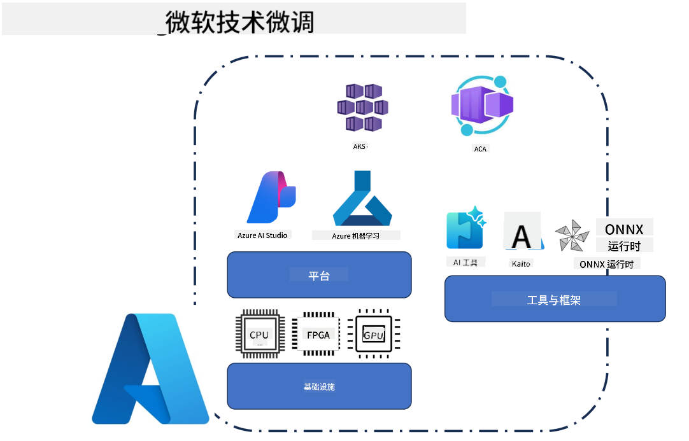
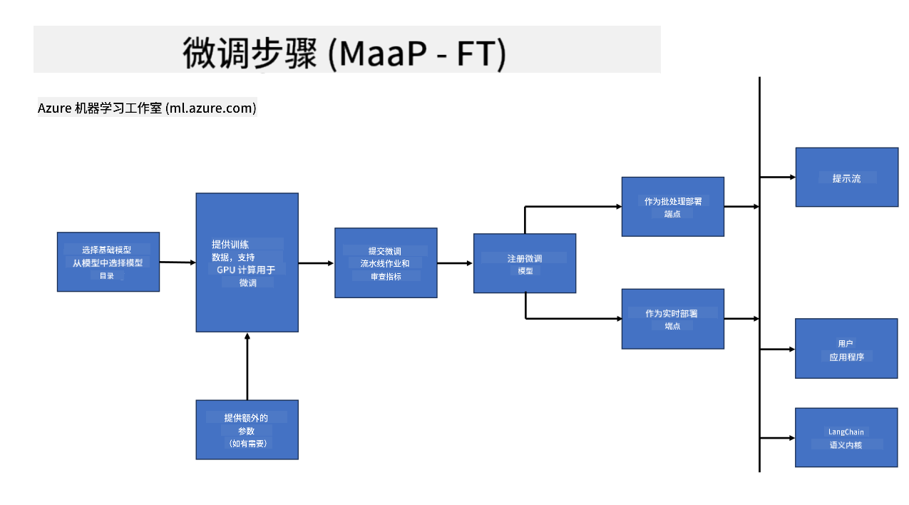

<!--
CO_OP_TRANSLATOR_METADATA:
{
  "original_hash": "cb5648935f63edc17e95ce38f23adc32",
  "translation_date": "2025-07-17T08:23:21+00:00",
  "source_file": "md/03.FineTuning/FineTuning_Scenarios.md",
  "language_code": "zh"
}
-->
## 微调场景

**平台** 包括 Azure AI Foundry、Azure Machine Learning、AI 工具、Kaito 和 ONNX Runtime 等多种技术。

**基础设施** 包括 CPU 和 FPGA，这些是微调过程中必不可少的硬件。下面展示这些技术对应的图标。

**工具与框架** 包括 ONNX Runtime。下面展示这些技术对应的图标。  
[插入 ONNX Runtime 图标]

使用微软技术进行微调涉及多个组件和工具。通过理解和利用这些技术，我们可以高效地微调应用，打造更优的解决方案。

## 模型即服务

通过托管微调功能对模型进行微调，无需创建和管理计算资源。

无服务器微调支持 Phi-3-mini 和 Phi-3-medium 模型，使开发者能够快速轻松地为云端和边缘场景定制模型，无需安排计算资源。我们还宣布，Phi-3-small 现已通过我们的模型即服务（Models-as-a-Service）提供，开发者可以快速轻松地开始 AI 开发，无需管理底层基础设施。

## 模型即平台

用户自行管理计算资源以微调模型。

[微调示例](https://github.com/Azure/azureml-examples/blob/main/sdk/python/foundation-models/system/finetune/chat-completion/chat-completion.ipynb)

## 微调场景

| | | | | | | |
|-|-|-|-|-|-|-|
|场景|LoRA|QLoRA|PEFT|DeepSpeed|ZeRO|DORA|
|将预训练的大型语言模型适配到特定任务或领域|是|是|是|是|是|是|
|针对文本分类、命名实体识别和机器翻译等NLP任务进行微调|是|是|是|是|是|是|
|针对问答任务进行微调|是|是|是|是|是|是|
|针对聊天机器人生成类人响应进行微调|是|是|是|是|是|是|
|针对音乐、艺术或其他创意形式进行微调|是|是|是|是|是|是|
|降低计算和资金成本|是|是|否|是|是|否|
|降低内存使用|否|是|否|是|是|是|
|使用更少参数实现高效微调|否|是|是|否|否|是|
|一种内存高效的数据并行形式，可访问所有 GPU 设备的总 GPU 内存|否|否|否|是|是|是|

## 微调性能示例

**免责声明**：  
本文件使用 AI 翻译服务 [Co-op Translator](https://github.com/Azure/co-op-translator) 进行翻译。虽然我们力求准确，但请注意，自动翻译可能包含错误或不准确之处。原始文件的母语版本应被视为权威来源。对于重要信息，建议采用专业人工翻译。对于因使用本翻译而产生的任何误解或误释，我们不承担任何责任。