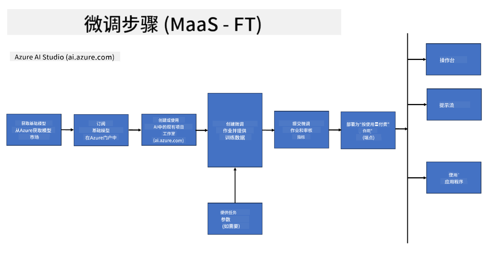
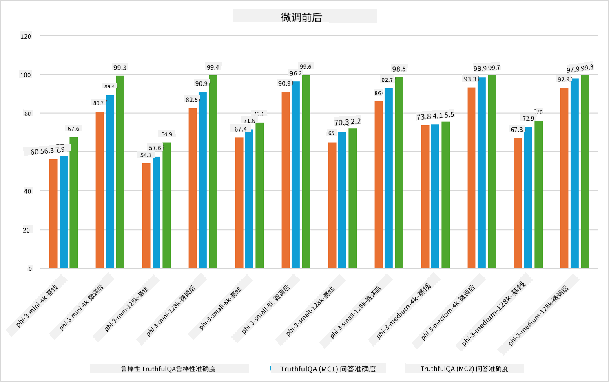

<!--
CO_OP_TRANSLATOR_METADATA:
{
  "original_hash": "cd52a3c9a424a77d2ec0470770c93846",
  "translation_date": "2025-04-03T08:21:10+00:00",
  "source_file": "md\\03.FineTuning\\FineTuning_Scenarios.md",
  "language_code": "zh"
}
-->
## 微调场景

**平台** 包括各种技术，例如 Azure AI Foundry、Azure Machine Learning、AI Tools、Kaito 和 ONNX Runtime。

**基础设施** 包括 CPU 和 FPGA，它们是微调过程中必不可少的部分。让我展示这些技术的图标。

**工具与框架** 包括 ONNX Runtime 和 ONNX Runtime。让我展示这些技术的图标。
[插入 ONNX Runtime 和 ONNX Runtime 的图标]

使用微软技术进行微调涉及多个组件和工具。通过理解和利用这些技术，我们可以有效地优化应用程序并创造更好的解决方案。

## 模型即服务

使用托管微调功能对模型进行优化，无需创建和管理计算资源。

无服务器微调适用于 Phi-3-mini 和 Phi-3-medium 模型，使开发者能够快速轻松地定制模型以适应云和边缘场景，而无需安排计算资源。此外，我们还宣布 Phi-3-small 现已通过我们的模型即服务（Models-as-a-Service）产品提供，开发者可以快速轻松地开始 AI 开发，而无需管理底层基础设施。

## 模型即平台

用户自行管理计算资源以优化其模型。

[微调示例](https://github.com/Azure/azureml-examples/blob/main/sdk/python/foundation-models/system/finetune/chat-completion/chat-completion.ipynb)

## 微调场景

| | | | | | | |
|-|-|-|-|-|-|-|
|场景|LoRA|QLoRA|PEFT|DeepSpeed|ZeRO|DORA|
|将预训练的 LLMs 适配到特定任务或领域|是|是|是|是|是|是|
|针对 NLP 任务（如文本分类、命名实体识别和机器翻译）进行微调|是|是|是|是|是|是|
|针对问答任务进行微调|是|是|是|是|是|是|
|优化生成聊天机器人中类似人类的响应|是|是|是|是|是|是|
|生成音乐、艺术或其他形式创意的微调|是|是|是|是|是|是|
|降低计算和财务成本|是|是|否|是|是|否|
|减少内存使用|否|是|否|是|是|是|
|使用更少的参数进行高效微调|否|是|是|否|否|是|
|一种内存高效的数据并行形式，可利用所有可用 GPU 设备的总 GPU 内存|否|否|否|是|是|是|

## 微调性能示例

**免责声明**:  
本文档使用AI翻译服务 [Co-op Translator](https://github.com/Azure/co-op-translator) 进行翻译。虽然我们努力确保翻译的准确性，但请注意，自动翻译可能包含错误或不准确之处。应以原文档的原始语言版本为权威来源。对于关键信息，建议使用专业人工翻译。对于因使用本翻译而导致的任何误解或误读，我们不承担任何责任。