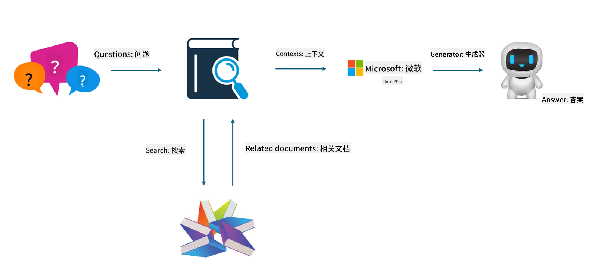

<!--
CO_OP_TRANSLATOR_METADATA:
{
  "original_hash": "5f1c641d645d9e86acdd304d5e9a03de",
  "translation_date": "2025-04-03T08:25:06+00:00",
  "source_file": "md\\03.FineTuning\\FineTuning_vs_RAG.md",
  "language_code": "zh"
}
-->
## 微调 vs RAG

## 检索增强生成

RAG 是数据检索 + 文本生成。企业的结构化数据和非结构化数据存储在向量数据库中。当搜索相关内容时，会找到相关的摘要和内容以形成上下文，并结合 LLM/SLM 的文本补全能力生成内容。

## RAG 流程

## 微调
微调是基于某个模型的改进。它不需要从模型算法开始，但需要持续积累数据。如果在行业应用中需要更精准的术语和语言表达，微调是更好的选择。但如果你的数据频繁变化，微调可能会变得复杂。

## 如何选择
如果我们的答案需要引入外部数据，RAG 是最佳选择。

如果你需要输出稳定且精准的行业知识，微调将是一个不错的选择。RAG 优先拉取相关内容，但可能无法完全掌握专业细微差别。

微调需要高质量的数据集，如果只是小范围的数据，效果不会有太大差异。RAG 更加灵活。

微调是一个黑盒子，有些玄学，内部机制难以理解。但 RAG 可以更容易找到数据来源，从而有效调整幻觉或内容错误，并提供更好的透明性。

**免责声明**：  
本文档使用 AI 翻译服务 [Co-op Translator](https://github.com/Azure/co-op-translator) 进行翻译。虽然我们努力确保翻译的准确性，但请注意，自动翻译可能包含错误或不准确之处。原始语言的文档应被视为权威来源。对于重要信息，建议使用专业人工翻译。我们不对因使用此翻译而引发的任何误解或误读承担责任。