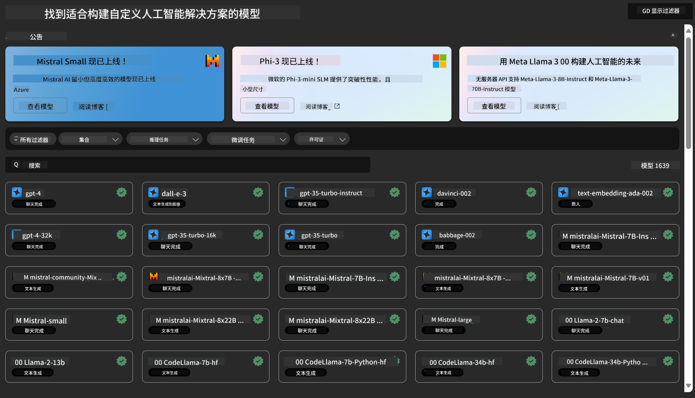
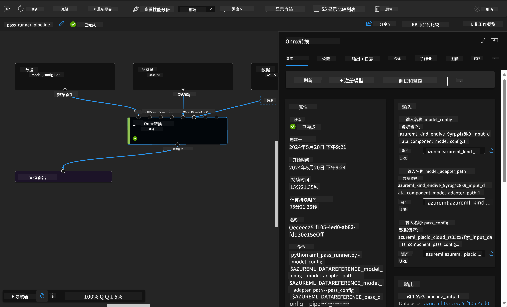

<!--
CO_OP_TRANSLATOR_METADATA:
{
  "original_hash": "315566447513c4c6215ea5a004315e4f",
  "translation_date": "2025-04-03T08:26:28+00:00",
  "source_file": "md\\03.FineTuning\\Introduce_AzureML.md",
  "language_code": "zh"
}
-->
# **介绍 Azure Machine Learning 服务**

[Azure Machine Learning](https://ml.azure.com?WT.mc_id=aiml-138114-kinfeylo) 是一个云服务，用于加速和管理机器学习 (ML) 项目生命周期。

ML 专业人士、数据科学家和工程师可以在日常工作流程中使用它来：

- 训练和部署模型。
- 管理机器学习运营 (MLOps)。
- 您可以在 Azure Machine Learning 中创建模型，也可以使用基于开源平台（如 PyTorch、TensorFlow 或 scikit-learn）构建的模型。
- MLOps 工具帮助您监控、重新训练和重新部署模型。

## 谁适合使用 Azure Machine Learning？

**数据科学家和机器学习工程师**

他们可以使用工具加速和自动化日常工作流程。
Azure ML 提供了公平性、可解释性、跟踪和审计功能。

**应用程序开发人员**

他们可以无缝地将模型集成到应用程序或服务中。

**平台开发人员**

他们可以使用由可靠的 Azure Resource Manager API 支持的强大工具集。
这些工具允许构建先进的机器学习工具。

**企业用户**

在 Microsoft Azure 云中工作，企业可以利用熟悉的安全性和基于角色的访问控制。
设置项目以控制对受保护数据和特定操作的访问。

## 团队每个人的生产力提升

ML 项目通常需要具备多样技能的团队来构建和维护。

Azure ML 提供了工具，使您能够：
- 通过共享的笔记本、计算资源、无服务器计算、数据和环境与团队协作。
- 开发具有公平性、可解释性、跟踪和审计功能的模型，以满足数据溯源和审计合规性要求。
- 快速轻松地大规模部署机器学习模型，并通过 MLOps 高效管理和治理它们。
- 使用内置的治理、安全性和合规性功能，在任何地方运行机器学习工作负载。

## 跨平台兼容工具

ML 团队中的任何成员都可以使用他们喜欢的工具来完成工作。
无论是运行快速实验、超参数调优、构建流水线，还是管理推理，您都可以使用熟悉的界面，包括：
- Azure Machine Learning Studio
- Python SDK (v2)
- Azure CLI (v2)
- Azure Resource Manager REST APIs

在优化模型并在整个开发周期中协作时，您可以通过 Azure Machine Learning Studio 的用户界面共享和查找资产、资源和指标。

## **Azure ML 中的 LLM/SLM**

Azure ML 增加了许多与 LLM/SLM 相关的功能，将 LLMOps 和 SLMOps 结合起来，创建了一个面向企业的生成式人工智能技术平台。

### **模型目录**

企业用户可以通过模型目录根据不同的业务场景部署不同的模型，并以模型即服务的形式提供服务，供企业开发人员或用户访问。

Azure Machine Learning Studio 中的模型目录是发现和使用各种模型的中心，这些模型可以帮助您构建生成式 AI 应用程序。模型目录涵盖了数百种模型，来自模型提供商如 Azure OpenAI 服务、Mistral、Meta、Cohere、Nvidia、Hugging Face，以及 Microsoft 训练的模型。非 Microsoft 提供商的模型属于非 Microsoft 产品，根据 Microsoft 的产品条款定义，并受模型附带的条款约束。

### **任务流水线**

机器学习流水线的核心是将完整的机器学习任务拆分为多步骤工作流。每一步都是一个可管理的组件，可以单独开发、优化、配置和自动化。步骤之间通过定义良好的接口连接。Azure Machine Learning 流水线服务会自动协调流水线步骤之间的所有依赖关系。

在微调 SLM / LLM 时，我们可以通过流水线管理数据、训练和生成过程。

### **提示流**

使用 Azure Machine Learning 提示流的优势：
Azure Machine Learning 提示流提供了一系列优势，帮助用户从构思到实验，最终实现生产就绪的基于 LLM 的应用程序：

**提示工程灵活性**

交互式创作体验：Azure Machine Learning 提示流提供了流程结构的可视化表示，使用户能够轻松理解和导航项目。同时，它还提供类似笔记本的编码体验，用于高效开发和调试流程。
提示调优的变体：用户可以创建和比较多个提示变体，促进迭代优化过程。

评估：内置评估流程使用户能够评估提示和流程的质量和效果。

全面资源：Azure Machine Learning 提示流包含内置工具、示例和模板库，这些资源可以作为开发的起点，激发创造力并加速过程。

**企业级基于 LLM 的应用程序**

协作：Azure Machine Learning 提示流支持团队协作，允许多个用户共同参与提示工程项目，分享知识，并保持版本控制。

一体化平台：Azure Machine Learning 提示流简化了整个提示工程过程，从开发和评估到部署和监控。用户可以轻松地将流程部署为 Azure Machine Learning 端点，并实时监控其性能，确保最佳运行和持续改进。

Azure Machine Learning 企业级解决方案：提示流利用 Azure Machine Learning 的强大企业级解决方案，为流程开发、实验和部署提供安全、可扩展且可靠的基础。

通过 Azure Machine Learning 提示流，用户可以释放提示工程的灵活性，高效协作，并利用企业级解决方案成功开发和部署基于 LLM 的应用程序。

结合 Azure ML 的计算能力、数据和不同组件，企业开发人员可以轻松构建自己的人工智能应用程序。

**免责声明**:  
本文档使用 AI 翻译服务 [Co-op Translator](https://github.com/Azure/co-op-translator) 进行翻译。尽管我们努力确保翻译的准确性，但请注意，自动翻译可能会包含错误或不准确之处。原文档的母语版本应被视为权威来源。对于关键信息，建议使用专业的人工翻译。我们对因使用本翻译而产生的任何误解或错误解释不承担责任。