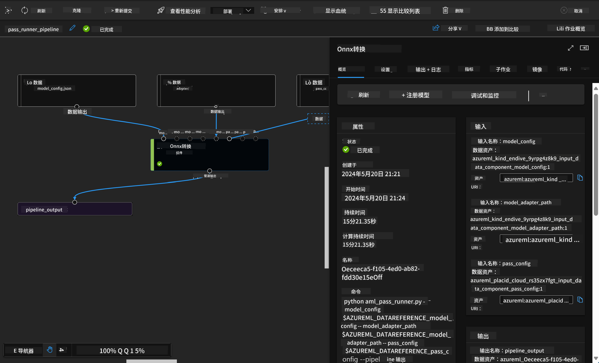

<!--
CO_OP_TRANSLATOR_METADATA:
{
  "original_hash": "7fe541373802e33568e94e13226d463c",
  "translation_date": "2025-05-07T13:32:07+00:00",
  "source_file": "md/03.FineTuning/Introduce_AzureML.md",
  "language_code": "zh"
}
-->
# **介绍 Azure 机器学习服务**

[Azure 机器学习](https://ml.azure.com?WT.mc_id=aiml-138114-kinfeylo) 是一项云服务，用于加速和管理机器学习（ML）项目的生命周期。

机器学习专业人员、数据科学家和工程师可以在日常工作流程中使用它来：

- 训练和部署模型。
- 管理机器学习运维（MLOps）。
- 你可以在 Azure 机器学习中创建模型，或使用基于开源平台（如 PyTorch、TensorFlow 或 scikit-learn）构建的模型。
- MLOps 工具帮助你监控、重新训练和重新部署模型。

## Azure 机器学习适合谁？

**数据科学家和机器学习工程师**

他们可以使用工具来加速和自动化日常工作流程。  
Azure ML 提供公平性、可解释性、跟踪和审计功能。

**应用开发者**  
他们可以无缝地将模型集成到应用程序或服务中。

**平台开发者**

他们可以访问由持久的 Azure 资源管理器 API 支持的强大工具集。  
这些工具允许构建高级机器学习工具。

**企业**

在 Microsoft Azure 云中工作，企业可以享受熟悉的安全性和基于角色的访问控制。  
设置项目以控制对受保护数据和特定操作的访问。

## 团队每个人的生产力提升  
机器学习项目通常需要具备多样技能的团队来构建和维护。

Azure ML 提供工具，帮助你：  
- 通过共享笔记本、计算资源、无服务器计算、数据和环境与团队协作。  
- 开发具备公平性、可解释性、跟踪和审计能力的模型，以满足血统和审计合规要求。  
- 快速轻松地大规模部署机器学习模型，并通过 MLOps 高效管理和治理它们。  
- 在任何地方运行机器学习工作负载，同时内置治理、安全和合规性。

## 跨平台兼容的工具

机器学习团队中的任何人都可以使用自己喜欢的工具完成工作。  
无论是快速实验、超参数调优、构建管道还是管理推理，你都可以使用熟悉的界面，包括：  
- Azure 机器学习 Studio  
- Python SDK（v2）  
- Azure CLI（v2）  
- Azure 资源管理器 REST API  

在模型不断优化和协作开发过程中，你可以在 Azure 机器学习 Studio UI 中共享和查找资产、资源和指标。

## **Azure ML 中的 LLM/SLM**

Azure ML 增加了许多与 LLM/SLM 相关的功能，结合了 LLMOps 和 SLMOps，打造企业级的生成式人工智能技术平台。

### **模型目录**

企业用户可以通过模型目录根据不同业务场景部署不同模型，并作为模型即服务（Model as Service）为企业开发者或用户提供访问。

Azure 机器学习 Studio 中的模型目录是发现和使用各种模型的中心，帮助你构建生成式 AI 应用。模型目录涵盖了数百个模型，来自 Azure OpenAI 服务、Mistral、Meta、Cohere、Nvidia、Hugging Face 等模型提供商，包括微软训练的模型。除微软外的提供商模型为非微软产品，按照微软产品条款定义，并受模型附带条款约束。

### **作业管道**

机器学习管道的核心是将完整的机器学习任务拆分为多步骤工作流。每一步都是一个可管理的组件，可以单独开发、优化、配置和自动化。各步骤通过明确定义的接口连接。Azure 机器学习管道服务会自动协调所有步骤间的依赖关系。

在微调 SLM / LLM 时，我们可以通过管道管理数据、训练和生成过程。

### **Prompt flow**

使用 Azure 机器学习 prompt flow 的优势  
Azure 机器学习 prompt flow 提供多种优势，帮助用户从创意阶段过渡到实验，最终实现基于 LLM 的生产级应用：

**Prompt 工程的灵活性**

交互式创作体验：Azure 机器学习 prompt flow 提供流程结构的可视化展示，使用户轻松理解和导航项目。同时提供类似笔记本的编码体验，提升流程开发和调试效率。  
Prompt 调优的变体：用户可以创建并比较多个 prompt 变体，促进迭代优化过程。  

评估：内置评估流程帮助用户评估 prompt 和流程的质量与效果。  

丰富资源：Azure 机器学习 prompt flow 包含内置工具、示例和模板库，作为开发起点，激发创意并加速流程。

**基于 LLM 应用的企业级准备**

协作：Azure 机器学习 prompt flow 支持团队协作，允许多用户共同进行 prompt 工程项目，分享知识并维护版本控制。  

一体化平台：Azure 机器学习 prompt flow 简化了从开发、评估到部署和监控的整个 prompt 工程流程。用户可以轻松将流程部署为 Azure 机器学习端点，实时监控其性能，确保最佳运行和持续改进。  

Azure 机器学习企业级解决方案支持：Prompt flow 利用 Azure 机器学习强大的企业级解决方案，提供安全、可扩展和可靠的基础，支持流程的开发、实验和部署。

借助 Azure 机器学习 prompt flow，用户可以释放 prompt 工程的灵活性，高效协作，并利用企业级解决方案，成功开发和部署基于 LLM 的应用。

结合 Azure ML 的计算能力、数据和各类组件，企业开发者可以轻松构建自己的人工智能应用。

**免责声明**：  
本文件使用 AI 翻译服务 [Co-op Translator](https://github.com/Azure/co-op-translator) 进行翻译。虽然我们力求准确，但请注意，自动翻译可能包含错误或不准确之处。原始文件的母语版本应被视为权威来源。对于重要信息，建议使用专业人工翻译。对于因使用本翻译而产生的任何误解或误释，我们概不负责。