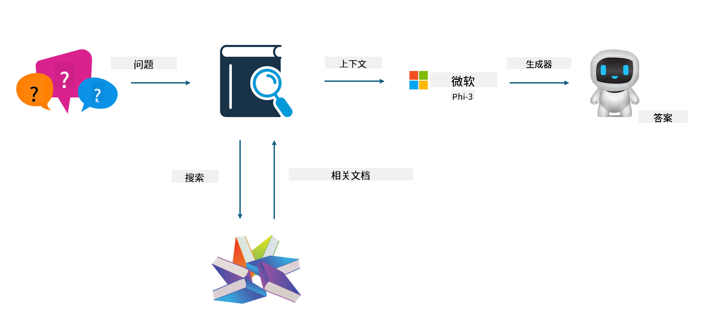
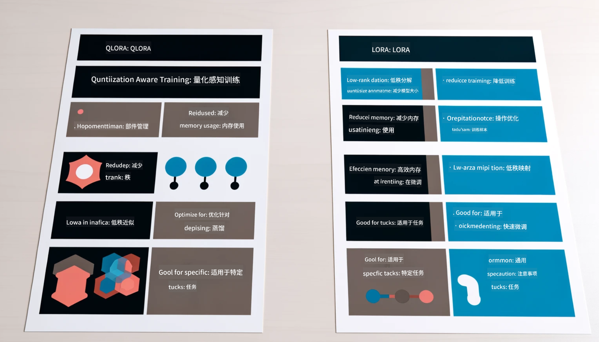

<!--
CO_OP_TRANSLATOR_METADATA:
{
  "original_hash": "743d7e9cb9c4e8ea642d77bee657a7fa",
  "translation_date": "2025-05-07T13:34:02+00:00",
  "source_file": "md/03.FineTuning/LetPhi3gotoIndustriy.md",
  "language_code": "zh"
}
-->
# **让 Phi-3 成为行业专家**

要将 Phi-3 模型应用到某个行业，需要向 Phi-3 模型中加入行业业务数据。我们有两种不同的选择，第一种是 RAG（检索增强生成），第二种是微调。

## **RAG 与微调的对比**

### **检索增强生成**

RAG 是数据检索加文本生成。企业的结构化和非结构化数据存储在向量数据库中。当检索相关内容时，会找到相关的摘要和内容组成上下文，并结合 LLM/SLM 的文本补全能力来生成内容。

### **微调**

微调是在已有模型基础上的改进。它不需要从模型算法开始，但需要持续积累数据。如果你希望行业应用中的术语和语言表达更精准，微调是更好的选择。但如果数据频繁变化，微调会变得复杂。

### **如何选择**

1. 如果答案需要引入外部数据，RAG 是最佳选择

2. 如果需要输出稳定且精准的行业知识，微调会是不错的选择。RAG 优先拉取相关内容，但可能无法完全把握专业细节。

3. 微调需要高质量数据集，数据量小的话效果不明显。RAG 更灵活

4. 微调是个黑箱，难以理解内部机制。但 RAG 更容易追溯数据来源，有助于有效调整幻觉或内容错误，提供更好的透明度。

### **应用场景**

1. 垂直行业需要特定专业词汇和表达，***微调*** 是最佳选择

2. 问答系统，涉及不同知识点综合，***RAG*** 是最佳选择

3. 自动化业务流程结合，***RAG + 微调*** 是最佳选择

## **如何使用 RAG**

向量数据库是以数学形式存储数据的集合。向量数据库让机器学习模型更容易记住之前的输入，从而支持搜索、推荐和文本生成等应用。数据的识别基于相似度指标，而非精确匹配，使计算模型能够理解数据的上下文。

向量数据库是实现 RAG 的关键。我们可以通过 text-embedding-3、jina-ai-embedding 等向量模型将数据转换为向量存储。

了解更多关于创建 RAG 应用：[https://github.com/microsoft/Phi-3CookBook](https://github.com/microsoft/Phi-3CookBook?WT.mc_id=aiml-138114-kinfeylo)

## **如何使用微调**

微调中常用的算法有 Lora 和 QLora。如何选择？
- [查看此示例笔记本了解更多](../../../../code/04.Finetuning/Phi_3_Inference_Finetuning.ipynb)
- [Python 微调示例代码](../../../../code/04.Finetuning/FineTrainingScript.py)

### **Lora 和 QLora**

LoRA（低秩适配）和 QLoRA（量化低秩适配）都是使用参数高效微调（PEFT）技术来微调大型语言模型（LLM）的方法。PEFT 技术旨在比传统方法更高效地训练模型。

LoRA 是一种独立的微调技术，通过对权重更新矩阵应用低秩近似来减少内存占用。它训练速度快，性能接近传统微调方法。

QLoRA 是 LoRA 的扩展版本，结合了量化技术，进一步减少内存使用。QLoRA 将预训练 LLM 中权重参数的精度量化为 4 位，比 LoRA 更节省内存。但由于额外的量化和反量化步骤，QLoRA 训练速度比 LoRA 慢约 30%。

QLoRA 使用 LoRA 来修正量化过程中引入的误差。QLoRA 使得在相对较小且易获得的 GPU 上微调数十亿参数的超大模型成为可能。例如，QLoRA 可以用 2 块 GPU 微调一个需要 36 块 GPU 的 700 亿参数模型。

**免责声明**：  
本文件使用 AI 翻译服务 [Co-op Translator](https://github.com/Azure/co-op-translator) 进行翻译。尽管我们力求准确，但请注意，自动翻译可能存在错误或不准确之处。原始文件的原文版本应被视为权威来源。对于重要信息，建议使用专业人工翻译。对于因使用本翻译而产生的任何误解或误释，我们不承担任何责任。