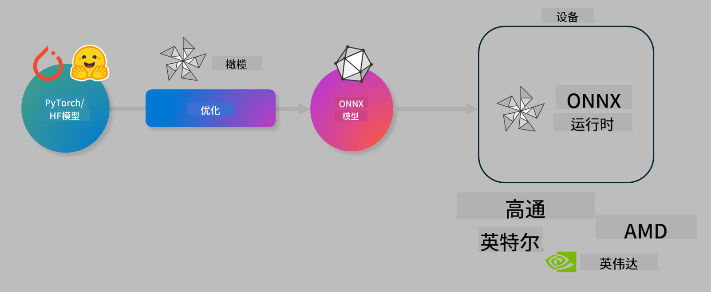

<!--
CO_OP_TRANSLATOR_METADATA:
{
  "original_hash": "76956c0c22e5686908a6d85ec72126af",
  "translation_date": "2025-04-03T08:29:44+00:00",
  "source_file": "md\\03.FineTuning\\olive-lab\\readme.md",
  "language_code": "zh"
}
-->
# 实验：优化AI模型以实现设备端推理

## 简介

> [!IMPORTANT]  
> 本实验需要安装**Nvidia A10或A100 GPU**及相关驱动程序，并且安装CUDA工具包（版本12及以上）。

> [!NOTE]  
> 本实验为**35分钟**的实践课程，将向您介绍如何使用OLIVE优化模型以实现设备端推理的核心概念。

## 学习目标

完成本实验后，您将能够使用OLIVE完成以下任务：

- 使用AWQ量化方法对AI模型进行量化。
- 为特定任务微调AI模型。
- 生成LoRA适配器（微调后的模型），以便在ONNX Runtime上实现高效设备端推理。

### 什么是Olive

Olive (*O*NNX *live*) 是一个模型优化工具包，配备CLI，可帮助您为ONNX Runtime +++https://onnxruntime.ai+++ 提供高质量和高性能的模型。



Olive的输入通常是一个PyTorch或Hugging Face模型，输出则是一个经过优化的ONNX模型，可以在运行ONNX Runtime的设备（部署目标）上执行。Olive会根据硬件供应商（如Qualcomm、AMD、Nvidia或Intel）提供的AI加速器（NPU、GPU、CPU）优化模型。

Olive执行一个*工作流*，即一系列有序的模型优化任务，这些任务被称为*passes*。例如，模型压缩、图捕获、量化、图优化等。每个pass都有一组可调参数，用以优化指标（如准确性和延迟），这些指标由相关的评估器进行评估。Olive采用搜索算法逐步或组合调优每个pass，以实现自动优化。

#### Olive的优势

- **减少试错时间**：通过自动化的图优化、压缩和量化技术，避免手动实验的挫败感。定义您的质量和性能约束，Olive会自动找到最佳模型。
- **40+内置模型优化组件**：涵盖量化、压缩、图优化和微调的最新技术。
- **易于使用的CLI**：支持常见的模型优化任务，例如olive quantize、olive auto-opt、olive finetune。
- 内置模型打包和部署功能。
- 支持生成**多LoRA服务**模型。
- 使用YAML/JSON构建工作流，协调模型优化和部署任务。
- **与Hugging Face和Azure AI集成**。
- 内置**缓存机制**，可**节省成本**。

## 实验说明

> [!NOTE]  
> 请确保您已根据实验1设置好Azure AI Hub和项目，并配置好A100计算资源。

### 步骤0：连接到Azure AI计算资源

您将使用**VS Code**的远程功能连接到Azure AI计算资源。

1. 打开您的**VS Code**桌面应用程序：
2. 使用**Shift+Ctrl+P**打开**命令面板**。
3. 在命令面板中搜索**AzureML - remote: Connect to compute instance in New Window**。
4. 按屏幕提示连接到计算资源，这包括选择您的Azure订阅、资源组、项目和在实验1中设置的计算资源名称。
5. 成功连接后，**Visual Code的左下角**会显示连接状态 `><Azure ML: Compute Name`。

### 步骤1：克隆此仓库

在VS Code中，使用**Ctrl+J**打开一个新终端，并克隆此仓库：

在终端中，您会看到提示

```
azureuser@computername:~/cloudfiles/code$ 
```  
克隆解决方案  

```bash
cd ~/localfiles
git clone https://github.com/microsoft/phi-3cookbook.git
```

### 步骤2：在VS Code中打开文件夹

在终端中执行以下命令，将相关文件夹打开到VS Code的新窗口：

```bash
code phi-3cookbook/code/04.Finetuning/Olive-lab
```  

或者，您可以通过选择**文件** > **打开文件夹**手动打开文件夹。

### 步骤3：安装依赖项

在VS Code的Azure AI计算实例中打开终端窗口（提示：**Ctrl+J**），并执行以下命令以安装依赖项：

```bash
conda create -n olive-ai python=3.11 -y
conda activate olive-ai
pip install -r requirements.txt
az extension remove -n azure-cli-ml
az extension add -n ml
```  

> [!NOTE]  
> 安装所有依赖项约需5分钟。

在本实验中，您将下载并上传模型到Azure AI模型目录。为了访问模型目录，您需要使用以下命令登录Azure：

```bash
az login
```  

> [!NOTE]  
> 登录时，系统会要求您选择订阅，请确保选择实验中提供的订阅。

### 步骤4：执行Olive命令

在VS Code的Azure AI计算实例中打开终端窗口（提示：**Ctrl+J**），并确保激活了`olive-ai` conda环境：

```bash
conda activate olive-ai
```  

接下来，在命令行中执行以下Olive命令。

1. **检查数据**：在此示例中，您将微调Phi-3.5-Mini模型，使其专注于回答与旅行相关的问题。以下代码会显示数据集的前几条记录，这些记录采用JSON行格式：

    ```bash
    head data/data_sample_travel.jsonl
    ```  
2. **量化模型**：在训练模型之前，您可以使用以下命令进行量化，该命令采用一种称为主动感知量化（AWQ）的技术 +++https://arxiv.org/abs/2306.00978+++。AWQ通过考虑推理期间生成的激活数据对模型权重进行量化。这意味着量化过程会考虑激活中的实际数据分布，与传统权重量化方法相比，能更好地保留模型的准确性。

    ```bash
    olive quantize \
       --model_name_or_path microsoft/Phi-3.5-mini-instruct \
       --trust_remote_code \
       --algorithm awq \
       --output_path models/phi/awq \
       --log_level 1
    ```  

    AWQ量化约需8分钟完成，模型大小将从约7.5GB减少到约2.5GB。

    在本实验中，我们向您展示如何从Hugging Face导入模型（例如：`microsoft/Phi-3.5-mini-instruct`). However, Olive also allows you to input models from the Azure AI catalog by updating the `model_name_or_path` argument to an Azure AI asset ID (for example:  `azureml://registries/azureml/models/Phi-3.5-mini-instruct/versions/4`). 

1. **Train the model:** Next, the `olive finetune`命令会微调量化后的模型。先量化后微调会比先微调后量化得到更好的准确性，因为微调过程可以恢复部分因量化造成的损失。

    ```bash
    olive finetune \
        --method lora \
        --model_name_or_path models/phi/awq \
        --data_files "data/data_sample_travel.jsonl" \
        --data_name "json" \
        --text_template "<|user|>\n{prompt}<|end|>\n<|assistant|>\n{response}<|end|>" \
        --max_steps 100 \
        --output_path ./models/phi/ft \
        --log_level 1
    ```  

    微调约需6分钟完成（100步）。

3. **优化模型**：训练完成后，您可以使用Olive的`auto-opt` command, which will capture the ONNX graph and automatically perform a number of optimizations to improve the model performance for CPU by compressing the model and doing fusions. It should be noted, that you can also optimize for other devices such as NPU or GPU by just updating the `--device` and `--provider`参数优化模型。但在本实验中，我们将使用CPU进行操作。

    ```bash
    olive auto-opt \
       --model_name_or_path models/phi/ft/model \
       --adapter_path models/phi/ft/adapter \
       --device cpu \
       --provider CPUExecutionProvider \
       --use_ort_genai \
       --output_path models/phi/onnx-ao \
       --log_level 1
    ```  

    优化约需5分钟完成。

### 步骤5：模型推理快速测试

要测试模型推理，请在文件夹中创建一个名为**app.py**的Python文件，并将以下代码复制粘贴进去：

```python
import onnxruntime_genai as og
import numpy as np

print("loading model and adapters...", end="", flush=True)
model = og.Model("models/phi/onnx-ao/model")
adapters = og.Adapters(model)
adapters.load("models/phi/onnx-ao/model/adapter_weights.onnx_adapter", "travel")
print("DONE!")

tokenizer = og.Tokenizer(model)
tokenizer_stream = tokenizer.create_stream()

params = og.GeneratorParams(model)
params.set_search_options(max_length=100, past_present_share_buffer=False)
user_input = "what is the best thing to see in chicago"
params.input_ids = tokenizer.encode(f"<|user|>\n{user_input}<|end|>\n<|assistant|>\n")

generator = og.Generator(model, params)

generator.set_active_adapter(adapters, "travel")

print(f"{user_input}")

while not generator.is_done():
    generator.compute_logits()
    generator.generate_next_token()

    new_token = generator.get_next_tokens()[0]
    print(tokenizer_stream.decode(new_token), end='', flush=True)

print("\n")
```  

使用以下命令执行代码：

```bash
python app.py
```  

### 步骤6：上传模型到Azure AI

将模型上传到Azure AI模型仓库后，模型可以与开发团队的其他成员共享，并且可以对模型进行版本控制。使用以下命令上传模型：

> [!NOTE]  
> 更新`{}` placeholders with the name of your resource group and Azure AI Project Name. 

To find your resource group `"resourceGroup"`和Azure AI项目名称，然后运行以下命令：

```
az ml workspace show
```  

或者访问+++ai.azure.com+++，选择**管理中心** > **项目** > **概览**。

更新`{}`占位符为您的资源组名称和Azure AI项目名称。

```bash
az ml model create \
    --name ft-for-travel \
    --version 1 \
    --path ./models/phi/onnx-ao \
    --resource-group {RESOURCE_GROUP_NAME} \
    --workspace-name {PROJECT_NAME}
```  

随后，您可以在https://ml.azure.com/model/list 查看您上传的模型并进行部署。

**免责声明**：  
本文档使用 AI 翻译服务 [Co-op Translator](https://github.com/Azure/co-op-translator) 进行翻译。尽管我们努力确保翻译的准确性，但请注意，自动翻译可能包含错误或不准确之处。应以原始语言的文档作为权威来源。对于重要信息，建议使用专业人工翻译。因使用本翻译而产生的任何误解或误读，我们概不负责。